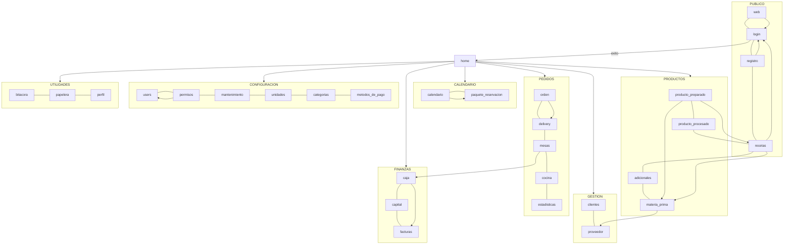
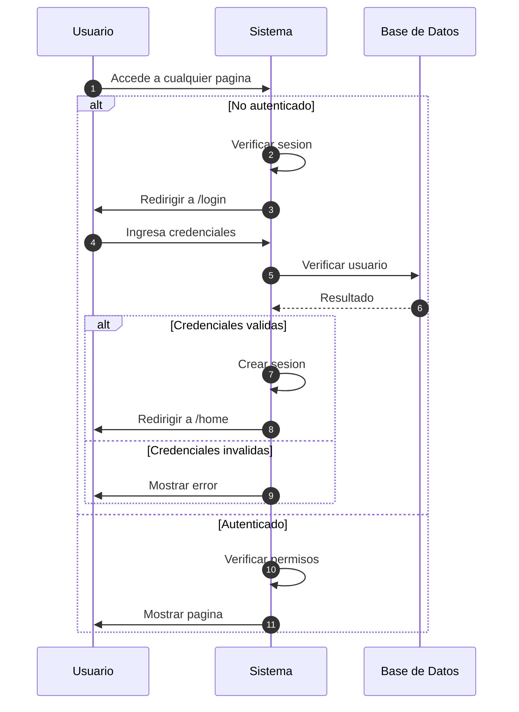

# Mapa Navegacional - BurgerHouse

## Navegacion del Sistema

```mermaid
flowchart TB
    WEB["web"]
    LOGIN["login"]
    REG["registro"]
    REC["recover_password"]
    HOME["home"]
    ORDEN["orden"]
    DELIVERY["delivery"]
    COCINA["cocina"]
    MESAS["mesas"]
    ESTAD["estadisticas"]
    CAL["calendario"]
    PAQ["paquete_reservacion"]
    PP["producto_preparado"]
    PROCP["producto_procesado"]
    REC["recetas"]
    ADIC["adicionales"]
    MP["materia_prima"]
    CAJA["caja"]
    CAPITAL["capital"]
    FACT["facturas"]
    CLI["clientes"]
    PROV["proveedor"]
    USERS["users"]
    PERMS["permisos"]
    MANT["mantenimiento"]
    UNID["unidades"]
    CAT["categorias"]
    MET["metodos_de_pago"]
    BITA["bitacora"]
    PAP["papelera"]
    PERF["perfil"]

    subgraph PUBLIC[PUBLICO]
        WEB --- LOGIN --- REG --- REC
    end

    subgraph PEDIDOS[PEDIDOS]
        ORDEN --- DELIVERY --- MESAS --- COCINA --- ESTAD
    end

    subgraph CALEND[CALENDARIO]
        CAL --- PAQ
    end

    subgraph PROD[PRODUCTOS]
        PP --- PROCP --- REC --- ADIC --- MP
    end

    subgraph FIN[GESTION]
        CLI --- PROV
    end

    subgraph CAJ[FINANZAS]
        CAJA --- CAPITAL --- FACT
    end

    subgraph CONF[CONFIGURACION]
        USERS --- PERMS --- MANT --- UNID --- CAT --- MET
    end

    subgraph UTIL[UTILIDADES]
        BITA --- PAP --- PERF
    end

    LOGIN -->|"exito"| HOME
    WEB --> LOGIN
    REG --> LOGIN
    REC --> LOGIN

    HOME --> PEDIDOS
    HOME --> CALEND
    HOME --> PROD
    HOME --> FIN
    HOME --> CAJ
    HOME --> CONF
    HOME --> UTIL

    ORDEN --> DELIVERY
    MESAS --> CAJA
    CAL --> PAQ
    PP --> REC
    PP --> MP
    REC --> MP
    MP --> PROV
    PERMS --> USERS
    CAJA --> FACT
```

## Flujo de Autenticacion

```mermaid
sequenceDiagram
    autonumber
    participant U as Usuario
    participant SYS as Sistema
    participant DB as Base de Datos
    
    U->>SYS: Accede a cualquier pagina
    
    alt No autenticado
        SYS->>SYS: Verificar sesion
        SYS->>U: Redirigir a /login
        U->>SYS: Ingresa credenciales
        SYS->>DB: Verificar usuario
        DB-->>SYS: Resultado
        alt Credenciales validas
            SYS->>SYS: Crear sesion
            SYS->>U: Redirigir a /home
        else Credenciales invalidas
            SYS->>U: Mostrar error
        end
    else Autenticado
        SYS->>SYS: Verificar permisos
        SYS->>U: Mostrar pagina
    end
```
