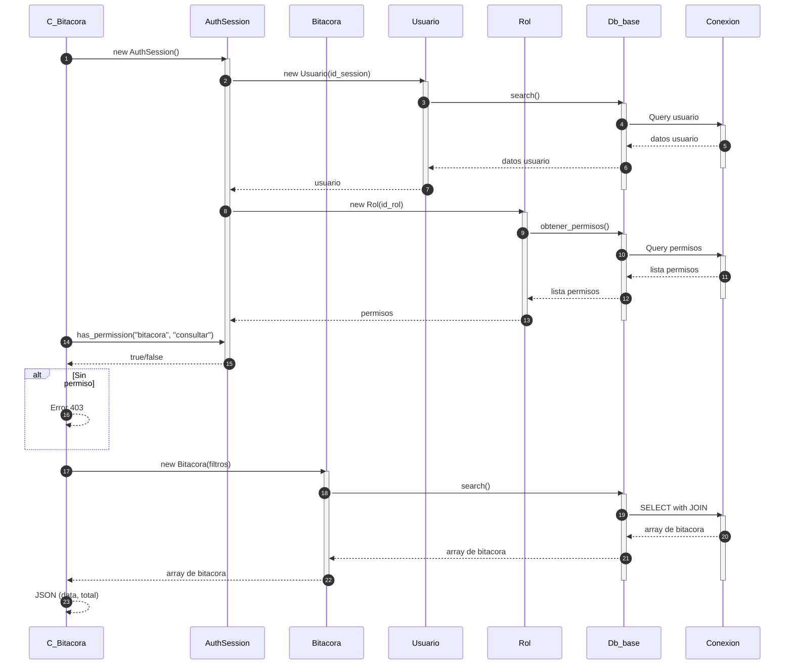
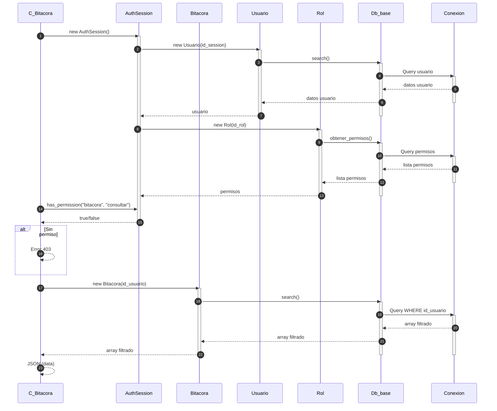
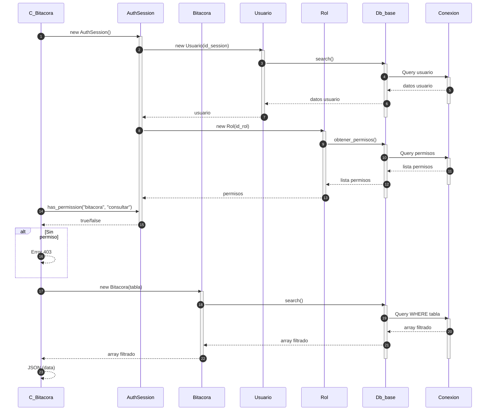

# Modulo Bitacora - Diagrama de Secuencia

## Consultar Bitacora

```mermaid
sequenceDiagram
    autonumber
    participant C_Bitacora as C_Bitacora
    participant AuthSession as AuthSession
    participant Bitacora as Bitacora
    participant Usuario as Usuario
    participant Rol as Rol
    participant Db_base as Db_base
    participant Conexion as Conexion
    
    C_Bitacora->>AuthSession: new AuthSession()
    activate AuthSession
    AuthSession->>Usuario: new Usuario(id_session)
    activate Usuario
    Usuario->>Db_base: search()
    activate Db_base
    Db_base->>Conexion: Query usuario
    activate Conexion
    Conexion-->>Db_base: datos usuario
    Db_base-->>Usuario: datos usuario
    deactivate Conexion
    Usuario-->>AuthSession: usuario
    deactivate Usuario
    deactivate Db_base
    
    AuthSession->>Rol: new Rol(id_rol)
    activate Rol
    Rol->>Db_base: obtener_permisos()
    activate Db_base
    Db_base->>Conexion: Query permisos
    activate Conexion
    Conexion-->>Db_base: lista permisos
    Db_base-->>Rol: lista permisos
    deactivate Conexion
    Rol-->>AuthSession: permisos
    deactivate Rol
    deactivate Db_base
    
    C_Bitacora->>AuthSession: has_permission("bitacora", "consultar")
    AuthSession-->>C_Bitacora: true/false
    deactivate AuthSession
    
    alt Sin permiso
        C_Bitacora-->>C_Bitacora: Error 403
    end
    
    C_Bitacora->>Bitacora: new Bitacora(filtros)
    activate Bitacora
    Bitacora->>Db_base: search()
    activate Db_base
    Db_base->>Conexion: SELECT with JOIN
    activate Conexion
    Conexion-->>Db_base: array de bitacora
    Db_base-->>Bitacora: array de bitacora
    Bitacora-->>C_Bitacora: array de bitacora
    deactivate Bitacora
    deactivate Conexion
    deactivate Db_base
    
    C_Bitacora-->>C_Bitacora: JSON (data, total)
```

## Filtrar por Usuario

```mermaid
sequenceDiagram
    autonumber
    participant C_Bitacora as C_Bitacora
    participant AuthSession as AuthSession
    participant Bitacora as Bitacora
    participant Usuario as Usuario
    participant Rol as Rol
    participant Db_base as Db_base
    participant Conexion as Conexion
    
    C_Bitacora->>AuthSession: new AuthSession()
    activate AuthSession
    AuthSession->>Usuario: new Usuario(id_session)
    activate Usuario
    Usuario->>Db_base: search()
    activate Db_base
    Db_base->>Conexion: Query usuario
    activate Conexion
    Conexion-->>Db_base: datos usuario
    Db_base-->>Usuario: datos usuario
    deactivate Conexion
    Usuario-->>AuthSession: usuario
    deactivate Usuario
    deactivate Db_base
    
    AuthSession->>Rol: new Rol(id_rol)
    activate Rol
    Rol->>Db_base: obtener_permisos()
    activate Db_base
    Db_base->>Conexion: Query permisos
    activate Conexion
    Conexion-->>Db_base: lista permisos
    Db_base-->>Rol: lista permisos
    deactivate Conexion
    Rol-->>AuthSession: permisos
    deactivate Rol
    deactivate Db_base
    
    C_Bitacora->>AuthSession: has_permission("bitacora", "consultar")
    AuthSession-->>C_Bitacora: true/false
    deactivate AuthSession
    
    alt Sin permiso
        C_Bitacora-->>C_Bitacora: Error 403
    end
    
    C_Bitacora->>Bitacora: new Bitacora(id_usuario)
    activate Bitacora
    Bitacora->>Db_base: search()
    activate Db_base
    Db_base->>Conexion: Query WHERE id_usuario
    activate Conexion
    Conexion-->>Db_base: array filtrado
    Db_base-->>Bitacora: array filtrado
    Bitacora-->>C_Bitacora: array filtrado
    deactivate Bitacora
    deactivate Conexion
    deactivate Db_base
    
    C_Bitacora-->>C_Bitacora: JSON (data)
```

## Filtrar por Tabla

```mermaid
sequenceDiagram
    autonumber
    participant C_Bitacora as C_Bitacora
    participant AuthSession as AuthSession
    participant Bitacora as Bitacora
    participant Usuario as Usuario
    participant Rol as Rol
    participant Db_base as Db_base
    participant Conexion as Conexion
    
    C_Bitacora->>AuthSession: new AuthSession()
    activate AuthSession
    AuthSession->>Usuario: new Usuario(id_session)
    activate Usuario
    Usuario->>Db_base: search()
    activate Db_base
    Db_base->>Conexion: Query usuario
    activate Conexion
    Conexion-->>Db_base: datos usuario
    Db_base-->>Usuario: datos usuario
    deactivate Conexion
    Usuario-->>AuthSession: usuario
    deactivate Usuario
    deactivate Db_base
    
    AuthSession->>Rol: new Rol(id_rol)
    activate Rol
    Rol->>Db_base: obtener_permisos()
    activate Db_base
    Db_base->>Conexion: Query permisos
    activate Conexion
    Conexion-->>Db_base: lista permisos
    Db_base-->>Rol: lista permisos
    deactivate Conexion
    Rol-->>AuthSession: permisos
    deactivate Rol
    deactivate Db_base
    
    C_Bitacora->>AuthSession: has_permission("bitacora", "consultar")
    AuthSession-->>C_Bitacora: true/false
    deactivate AuthSession
    
    alt Sin permiso
        C_Bitacora-->>C_Bitacora: Error 403
    end
    
    C_Bitacora->>Bitacora: new Bitacora(tabla)
    activate Bitacora
    Bitacora->>Db_base: search()
    activate Db_base
    Db_base->>Conexion: Query WHERE tabla
    activate Conexion
    Conexion-->>Db_base: array filtrado
    Db_base-->>Bitacora: array filtrado
    Bitacora-->>C_Bitacora: array filtrado
    deactivate Bitacora
    deactivate Conexion
    deactivate Db_base
    
    C_Bitacora-->>C_Bitacora: JSON (data)
```
