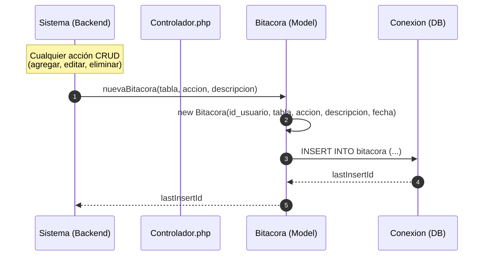
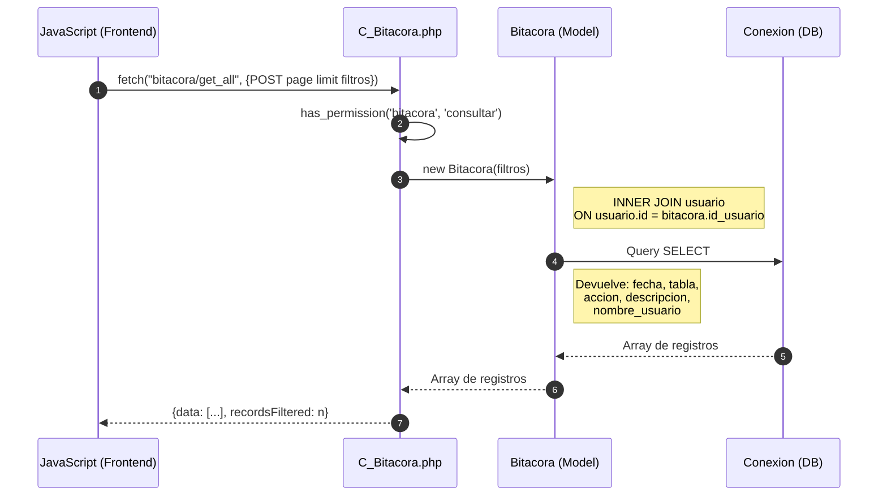
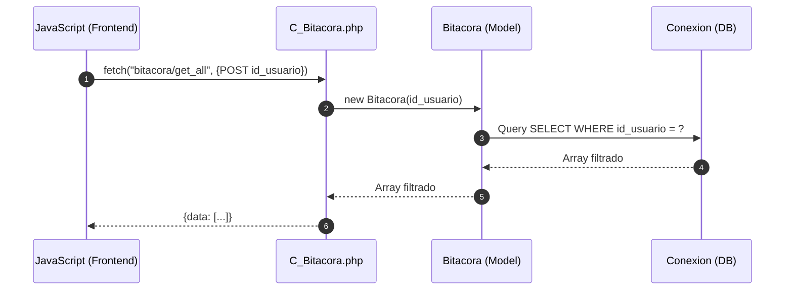
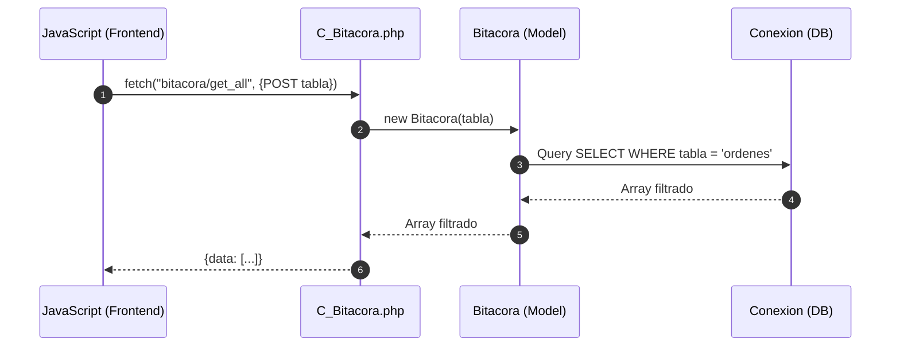

# Módulo Bitácora - Diagrama de Secuencia

## Registrar Acción en Bitácora

```mermaid
sequenceDiagram
    autonumber
    participant Sistema as Sistema (Backend)
    participant C_Accion as Controlador.php
    participant Bitacora as Bitacora (Model)
    participant DB as Conexion (DB)
    
    Note over Sistema: Cualquier acción CRUD<br/>(agregar, editar, eliminar)
    
    Sistema->>Bitacora: nuevaBitacora(tabla, accion, descripcion)
    
    Bitacora->>Bitacora: new Bitacora(id_usuario, tabla, accion, descripcion, fecha)
    
    Bitacora->>DB: INSERT INTO bitacora (...)
    DB-->>Bitacora: lastInsertId
    Bitacora-->>Sistema: lastInsertId
```

## Consultar Bitácora

```mermaid
sequenceDiagram
    autonumber
    participant JS as JavaScript (Frontend)
    participant C_Bitacora as C_Bitacora.php
    participant Bitacora as Bitacora (Model)
    participant DB as Conexion (DB)
    
    JS->>C_Bitacora: fetch("bitacora/get_all", {POST page limit filtros})
    
    C_Bitacora->>C_Bitacora: has_permission('bitacora', 'consultar')
    
    C_Bitacora->>Bitacora: new Bitacora(filtros)
    
    Note right of Bitacora: INNER JOIN usuario<br/>ON usuario.id = bitacora.id_usuario
    Bitacora->>DB: Query SELECT
    Note right of Bitacora: Devuelve: fecha, tabla,<br/>accion, descripcion,<br/>nombre_usuario
    DB-->>Bitacora: Array de registros
    Bitacora-->>C_Bitacora: Array de registros
    
    C_Bitacora-->>JS: {data: [...], recordsFiltered: n}
```

## Filtrar Bitácora por Usuario

```mermaid
sequenceDiagram
    autonumber
    participant JS as JavaScript (Frontend)
    participant C_Bitacora as C_Bitacora.php
    participant Bitacora as Bitacora (Model)
    participant DB as Conexion (DB)
    
    JS->>C_Bitacora: fetch("bitacora/get_all", {POST id_usuario})
    
    C_Bitacora->>Bitacora: new Bitacora(id_usuario)
    Bitacora->>DB: Query SELECT WHERE id_usuario = ?
    DB-->>Bitacora: Array filtrado
    Bitacora-->>C_Bitacora: Array filtrado
    
    C_Bitacora-->>JS: {data: [...]}
```

## Filtrar Bitácora por Tabla

```mermaid
sequenceDiagram
    autonumber
    participant JS as JavaScript (Frontend)
    participant C_Bitacora as C_Bitacora.php
    participant Bitacora as Bitacora (Model)
    participant DB as Conexion (DB)
    
    JS->>C_Bitacora: fetch("bitacora/get_all", {POST tabla})
    
    C_Bitacora->>Bitacora: new Bitacora(tabla)
    Bitacora->>DB: Query SELECT WHERE tabla = 'ordenes'
    DB-->>Bitacora: Array filtrado
    Bitacora-->>C_Bitacora: Array filtrado
    
    C_Bitacora-->>JS: {data: [...]}
```
