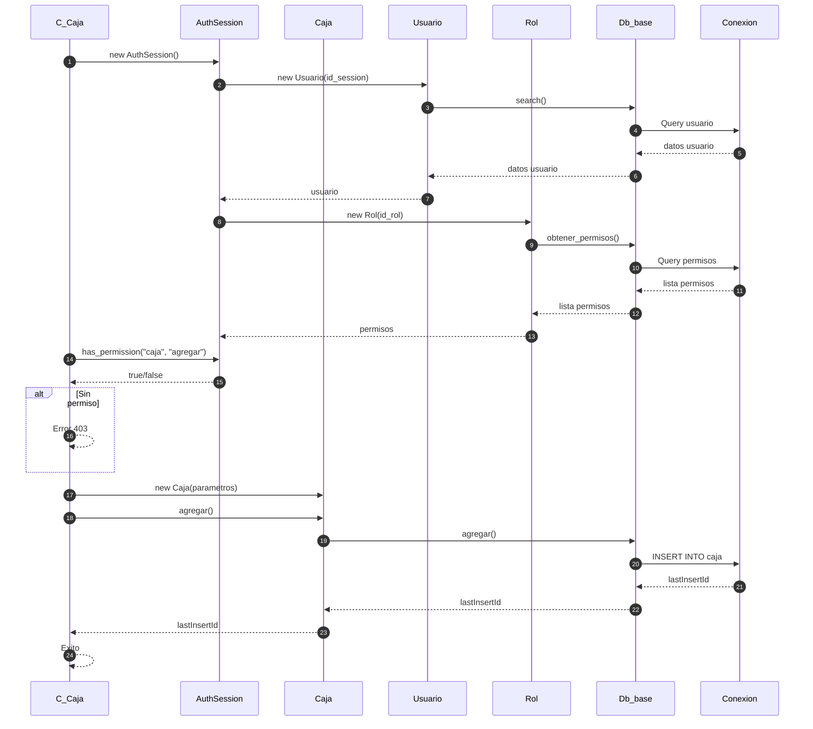
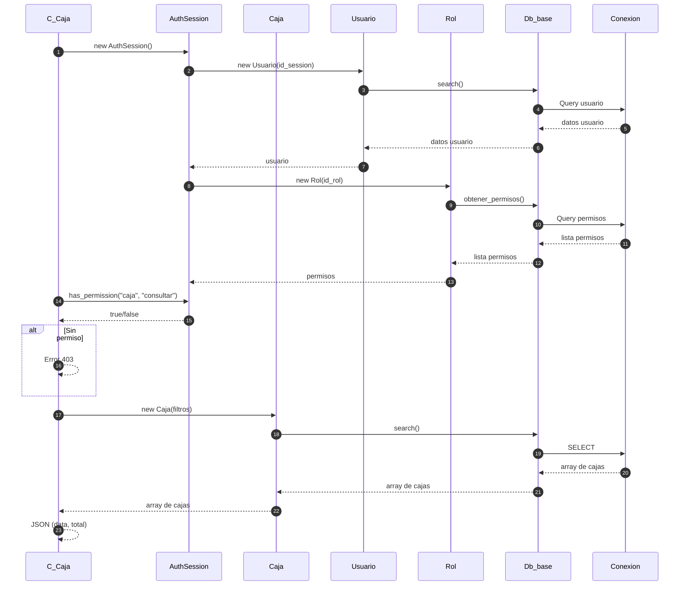
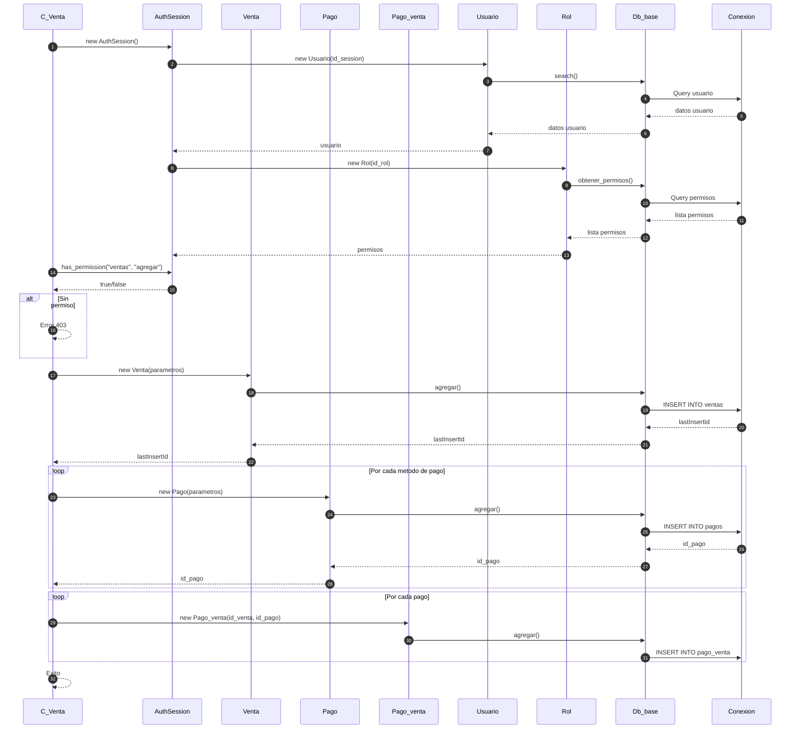
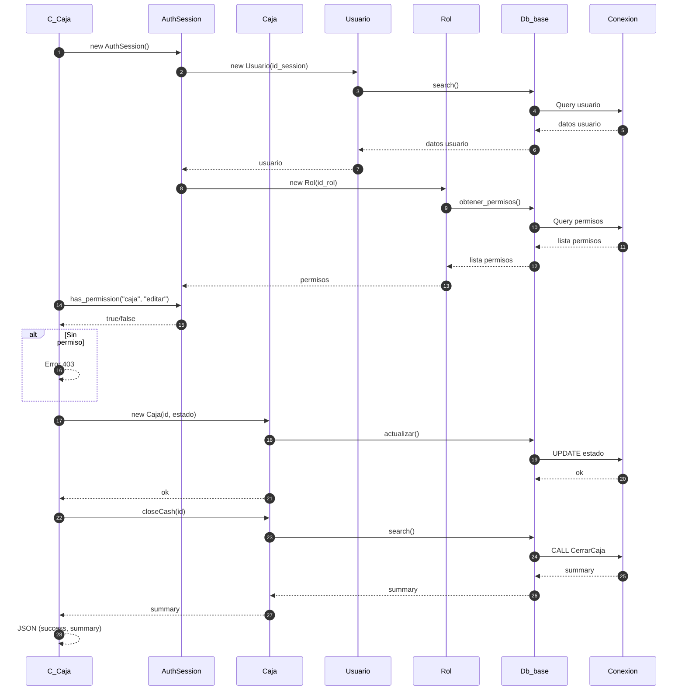
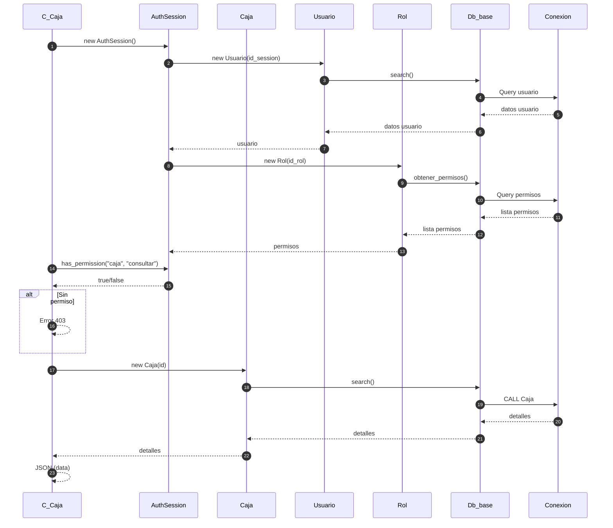

# Modulo Caja - Diagrama de Secuencia

## Abrir Caja

```mermaid
sequenceDiagram
    autonumber
    participant C_Caja as C_Caja
    participant AuthSession as AuthSession
    participant Caja as Caja
    participant Usuario as Usuario
    participant Rol as Rol
    participant Db_base as Db_base
    participant Conexion as Conexion
    
    C_Caja->>AuthSession: new AuthSession()
    AuthSession->>Usuario: new Usuario(id_session)
    Usuario->>Db_base: search()
    Db_base->>Conexion: Query usuario
    Conexion-->>Db_base: datos usuario
    Db_base-->>Usuario: datos usuario
    Usuario-->>AuthSession: usuario
    
    AuthSession->>Rol: new Rol(id_rol)
    Rol->>Db_base: obtener_permisos()
    Db_base->>Conexion: Query permisos
    Conexion-->>Db_base: lista permisos
    Db_base-->>Rol: lista permisos
    Rol-->>AuthSession: permisos
    
    C_Caja->>AuthSession: has_permission("caja", "agregar")
    AuthSession-->>C_Caja: true/false
    
    alt Sin permiso
        C_Caja-->>C_Caja: Error 403
    end
    
    C_Caja->>Caja: new Caja(parametros)
    C_Caja->>Caja: agregar()
    Caja->>Db_base: agregar()
    Db_base->>Conexion: INSERT INTO caja
    Conexion-->>Db_base: lastInsertId
    Db_base-->>Caja: lastInsertId
    Caja-->>C_Caja: lastInsertId
    
    C_Caja-->>C_Caja: Exito
```

## Consultar Cajas

```mermaid
sequenceDiagram
    autonumber
    participant C_Caja as C_Caja
    participant AuthSession as AuthSession
    participant Caja as Caja
    participant Usuario as Usuario
    participant Rol as Rol
    participant Db_base as Db_base
    participant Conexion as Conexion
    
    C_Caja->>AuthSession: new AuthSession()
    AuthSession->>Usuario: new Usuario(id_session)
    Usuario->>Db_base: search()
    Db_base->>Conexion: Query usuario
    Conexion-->>Db_base: datos usuario
    Db_base-->>Usuario: datos usuario
    Usuario-->>AuthSession: usuario
    
    AuthSession->>Rol: new Rol(id_rol)
    Rol->>Db_base: obtener_permisos()
    Db_base->>Conexion: Query permisos
    Conexion-->>Db_base: lista permisos
    Db_base-->>Rol: lista permisos
    Rol-->>AuthSession: permisos
    
    C_Caja->>AuthSession: has_permission("caja", "consultar")
    AuthSession-->>C_Caja: true/false
    
    alt Sin permiso
        C_Caja-->>C_Caja: Error 403
    end
    
    C_Caja->>Caja: new Caja(filtros)
    Caja->>Db_base: search()
    Db_base->>Conexion: SELECT
    Conexion-->>Db_base: array de cajas
    Db_base-->>Caja: array de cajas
    Caja-->>C_Caja: array de cajas
    
    C_Caja-->>C_Caja: JSON (data, total)
```

## Realizar Venta

```mermaid
sequenceDiagram
    autonumber
    participant C_Venta as C_Venta
    participant AuthSession as AuthSession
    participant Venta as Venta
    participant Pago as Pago
    participant Pago_venta as Pago_venta
    participant Usuario as Usuario
    participant Rol as Rol
    participant Db_base as Db_base
    participant Conexion as Conexion
    
    C_Venta->>AuthSession: new AuthSession()
    AuthSession->>Usuario: new Usuario(id_session)
    Usuario->>Db_base: search()
    Db_base->>Conexion: Query usuario
    Conexion-->>Db_base: datos usuario
    Db_base-->>Usuario: datos usuario
    Usuario-->>AuthSession: usuario
    
    AuthSession->>Rol: new Rol(id_rol)
    Rol->>Db_base: obtener_permisos()
    Db_base->>Conexion: Query permisos
    Conexion-->>Db_base: lista permisos
    Db_base-->>Rol: lista permisos
    Rol-->>AuthSession: permisos
    
    C_Venta->>AuthSession: has_permission("ventas", "agregar")
    AuthSession-->>C_Venta: true/false
    
    alt Sin permiso
        C_Venta-->>C_Venta: Error 403
    end
    
    C_Venta->>Venta: new Venta(parametros)
    Venta->>Db_base: agregar()
    Db_base->>Conexion: INSERT INTO ventas
    Conexion-->>Db_base: lastInsertId
    Db_base-->>Venta: lastInsertId
    Venta-->>C_Venta: lastInsertId
    
    loop Por cada metodo de pago
        C_Venta->>Pago: new Pago(parametros)
        Pago->>Db_base: agregar()
        Db_base->>Conexion: INSERT INTO pagos
        Conexion-->>Db_base: id_pago
        Db_base-->>Pago: id_pago
        Pago-->>C_Venta: id_pago
    end
    
    loop Por cada pago
        C_Venta->>Pago_venta: new Pago_venta(id_venta, id_pago)
        Pago_venta->>Db_base: agregar()
        Db_base->>Conexion: INSERT INTO pago_venta
    end
    
    C_Venta-->>C_Venta: Exito
```

## Cerrar Caja

```mermaid
sequenceDiagram
    autonumber
    participant C_Caja as C_Caja
    participant AuthSession as AuthSession
    participant Caja as Caja
    participant Usuario as Usuario
    participant Rol as Rol
    participant Db_base as Db_base
    participant Conexion as Conexion
    
    C_Caja->>AuthSession: new AuthSession()
    AuthSession->>Usuario: new Usuario(id_session)
    Usuario->>Db_base: search()
    Db_base->>Conexion: Query usuario
    Conexion-->>Db_base: datos usuario
    Db_base-->>Usuario: datos usuario
    Usuario-->>AuthSession: usuario
    
    AuthSession->>Rol: new Rol(id_rol)
    Rol->>Db_base: obtener_permisos()
    Db_base->>Conexion: Query permisos
    Conexion-->>Db_base: lista permisos
    Db_base-->>Rol: lista permisos
    Rol-->>AuthSession: permisos
    
    C_Caja->>AuthSession: has_permission("caja", "editar")
    AuthSession-->>C_Caja: true/false
    
    alt Sin permiso
        C_Caja-->>C_Caja: Error 403
    end
    
    C_Caja->>Caja: new Caja(id, estado)
    Caja->>Db_base: actualizar()
    Db_base->>Conexion: UPDATE estado
    Conexion-->>Db_base: ok
    Caja-->>C_Caja: ok
    
    C_Caja->>Caja: closeCash(id)
    Caja->>Db_base: search()
    Db_base->>Conexion: CALL CerrarCaja
    Conexion-->>Db_base: summary
    Db_base-->>Caja: summary
    Caja-->>C_Caja: summary
    
    C_Caja-->>C_Caja: JSON (success, summary)
```

## Ver Detalles de Caja

```mermaid
sequenceDiagram
    autonumber
    participant C_Caja as C_Caja
    participant AuthSession as AuthSession
    participant Caja as Caja
    participant Usuario as Usuario
    participant Rol as Rol
    participant Db_base as Db_base
    participant Conexion as Conexion
    
    C_Caja->>AuthSession: new AuthSession()
    AuthSession->>Usuario: new Usuario(id_session)
    Usuario->>Db_base: search()
    Db_base->>Conexion: Query usuario
    Conexion-->>Db_base: datos usuario
    Db_base-->>Usuario: datos usuario
    Usuario-->>AuthSession: usuario
    
    AuthSession->>Rol: new Rol(id_rol)
    Rol->>Db_base: obtener_permisos()
    Db_base->>Conexion: Query permisos
    Conexion-->>Db_base: lista permisos
    Db_base-->>Rol: lista permisos
    Rol-->>AuthSession: permisos
    
    C_Caja->>AuthSession: has_permission("caja", "consultar")
    AuthSession-->>C_Caja: true/false
    
    alt Sin permiso
        C_Caja-->>C_Caja: Error 403
    end
    
    C_Caja->>Caja: new Caja(id)
    Caja->>Db_base: search()
    Db_base->>Conexion: CALL Caja
    Conexion-->>Db_base: detalles
    Db_base-->>Caja: detalles
    Caja-->>C_Caja: detalles
    
    C_Caja-->>C_Caja: JSON (data)
```
