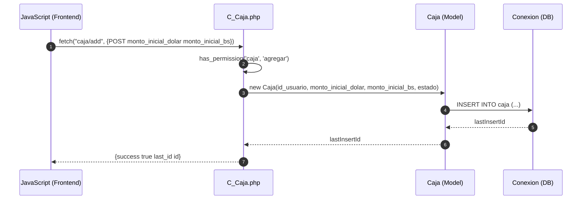
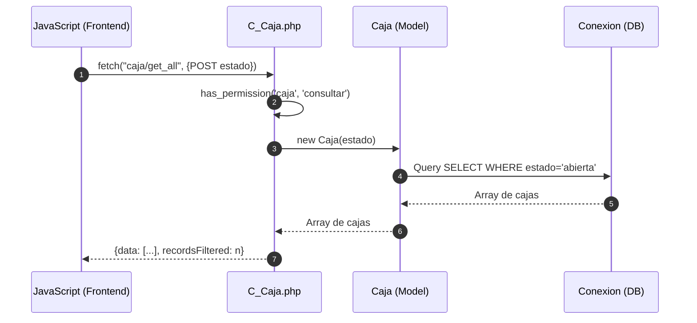
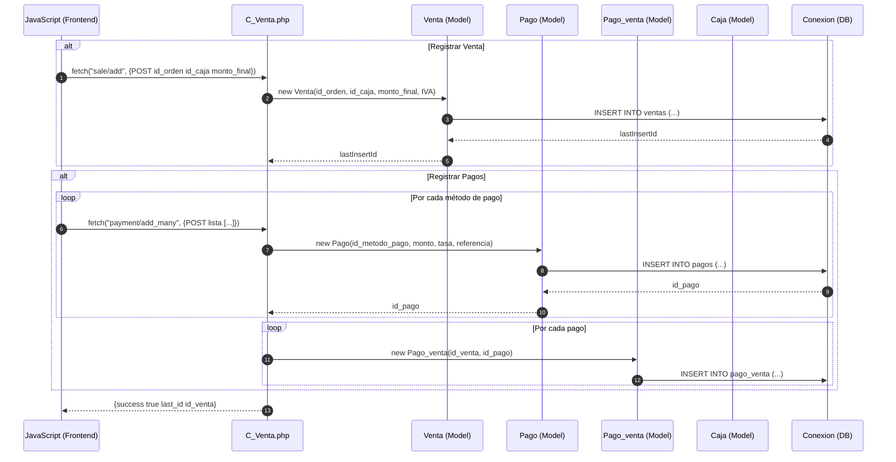
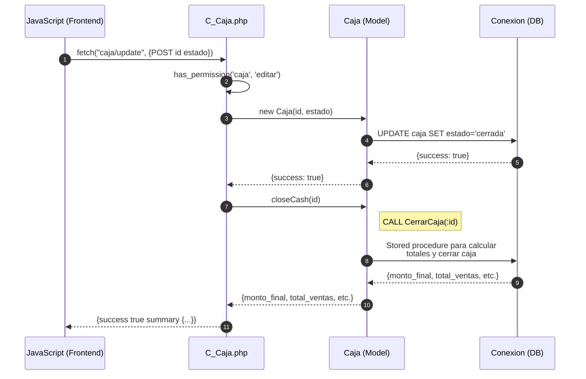
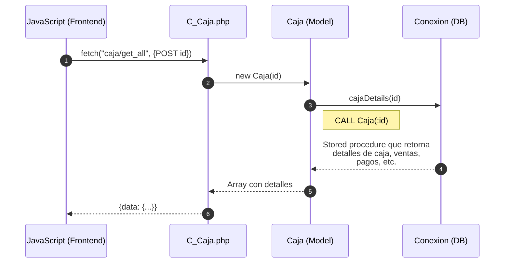

# Módulo Caja - Diagrama de Secuencia

## Abrir Caja

```mermaid
sequenceDiagram
    autonumber
    participant JS as JavaScript (Frontend)
    participant C_Caja as C_Caja.php
    participant Caja as Caja (Model)
    participant DB as Conexion (DB)
    
    JS->>C_Caja: fetch("caja/add", {POST monto_inicial_dolar monto_inicial_bs})
    
    C_Caja->>C_Caja: has_permission('caja', 'agregar')
    
    C_Caja->>Caja: new Caja(id_usuario, monto_inicial_dolar, monto_inicial_bs, estado)
    
    Caja->>DB: INSERT INTO caja (...)
    DB-->>Caja: lastInsertId
    Caja-->>C_Caja: lastInsertId
    
    C_Caja-->>JS: {success true last_id id}
```

## Consultar Cajas Abiertas

```mermaid
sequenceDiagram
    autonumber
    participant JS as JavaScript (Frontend)
    participant C_Caja as C_Caja.php
    participant Caja as Caja (Model)
    participant DB as Conexion (DB)
    
    JS->>C_Caja: fetch("caja/get_all", {POST estado})
    
    C_Caja->>C_Caja: has_permission('caja', 'consultar')
    
    C_Caja->>Caja: new Caja(estado)
    Caja->>DB: Query SELECT WHERE estado='abierta'
    DB-->>Caja: Array de cajas
    Caja-->>C_Caja: Array de cajas
    
    C_Caja-->>JS: {data: [...], recordsFiltered: n}
```

## Realizar Venta (Cerrar caja al final)

```mermaid
sequenceDiagram
    autonumber
    participant JS as JavaScript (Frontend)
    participant C_Venta as C_Venta.php
    participant Venta as Venta (Model)
    participant Pago as Pago (Model)
    participant Pago_venta as Pago_venta (Model)
    participant Caja as Caja (Model)
    participant DB as Conexion (DB)
    
    alt Registrar Venta
        JS->>C_Venta: fetch("sale/add", {POST id_orden id_caja monto_final})
        
        C_Venta->>Venta: new Venta(id_orden, id_caja, monto_final, IVA)
        Venta->>DB: INSERT INTO ventas (...)
        DB-->>Venta: lastInsertId
        Venta-->>C_Venta: lastInsertId
    end
    
    alt Registrar Pagos
        loop Por cada método de pago
            JS->>C_Venta: fetch("payment/add_many", {POST lista [...]})
            
            C_Venta->>Pago: new Pago(id_metodo_pago, monto, tasa, referencia)
            Pago->>DB: INSERT INTO pagos (...)
            DB-->>Pago: id_pago
            Pago-->>C_Venta: id_pago
        end
        
        loop Por cada pago
            C_Venta->>Pago_venta: new Pago_venta(id_venta, id_pago)
            Pago_venta->>DB: INSERT INTO pago_venta (...)
        end
    end
    
    C_Venta-->>JS: {success true last_id id_venta}
```

## Cerrar Caja

```mermaid
sequenceDiagram
    autonumber
    participant JS as JavaScript (Frontend)
    participant C_Caja as C_Caja.php
    participant Caja as Caja (Model)
    participant DB as Conexion (DB)
    
    JS->>C_Caja: fetch("caja/update", {POST id estado})
    
    C_Caja->>C_Caja: has_permission('caja', 'editar')
    
    C_Caja->>Caja: new Caja(id, estado)
    Caja->>DB: UPDATE caja SET estado='cerrada'
    DB-->>Caja: {success: true}
    Caja-->>C_Caja: {success: true}
    
    C_Caja->>Caja: closeCash(id)
    Note right of Caja: CALL CerrarCaja(:id)
    Caja->>DB: Stored procedure para calcular<br/>totales y cerrar caja
    DB-->>Caja: {monto_final, total_ventas, etc.}
    Caja-->>C_Caja: {monto_final, total_ventas, etc.}
    
    C_Caja-->>JS: {success true summary {...}}
```

## Ver Detalles de Caja

```mermaid
sequenceDiagram
    autonumber
    participant JS as JavaScript (Frontend)
    participant C_Caja as C_Caja.php
    participant Caja as Caja (Model)
    participant DB as Conexion (DB)
    
    JS->>C_Caja: fetch("caja/get_all", {POST id})
    
    C_Caja->>Caja: new Caja(id)
    Caja->>DB: cajaDetails(id)
    Note right of Caja: CALL Caja(:id)
    DB-->>Caja: Stored procedure que retorna<br/>detalles de caja, ventas,<br/>pagos, etc.
    Caja-->>C_Caja: Array con detalles
    
    C_Caja-->>JS: {data: {...}}
```
