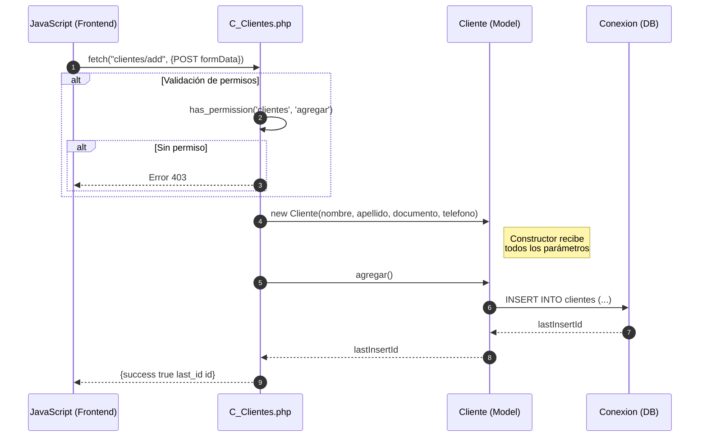
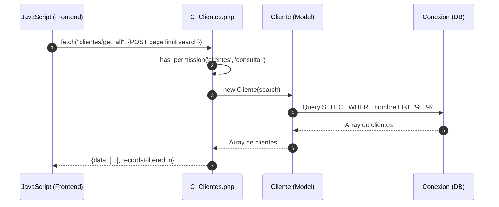
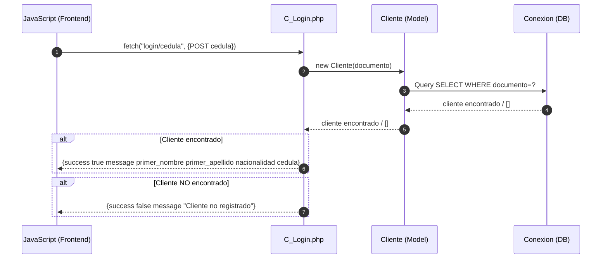
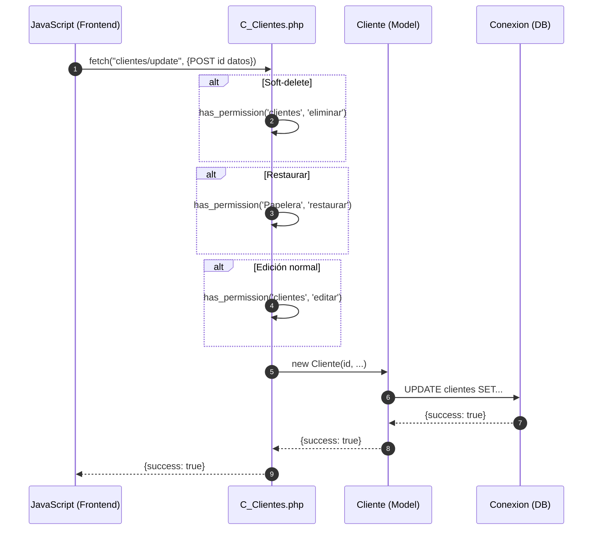
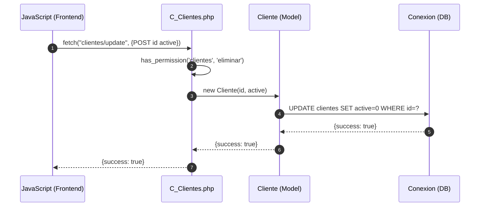

# Módulo Clientes - Diagrama de Secuencia

## Agregar Cliente

```mermaid
sequenceDiagram
    autonumber
    participant JS as JavaScript (Frontend)
    participant C_Clientes as C_Clientes.php
    participant Cliente as Cliente (Model)
    participant DB as Conexion (DB)
    
    JS->>C_Clientes: fetch("clientes/add", {POST formData})
    
    alt Validación de permisos
        C_Clientes->>C_Clientes: has_permission('clientes', 'agregar')
        alt Sin permiso
            C_Clientes-->>JS: Error 403
        end
    end
    
    C_Clientes->>Cliente: new Cliente(nombre, apellido, documento, telefono)
    Note right of Cliente: Constructor recibe<br/>todos los parámetros
    
    C_Clientes->>Cliente: agregar()
    Cliente->>DB: INSERT INTO clientes (...)
    DB-->>Cliente: lastInsertId
    Cliente-->>C_Clientes: lastInsertId
    
    C_Clientes-->>JS: {success true last_id id}
```

## Consultar Clientes

```mermaid
sequenceDiagram
    autonumber
    participant JS as JavaScript (Frontend)
    participant C_Clientes as C_Clientes.php
    participant Cliente as Cliente (Model)
    participant DB as Conexion (DB)
    
    JS->>C_Clientes: fetch("clientes/get_all", {POST page limit search})
    
    C_Clientes->>C_Clientes: has_permission('clientes', 'consultar')
    
    C_Clientes->>Cliente: new Cliente(search)
    Cliente->>DB: Query SELECT WHERE nombre LIKE '%...%'
    DB-->>Cliente: Array de clientes
    Cliente-->>C_Clientes: Array de clientes
    
    C_Clientes-->>JS: {data: [...], recordsFiltered: n}
```

## Buscar Cliente por Cédula (Login)

```mermaid
sequenceDiagram
    autonumber
    participant JS as JavaScript (Frontend)
    participant C_Login as C_Login.php
    participant Cliente as Cliente (Model)
    participant DB as Conexion (DB)
    
    JS->>C_Login: fetch("login/cedula", {POST cedula})
    
    C_Login->>Cliente: new Cliente(documento)
    Cliente->>DB: Query SELECT WHERE documento=?
    DB-->>Cliente: cliente encontrado / []
    Cliente-->>C_Login: cliente encontrado / []
    
    alt Cliente encontrado
        C_Login-->>JS: {success true message primer_nombre primer_apellido nacionalidad cedula}
    end
    
    alt Cliente NO encontrado
        C_Login-->>JS: {success false message "Cliente no registrado"}
    end
```

## Actualizar Cliente

```mermaid
sequenceDiagram
    autonumber
    participant JS as JavaScript (Frontend)
    participant C_Clientes as C_Clientes.php
    participant Cliente as Cliente (Model)
    participant DB as Conexion (DB)
    
    JS->>C_Clientes: fetch("clientes/update", {POST id datos})
    
    alt Soft-delete
        C_Clientes->>C_Clientes: has_permission('clientes', 'eliminar')
    end
    
    alt Restaurar
        C_Clientes->>C_Clientes: has_permission('Papelera', 'restaurar')
    end
    
    alt Edición normal
        C_Clientes->>C_Clientes: has_permission('clientes', 'editar')
    end
    
    C_Clientes->>Cliente: new Cliente(id, ...)
    Cliente->>DB: UPDATE clientes SET...
    DB-->>Cliente: {success: true}
    Cliente-->>C_Clientes: {success: true}
    
    C_Clientes-->>JS: {success: true}
```

## Eliminar Cliente (Soft-delete)

```mermaid
sequenceDiagram
    autonumber
    participant JS as JavaScript (Frontend)
    participant C_Clientes as C_Clientes.php
    participant Cliente as Cliente (Model)
    participant DB as Conexion (DB)
    
    JS->>C_Clientes: fetch("clientes/update", {POST id active})
    
    C_Clientes->>C_Clientes: has_permission('clientes', 'eliminar')
    
    C_Clientes->>Cliente: new Cliente(id, active)
    Cliente->>DB: UPDATE clientes SET active=0 WHERE id=?
    DB-->>Cliente: {success: true}
    Cliente-->>C_Clientes: {success: true}
    
    C_Clientes-->>JS: {success: true}
```
