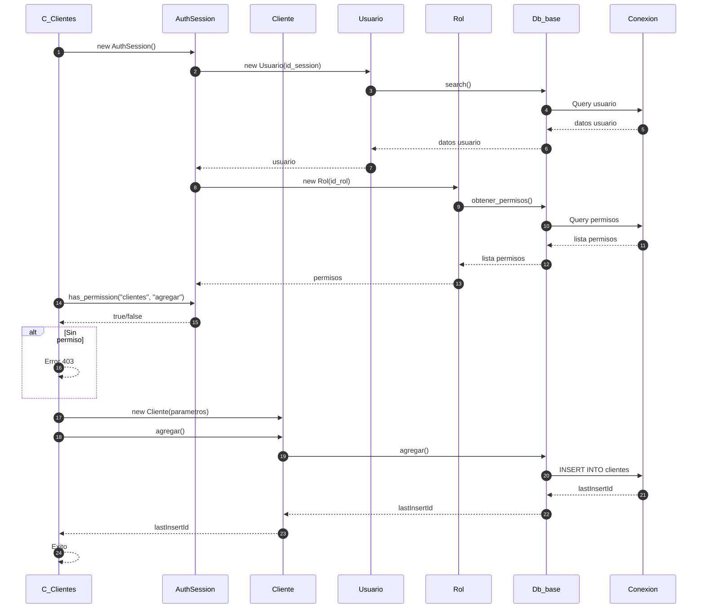
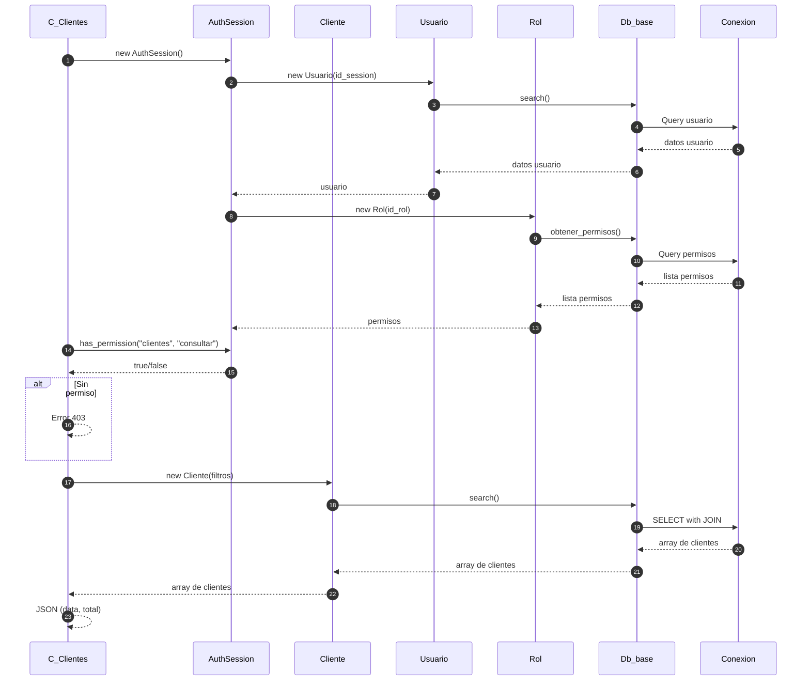
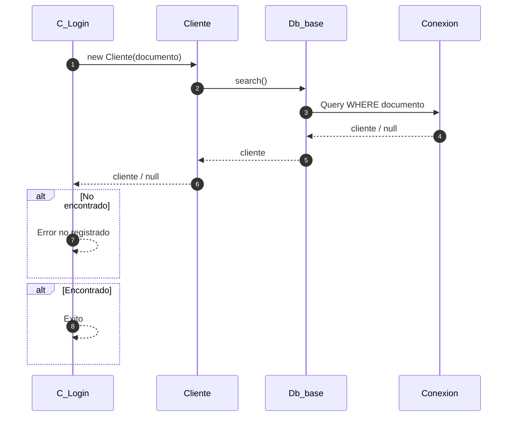
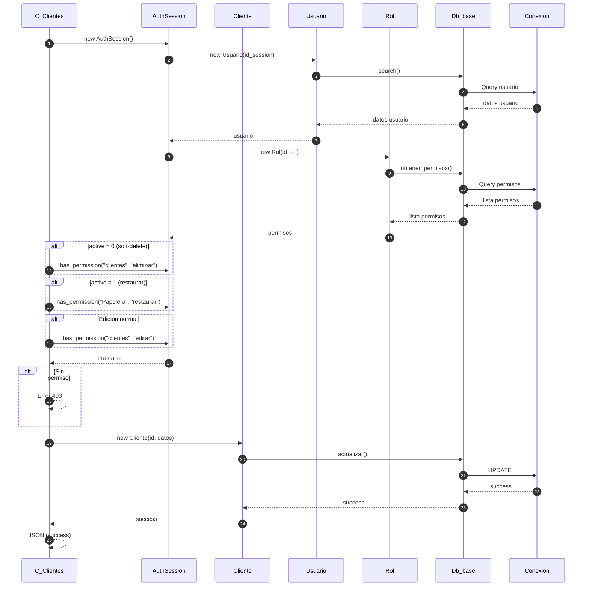
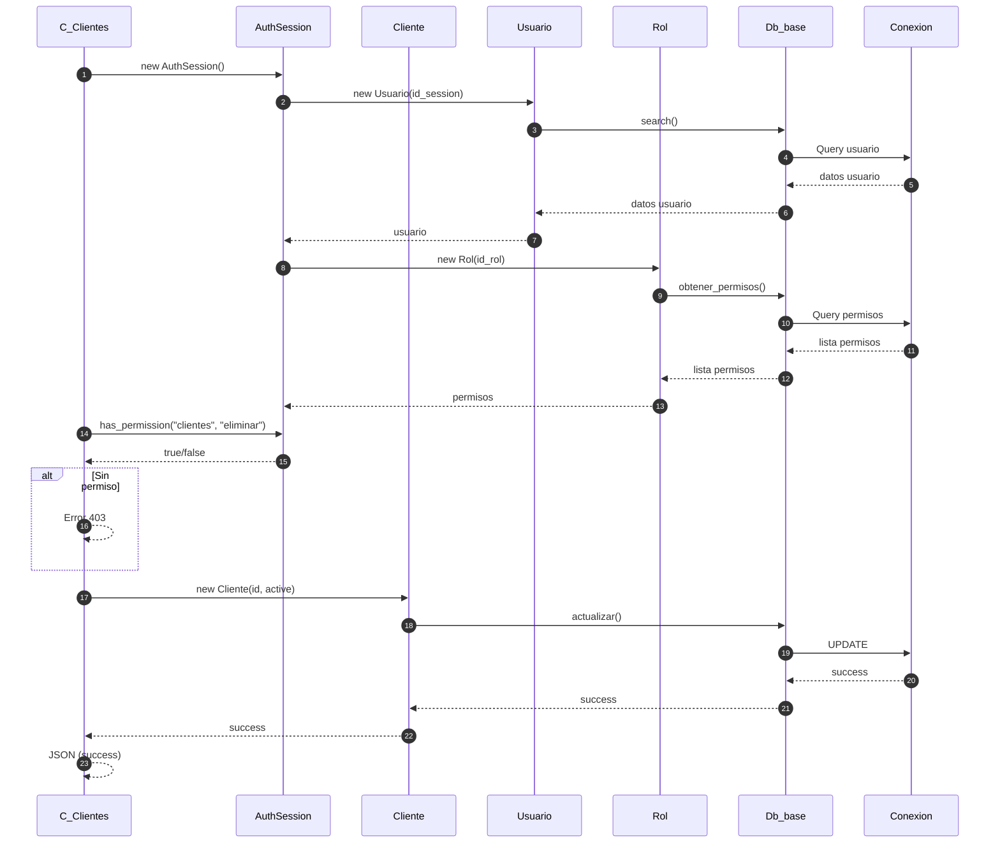

# Modulo Clientes - Diagrama de Secuencia

## Agregar Cliente

```mermaid
sequenceDiagram
    autonumber
    participant C_Clientes as C_Clientes
    participant AuthSession as AuthSession
    participant Cliente as Cliente
    participant Usuario as Usuario
    participant Rol as Rol
    participant Db_base as Db_base
    participant Conexion as Conexion
    
    C_Clientes->>AuthSession: new AuthSession()
    AuthSession->>Usuario: new Usuario(id_session)
    Usuario->>Db_base: search()
    Db_base->>Conexion: Query usuario
    Conexion-->>Db_base: datos usuario
    Db_base-->>Usuario: datos usuario
    Usuario-->>AuthSession: usuario
    
    AuthSession->>Rol: new Rol(id_rol)
    Rol->>Db_base: obtener_permisos()
    Db_base->>Conexion: Query permisos
    Conexion-->>Db_base: lista permisos
    Db_base-->>Rol: lista permisos
    Rol-->>AuthSession: permisos
    
    C_Clientes->>AuthSession: has_permission("clientes", "agregar")
    AuthSession-->>C_Clientes: true/false
    
    alt Sin permiso
        C_Clientes-->>C_Clientes: Error 403
    end
    
    C_Clientes->>Cliente: new Cliente(parametros)
    C_Clientes->>Cliente: agregar()
    Cliente->>Db_base: agregar()
    Db_base->>Conexion: INSERT INTO clientes
    Conexion-->>Db_base: lastInsertId
    Db_base-->>Cliente: lastInsertId
    Cliente-->>C_Clientes: lastInsertId
    
    C_Clientes-->>C_Clientes: Exito
```

## Consultar Clientes

```mermaid
sequenceDiagram
    autonumber
    participant C_Clientes as C_Clientes
    participant AuthSession as AuthSession
    participant Cliente as Cliente
    participant Usuario as Usuario
    participant Rol as Rol
    participant Db_base as Db_base
    participant Conexion as Conexion
    
    C_Clientes->>AuthSession: new AuthSession()
    AuthSession->>Usuario: new Usuario(id_session)
    Usuario->>Db_base: search()
    Db_base->>Conexion: Query usuario
    Conexion-->>Db_base: datos usuario
    Db_base-->>Usuario: datos usuario
    Usuario-->>AuthSession: usuario
    
    AuthSession->>Rol: new Rol(id_rol)
    Rol->>Db_base: obtener_permisos()
    Db_base->>Conexion: Query permisos
    Conexion-->>Db_base: lista permisos
    Db_base-->>Rol: lista permisos
    Rol-->>AuthSession: permisos
    
    C_Clientes->>AuthSession: has_permission("clientes", "consultar")
    AuthSession-->>C_Clientes: true/false
    
    alt Sin permiso
        C_Clientes-->>C_Clientes: Error 403
    end
    
    C_Clientes->>Cliente: new Cliente(filtros)
    Cliente->>Db_base: search()
    Db_base->>Conexion: SELECT with JOIN
    Conexion-->>Db_base: array de clientes
    Db_base-->>Cliente: array de clientes
    Cliente-->>C_Clientes: array de clientes
    
    C_Clientes-->>C_Clientes: JSON (data, total)
```

## Buscar Cliente por Cedula

```mermaid
sequenceDiagram
    autonumber
    participant C_Login as C_Login
    participant Cliente as Cliente
    participant Db_base as Db_base
    participant Conexion as Conexion
    
    C_Login->>Cliente: new Cliente(documento)
    Cliente->>Db_base: search()
    Db_base->>Conexion: Query WHERE documento
    Conexion-->>Db_base: cliente / null
    Db_base-->>Cliente: cliente
    Cliente-->>C_Login: cliente / null
    
    alt No encontrado
        C_Login-->>C_Login: Error no registrado
    end
    
    alt Encontrado
        C_Login-->>C_Login: Exito
    end
```

## Actualizar Cliente

```mermaid
sequenceDiagram
    autonumber
    participant C_Clientes as C_Clientes
    participant AuthSession as AuthSession
    participant Cliente as Cliente
    participant Usuario as Usuario
    participant Rol as Rol
    participant Db_base as Db_base
    participant Conexion as Conexion
    
    C_Clientes->>AuthSession: new AuthSession()
    AuthSession->>Usuario: new Usuario(id_session)
    Usuario->>Db_base: search()
    Db_base->>Conexion: Query usuario
    Conexion-->>Db_base: datos usuario
    Db_base-->>Usuario: datos usuario
    Usuario-->>AuthSession: usuario
    
    AuthSession->>Rol: new Rol(id_rol)
    Rol->>Db_base: obtener_permisos()
    Db_base->>Conexion: Query permisos
    Conexion-->>Db_base: lista permisos
    Db_base-->>Rol: lista permisos
    Rol-->>AuthSession: permisos
    
    alt active = 0 (soft-delete)
        C_Clientes->>AuthSession: has_permission("clientes", "eliminar")
    end
    
    alt active = 1 (restaurar)
        C_Clientes->>AuthSession: has_permission("Papelera", "restaurar")
    end
    
    alt Edicion normal
        C_Clientes->>AuthSession: has_permission("clientes", "editar")
    end
    
    AuthSession-->>C_Clientes: true/false
    
    alt Sin permiso
        C_Clientes-->>C_Clientes: Error 403
    end
    
    C_Clientes->>Cliente: new Cliente(id, datos)
    Cliente->>Db_base: actualizar()
    Db_base->>Conexion: UPDATE
    Conexion-->>Db_base: success
    Db_base-->>Cliente: success
    Cliente-->>C_Clientes: success
    
    C_Clientes-->>C_Clientes: JSON (success)
```

## Eliminar Cliente

```mermaid
sequenceDiagram
    autonumber
    participant C_Clientes as C_Clientes
    participant AuthSession as AuthSession
    participant Cliente as Cliente
    participant Usuario as Usuario
    participant Rol as Rol
    participant Db_base as Db_base
    participant Conexion as Conexion
    
    C_Clientes->>AuthSession: new AuthSession()
    AuthSession->>Usuario: new Usuario(id_session)
    Usuario->>Db_base: search()
    Db_base->>Conexion: Query usuario
    Conexion-->>Db_base: datos usuario
    Db_base-->>Usuario: datos usuario
    Usuario-->>AuthSession: usuario
    
    AuthSession->>Rol: new Rol(id_rol)
    Rol->>Db_base: obtener_permisos()
    Db_base->>Conexion: Query permisos
    Conexion-->>Db_base: lista permisos
    Db_base-->>Rol: lista permisos
    Rol-->>AuthSession: permisos
    
    C_Clientes->>AuthSession: has_permission("clientes", "eliminar")
    AuthSession-->>C_Clientes: true/false
    
    alt Sin permiso
        C_Clientes-->>C_Clientes: Error 403
    end
    
    C_Clientes->>Cliente: new Cliente(id, active)
    Cliente->>Db_base: actualizar()
    Db_base->>Conexion: UPDATE
    Conexion-->>Db_base: success
    Db_base-->>Cliente: success
    Cliente-->>C_Clientes: success
    
    C_Clientes-->>C_Clientes: JSON (success)
```
