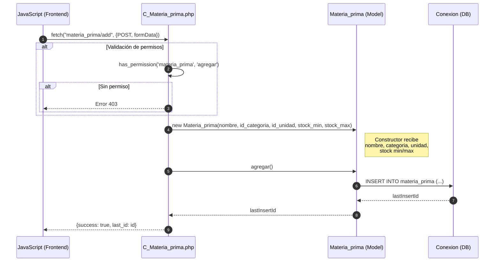
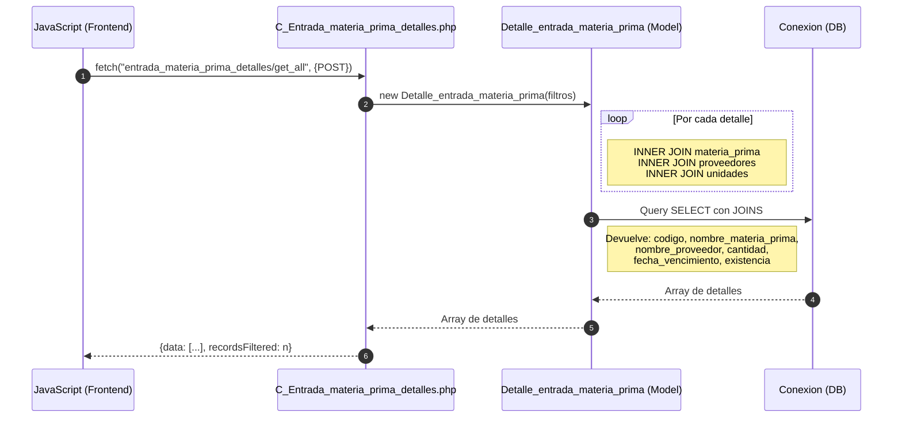
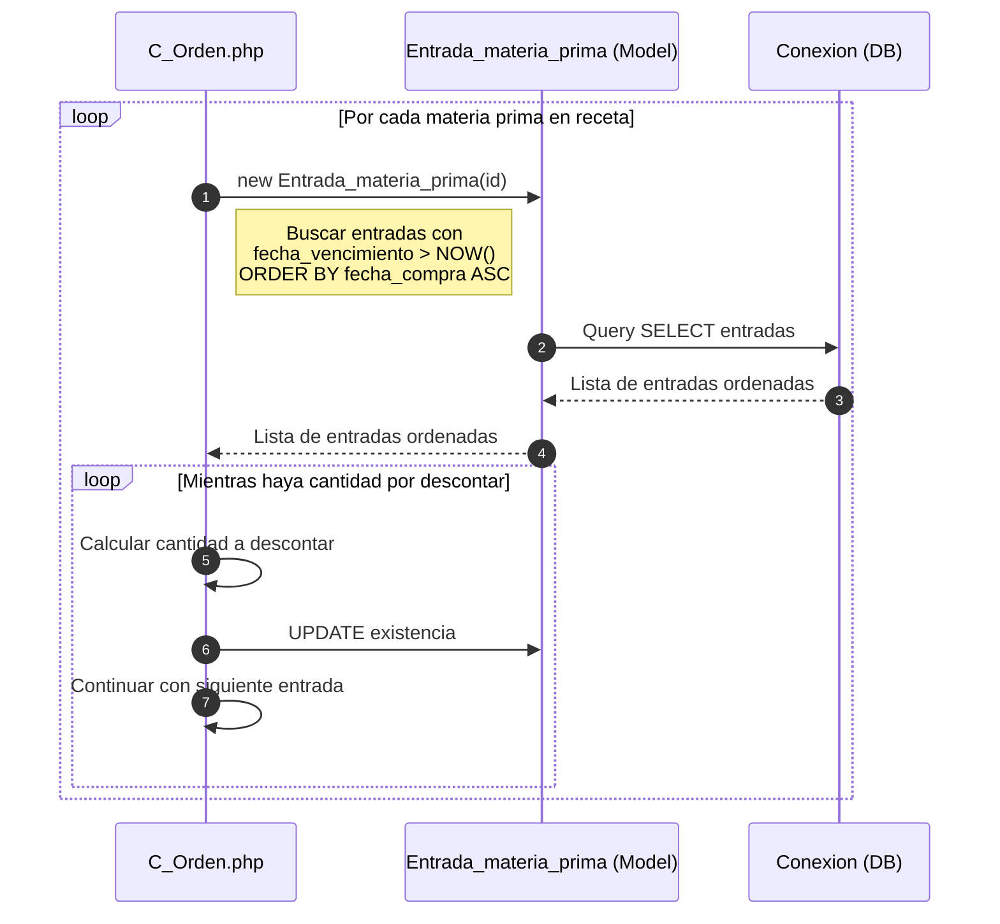

# Módulo Materia Prima - Diagrama de Secuencia

## Agregar Materia Prima



## Registrar Entrada de Materia Prima

```mermaid
sequenceDiagram
    autonumber
    participant JS as JavaScript (Frontend)
    participant C_Entrada_mp as C_Entrada_materia_prima.php
    participant Entrada_mp as Entrada_materia_prima (Model)
    participant Detalle_mp as Detalle_entrada_materia_prima (Model)
    participant DB as Conexion (DB)
    
    JS->>C_Entrada_mp: fetch("entrada_materia_prima/add", {POST, id_proveedor, fecha_compra})
    
    C_Entrada_mp->>Entrada_mp: new Entrada_materia_prima(id_proveedor, fecha_compra)
    Entrada_mp->>DB: INSERT INTO entradas_materia_prima (...)
    DB-->>Entrada_mp: id_entrada
    Entrada_mp-->>C_Entrada_mp: id_entrada
    
    loop Por cada item (materia prima)
        C_Entrada_mp->>Detalle_mp: new Detalle_entrada_materia_prima(
            id_entrada, 
            id_materia_prima, 
            cantidad, 
            fecha_vencimiento, 
            codigo
        )
        Detalle_mp->>DB: INSERT INTO detalles_entradas_materia_prima
        DB-->>Detalle_mp: lastInsertId
        Detalle_mp-->>C_Entrada_mp: lastInsertId
        
        C_Entrada_mp->>C_Entrada_mp: Actualizar existencia de materia_prima
    end
    
    C_Entrada_mp-->>JS: {success: true, last_id: id_entrada}
```

## Consultar Entradas de Materia Prima



## Agregar Pago de Entrada Materia Prima

```mermaid
sequenceDiagram
    autonumber
    participant JS as JavaScript (Frontend)
    participant C_Pago_mp as C_Pago_entrada_materia_prima.php
    participant Pago_mp as Pago_entrada_materia_prima (Model)
    participant DB as Conexion (DB)
    
    JS->>C_Pago_mp: fetch("pago_entrada_materia_prima/add", {POST, formData})
    
    C_Pago_mp->>Pago_mp: new Pago_entrada_materia_prima(
        id_entrada, 
        id_metodo_pago, 
        precio_compra, 
        tasa
    )
    
    Pago_mp->>DB: INSERT INTO pagos_entrada_materia_prima
    DB-->>Pago_mp: lastInsertId
    Pago_mp-->>C_Pago_mp: lastInsertId
    
    alt Si hay comprobante
        C_Pago_mp->>C_Pago_mp: move_uploaded_file(comprobante)
    end
    
    C_Pago_mp-->>JS: {success: true, last_id: id}
```

## Actualizar Existencia (Descontar Stock)


