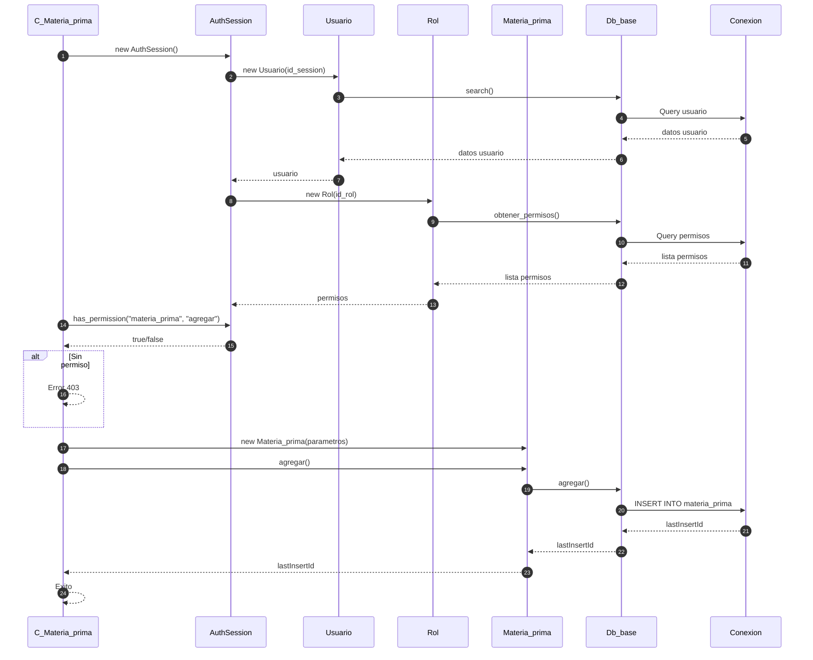
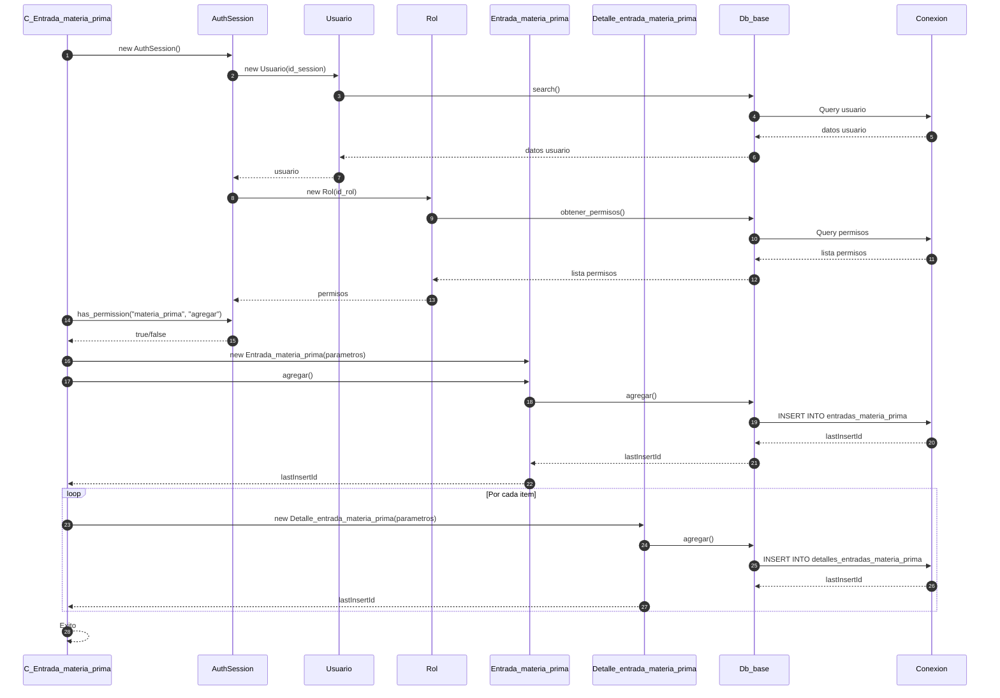
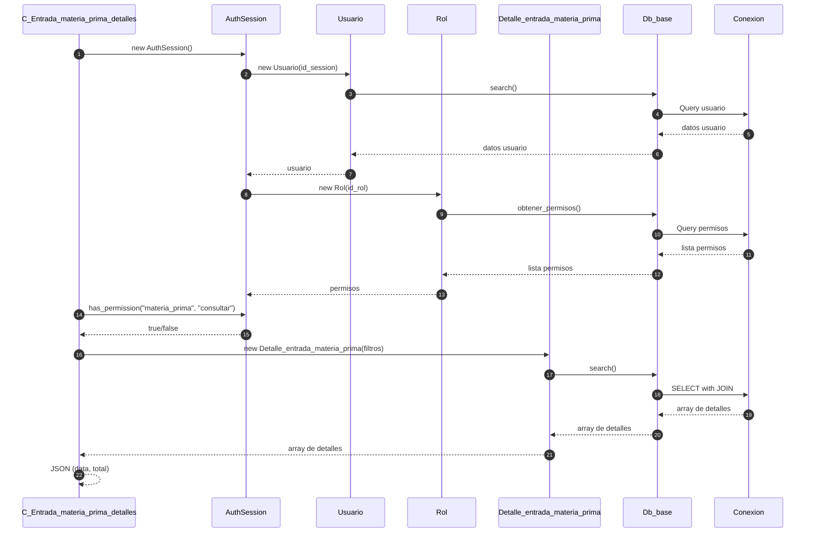
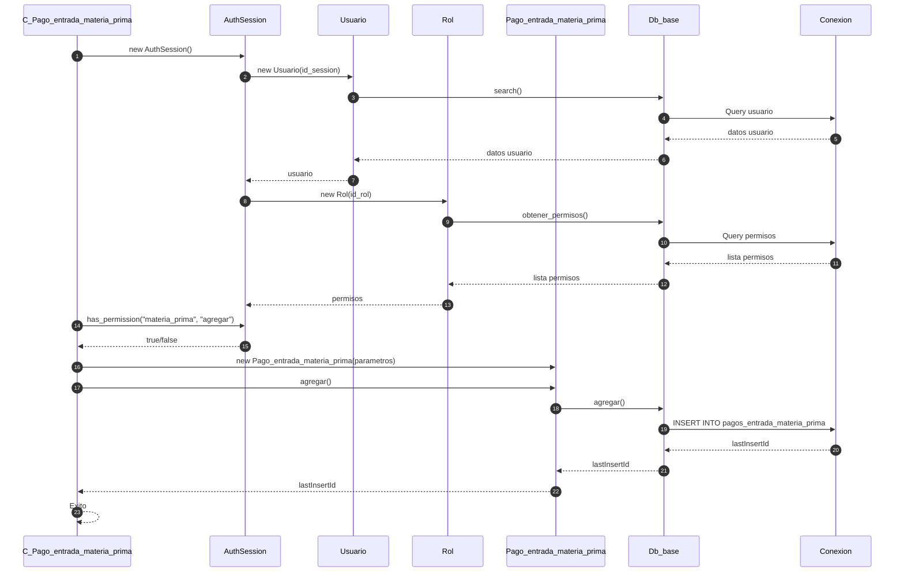
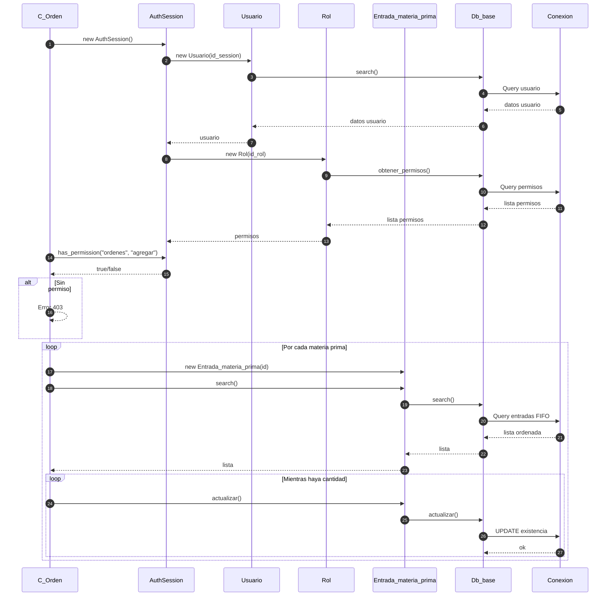

# Modulo Materia Prima - Diagrama de Secuencia

## Agregar Materia Prima

## Registrar Entrada de Materia Prima

## Consultar Entradas de Materia Prima

## Agregar Pago de Entrada Materia Prima

## Actualizar Existencia (Descontar Stock)

