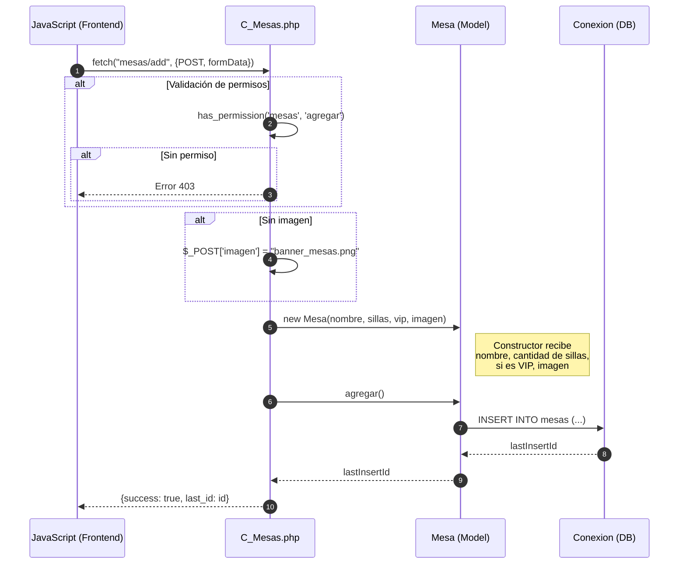
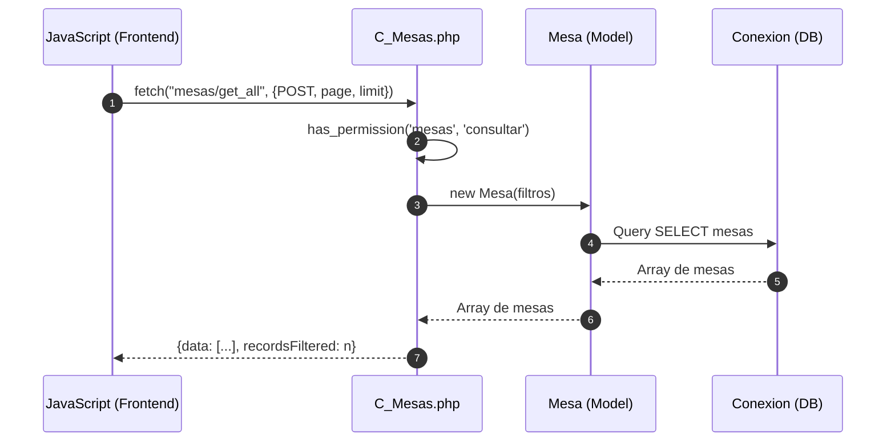
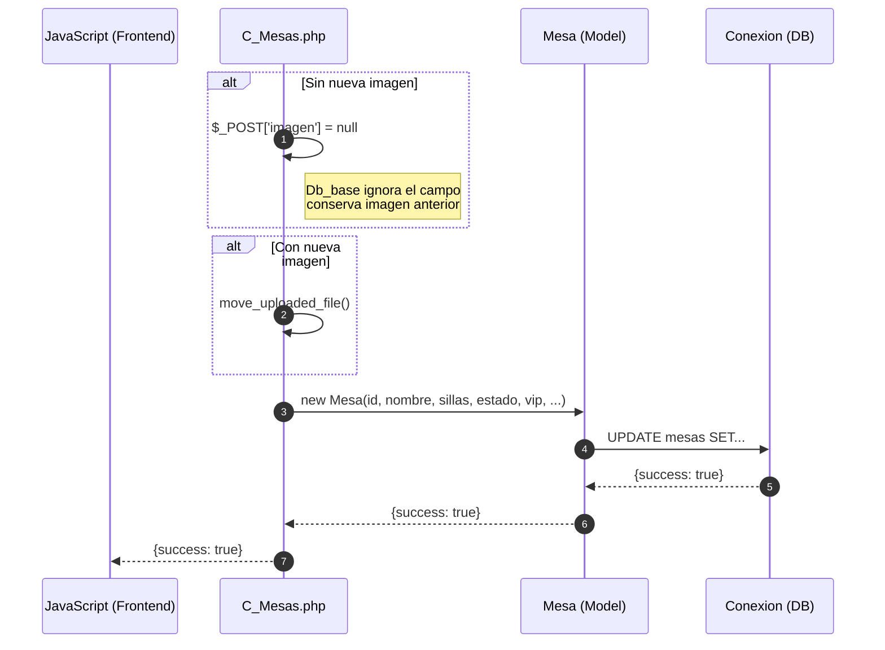
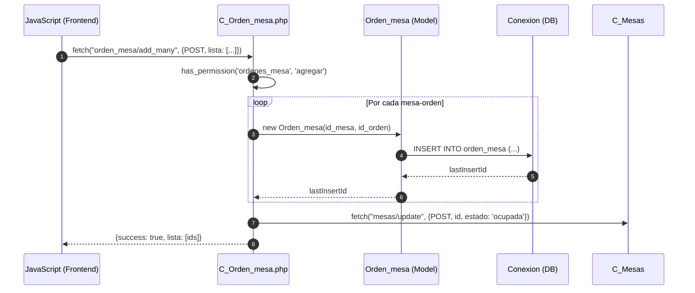
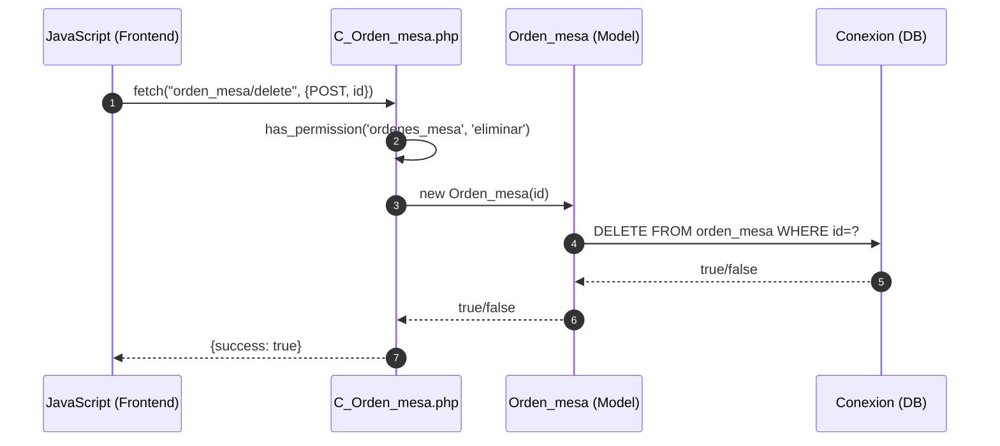

# Módulo Mesas - Diagrama de Secuencia

## Agregar Mesa

```mermaid
sequenceDiagram
    autonumber
    participant JS as JavaScript (Frontend)
    participant C_Mesas as C_Mesas.php
    participant Mesa as Mesa (Model)
    participant DB as Conexion (DB)
    
    JS->>C_Mesas: fetch("mesas/add", {POST, formData})
    
    alt Validación de permisos
        C_Mesas->>C_Mesas: has_permission('mesas', 'agregar')
        alt Sin permiso
            C_Mesas-->>JS: Error 403
        end
    end
    
    alt Sin imagen
        C_Mesas->>C_Mesas: $_POST['imagen'] = "banner_mesas.png"
    end
    
    C_Mesas->>Mesa: new Mesa(nombre, sillas, vip, imagen)
    Note right of Mesa: Constructor recibe<br/>nombre, cantidad de sillas,<br/>si es VIP, imagen
    
    C_Mesas->>Mesa: agregar()
    Mesa->>DB: INSERT INTO mesas (...)
    DB-->>Mesa: lastInsertId
    Mesa-->>C_Mesas: lastInsertId
    
    C_Mesas-->>JS: {success: true, last_id: id}
```

## Consultar Mesas

```mermaid
sequenceDiagram
    autonumber
    participant JS as JavaScript (Frontend)
    participant C_Mesas as C_Mesas.php
    participant Mesa as Mesa (Model)
    participant DB as Conexion (DB)
    
    JS->>C_Mesas: fetch("mesas/get_all", {POST, page, limit})
    
    C_Mesas->>C_Mesas: has_permission('mesas', 'consultar')
    
    C_Mesas->>Mesa: new Mesa(filtros)
    Mesa->>DB: Query SELECT mesas
    DB-->>Mesa: Array de mesas
    Mesa-->>C_Mesas: Array de mesas
    
    C_Mesas-->>JS: {data: [...], recordsFiltered: n}
```

## Actualizar Mesa

```mermaid
sequenceDiagram
    autonumber
    participant JS as JavaScript (Frontend)
    participant C_Mesas as C_Mesas.php
    participant Mesa as Mesa (Model)
    participant DB as Conexion (DB)
    
    alt Sin nueva imagen
        C_Mesas->>C_Mesas: $_POST['imagen'] = null
        Note right of C_Mesas: Db_base ignora el campo<br/>conserva imagen anterior
    end
    
    alt Con nueva imagen
        C_Mesas->>C_Mesas: move_uploaded_file()
    end
    
    C_Mesas->>Mesa: new Mesa(id, nombre, sillas, estado, vip, ...)
    Mesa->>DB: UPDATE mesas SET...
    DB-->>Mesa: {success: true}
    Mesa-->>C_Mesas: {success: true}
    
    C_Mesas-->>JS: {success: true}
```

## Bloquear Mesa (para orden local)

```mermaid
sequenceDiagram
    autonumber
    participant JS as JavaScript (Frontend)
    participant C_Orden_mesa as C_Orden_mesa.php
    participant Orden_mesa as Orden_mesa (Model)
    participant DB as Conexion (DB)
    
    JS->>C_Orden_mesa: fetch("orden_mesa/add_many", {POST, lista: [...]})
    
    C_Orden_mesa->>C_Orden_mesa: has_permission('ordenes_mesa', 'agregar')
    
    loop Por cada mesa-orden
        C_Orden_mesa->>Orden_mesa: new Orden_mesa(id_mesa, id_orden)
        Orden_mesa->>DB: INSERT INTO orden_mesa (...)
        DB-->>Orden_mesa: lastInsertId
        Orden_mesa-->>C_Orden_mesa: lastInsertId
    end
    
    C_Orden_mesa->>C_Mesas: fetch("mesas/update", {POST, id, estado: 'ocupada'})
    
    C_Orden_mesa-->>JS: {success: true, lista: [ids]}
```

## Liberar Mesa (al pagar orden)

```mermaid
sequenceDiagram
    autonumber
    participant JS as JavaScript (Frontend)
    participant C_Orden_mesa as C_Orden_mesa.php
    participant Orden_mesa as Orden_mesa (Model)
    participant DB as Conexion (DB)
    
    JS->>C_Orden_mesa: fetch("orden_mesa/delete", {POST, id})
    
    C_Orden_mesa->>C_Orden_mesa: has_permission('ordenes_mesa', 'eliminar')
    
    C_Orden_mesa->>Orden_mesa: new Orden_mesa(id)
    Orden_mesa->>DB: DELETE FROM orden_mesa WHERE id=?
    DB-->>Orden_mesa: true/false
    Orden_mesa-->>C_Orden_mesa: true/false
    
    C_Orden_mesa-->>JS: {success: true}
```
