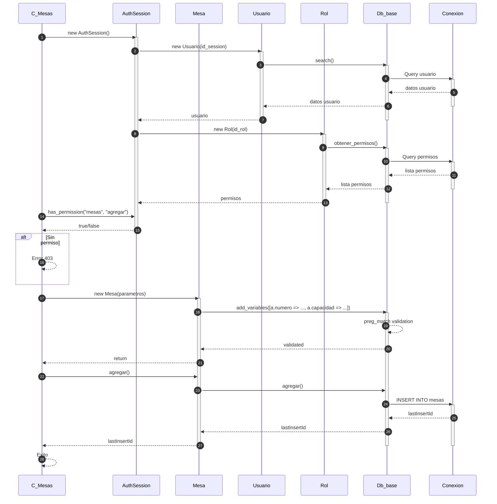
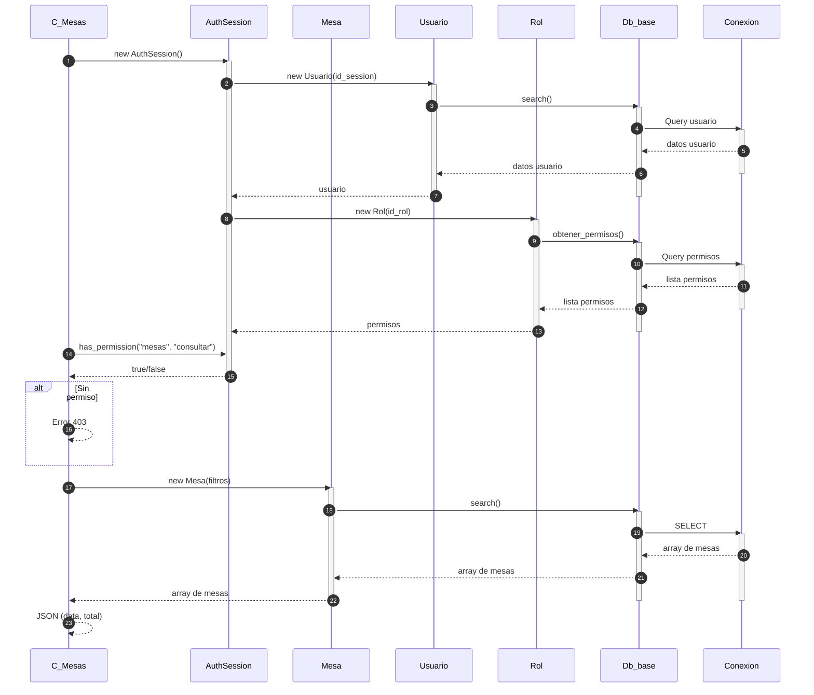
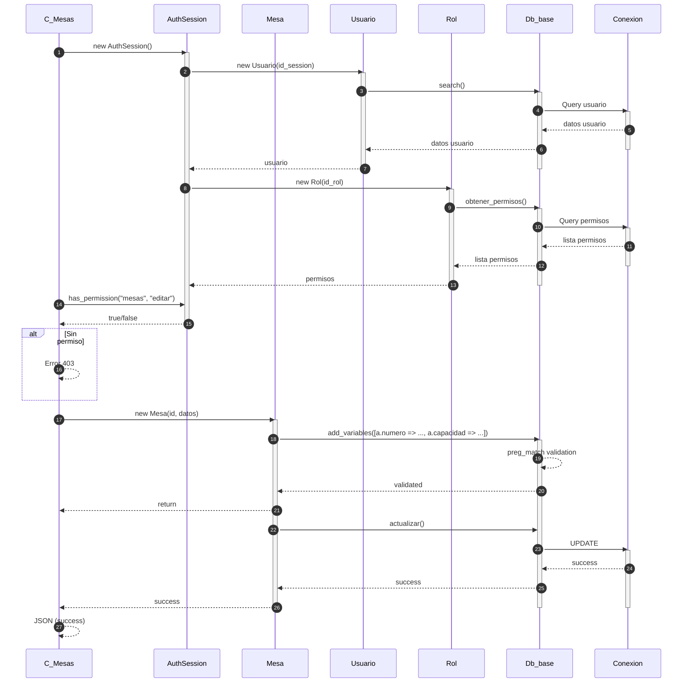
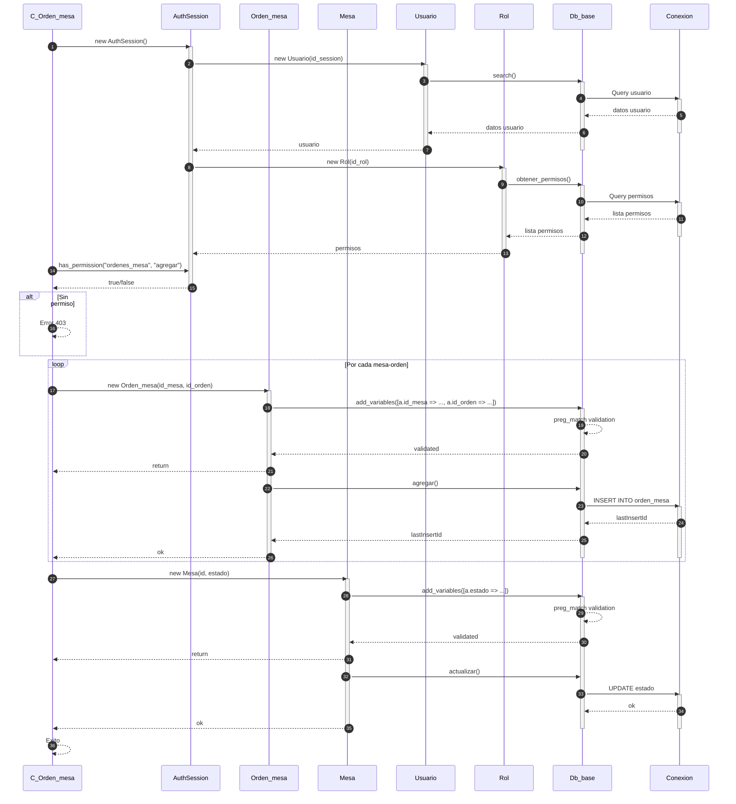
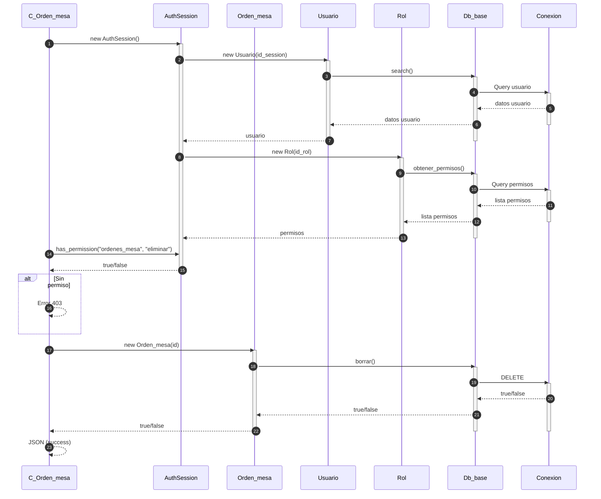

# Modulo Mesas - Diagrama de Secuencia

## Agregar Mesa

```mermaid
sequenceDiagram
    autonumber
    participant C_Mesas as C_Mesas
    participant AuthSession as AuthSession
    participant Mesa as Mesa
    participant Usuario as Usuario
    participant Rol as Rol
    participant Db_base as Db_base
    participant Conexion as Conexion
    
    C_Mesas->>AuthSession: new AuthSession()
    activate AuthSession
    AuthSession->>Usuario: new Usuario(id_session)
    activate Usuario
    Usuario->>Db_base: search()
    activate Db_base
    Db_base->>Conexion: Query usuario
    activate Conexion
    Conexion-->>Db_base: datos usuario
    Db_base-->>Usuario: datos usuario
    deactivate Conexion
    Usuario-->>AuthSession: usuario
    deactivate Usuario
    deactivate Db_base
    
    AuthSession->>Rol: new Rol(id_rol)
    activate Rol
    Rol->>Db_base: obtener_permisos()
    activate Db_base
    Db_base->>Conexion: Query permisos
    activate Conexion
    Conexion-->>Db_base: lista permisos
    Db_base-->>Rol: lista permisos
    deactivate Conexion
    Rol-->>AuthSession: permisos
    deactivate Rol
    deactivate Db_base
    
    C_Mesas->>AuthSession: has_permission("mesas", "agregar")
    AuthSession-->>C_Mesas: true/false
    deactivate AuthSession
    
    alt Sin permiso
        C_Mesas-->>C_Mesas: Error 403
    end
    
    C_Mesas->>Mesa: new Mesa(parametros)
    activate Mesa
    Mesa->>Db_base: add_variables([a.numero => ..., a.capacidad => ...])
    activate Db_base
    Db_base-->>Db_base: preg_match validation
    Db_base-->>Mesa: validated
    Mesa-->>C_Mesas: return
    C_Mesas->>Mesa: agregar()
    Mesa->>Db_base: agregar()
    Db_base->>Conexion: INSERT INTO mesas
    activate Conexion
    Conexion-->>Db_base: lastInsertId
    Db_base-->>Mesa: lastInsertId
    Mesa-->>C_Mesas: lastInsertId
    deactivate Mesa
    deactivate Conexion
    deactivate Db_base
    
    C_Mesas-->>C_Mesas: Exito
```

## Consultar Mesas

```mermaid
sequenceDiagram
    autonumber
    participant C_Mesas as C_Mesas
    participant AuthSession as AuthSession
    participant Mesa as Mesa
    participant Usuario as Usuario
    participant Rol as Rol
    participant Db_base as Db_base
    participant Conexion as Conexion
    
    C_Mesas->>AuthSession: new AuthSession()
    activate AuthSession
    AuthSession->>Usuario: new Usuario(id_session)
    activate Usuario
    Usuario->>Db_base: search()
    activate Db_base
    Db_base->>Conexion: Query usuario
    activate Conexion
    Conexion-->>Db_base: datos usuario
    Db_base-->>Usuario: datos usuario
    deactivate Conexion
    Usuario-->>AuthSession: usuario
    deactivate Usuario
    deactivate Db_base
    
    AuthSession->>Rol: new Rol(id_rol)
    activate Rol
    Rol->>Db_base: obtener_permisos()
    activate Db_base
    Db_base->>Conexion: Query permisos
    activate Conexion
    Conexion-->>Db_base: lista permisos
    Db_base-->>Rol: lista permisos
    deactivate Conexion
    Rol-->>AuthSession: permisos
    deactivate Rol
    deactivate Db_base
    
    C_Mesas->>AuthSession: has_permission("mesas", "consultar")
    AuthSession-->>C_Mesas: true/false
    deactivate AuthSession
    
    alt Sin permiso
        C_Mesas-->>C_Mesas: Error 403
    end
    
    C_Mesas->>Mesa: new Mesa(filtros)
    activate Mesa
    Mesa->>Db_base: search()
    activate Db_base
    Db_base->>Conexion: SELECT
    activate Conexion
    Conexion-->>Db_base: array de mesas
    Db_base-->>Mesa: array de mesas
    Mesa-->>C_Mesas: array de mesas
    deactivate Mesa
    deactivate Conexion
    deactivate Db_base
    
    C_Mesas-->>C_Mesas: JSON (data, total)
```

## Actualizar Mesa

```mermaid
sequenceDiagram
    autonumber
    participant C_Mesas as C_Mesas
    participant AuthSession as AuthSession
    participant Mesa as Mesa
    participant Usuario as Usuario
    participant Rol as Rol
    participant Db_base as Db_base
    participant Conexion as Conexion
    
    C_Mesas->>AuthSession: new AuthSession()
    activate AuthSession
    AuthSession->>Usuario: new Usuario(id_session)
    activate Usuario
    Usuario->>Db_base: search()
    activate Db_base
    Db_base->>Conexion: Query usuario
    activate Conexion
    Conexion-->>Db_base: datos usuario
    Db_base-->>Usuario: datos usuario
    deactivate Conexion
    Usuario-->>AuthSession: usuario
    deactivate Usuario
    deactivate Db_base
    
    AuthSession->>Rol: new Rol(id_rol)
    activate Rol
    Rol->>Db_base: obtener_permisos()
    activate Db_base
    Db_base->>Conexion: Query permisos
    activate Conexion
    Conexion-->>Db_base: lista permisos
    Db_base-->>Rol: lista permisos
    deactivate Conexion
    Rol-->>AuthSession: permisos
    deactivate Rol
    deactivate Db_base
    
    C_Mesas->>AuthSession: has_permission("mesas", "editar")
    AuthSession-->>C_Mesas: true/false
    deactivate AuthSession
    
    alt Sin permiso
        C_Mesas-->>C_Mesas: Error 403
    end
    
    C_Mesas->>Mesa: new Mesa(id, datos)
    activate Mesa
    Mesa->>Db_base: add_variables([a.numero => ..., a.capacidad => ...])
    activate Db_base
    Db_base-->>Db_base: preg_match validation
    Db_base-->>Mesa: validated
    Mesa-->>C_Mesas: return
    Mesa->>Db_base: actualizar()
    Db_base->>Conexion: UPDATE
    activate Conexion
    Conexion-->>Db_base: success
    Db_base-->>Mesa: success
    Mesa-->>C_Mesas: success
    deactivate Mesa
    deactivate Conexion
    deactivate Db_base
    
    C_Mesas-->>C_Mesas: JSON (success)
```

## Bloquear Mesa

```mermaid
sequenceDiagram
    autonumber
    participant C_Orden_mesa as C_Orden_mesa
    participant AuthSession as AuthSession
    participant Orden_mesa as Orden_mesa
    participant Mesa as Mesa
    participant Usuario as Usuario
    participant Rol as Rol
    participant Db_base as Db_base
    participant Conexion as Conexion
    
    C_Orden_mesa->>AuthSession: new AuthSession()
    activate AuthSession
    AuthSession->>Usuario: new Usuario(id_session)
    activate Usuario
    Usuario->>Db_base: search()
    activate Db_base
    Db_base->>Conexion: Query usuario
    activate Conexion
    Conexion-->>Db_base: datos usuario
    Db_base-->>Usuario: datos usuario
    deactivate Conexion
    Usuario-->>AuthSession: usuario
    deactivate Usuario
    deactivate Db_base
    
    AuthSession->>Rol: new Rol(id_rol)
    activate Rol
    Rol->>Db_base: obtener_permisos()
    activate Db_base
    Db_base->>Conexion: Query permisos
    activate Conexion
    Conexion-->>Db_base: lista permisos
    Db_base-->>Rol: lista permisos
    deactivate Conexion
    Rol-->>AuthSession: permisos
    deactivate Rol
    deactivate Db_base
    
    C_Orden_mesa->>AuthSession: has_permission("ordenes_mesa", "agregar")
    AuthSession-->>C_Orden_mesa: true/false
    deactivate AuthSession
    
    alt Sin permiso
        C_Orden_mesa-->>C_Orden_mesa: Error 403
    end
    
    loop Por cada mesa-orden
        C_Orden_mesa->>Orden_mesa: new Orden_mesa(id_mesa, id_orden)
        activate Orden_mesa
        Orden_mesa->>Db_base: add_variables([a.id_mesa => ..., a.id_orden => ...])
        activate Db_base
        Db_base-->>Db_base: preg_match validation
        Db_base-->>Orden_mesa: validated
        Orden_mesa-->>C_Orden_mesa: return
        Orden_mesa->>Db_base: agregar()
        Db_base->>Conexion: INSERT INTO orden_mesa
        activate Conexion
        Conexion-->>Db_base: lastInsertId
        Db_base-->>Orden_mesa: lastInsertId
        Orden_mesa-->>C_Orden_mesa: ok
        deactivate Orden_mesa
        deactivate Conexion
        deactivate Db_base
    end
    
    C_Orden_mesa->>Mesa: new Mesa(id, estado)
    activate Mesa
    Mesa->>Db_base: add_variables([a.estado => ...])
    activate Db_base
    Db_base-->>Db_base: preg_match validation
    Db_base-->>Mesa: validated
    Mesa-->>C_Orden_mesa: return
    Mesa->>Db_base: actualizar()
    Db_base->>Conexion: UPDATE estado
    activate Conexion
    Conexion-->>Db_base: ok
    Mesa-->>C_Orden_mesa: ok
    deactivate Mesa
    deactivate Conexion
    deactivate Db_base
    
    C_Orden_mesa-->>C_Orden_mesa: Exito
```

## Liberar Mesa

```mermaid
sequenceDiagram
    autonumber
    participant C_Orden_mesa as C_Orden_mesa
    participant AuthSession as AuthSession
    participant Orden_mesa as Orden_mesa
    participant Usuario as Usuario
    participant Rol as Rol
    participant Db_base as Db_base
    participant Conexion as Conexion
    
    C_Orden_mesa->>AuthSession: new AuthSession()
    activate AuthSession
    AuthSession->>Usuario: new Usuario(id_session)
    activate Usuario
    Usuario->>Db_base: search()
    activate Db_base
    Db_base->>Conexion: Query usuario
    activate Conexion
    Conexion-->>Db_base: datos usuario
    Db_base-->>Usuario: datos usuario
    deactivate Conexion
    Usuario-->>AuthSession: usuario
    deactivate Usuario
    deactivate Db_base
    
    AuthSession->>Rol: new Rol(id_rol)
    activate Rol
    Rol->>Db_base: obtener_permisos()
    activate Db_base
    Db_base->>Conexion: Query permisos
    activate Conexion
    Conexion-->>Db_base: lista permisos
    Db_base-->>Rol: lista permisos
    deactivate Conexion
    Rol-->>AuthSession: permisos
    deactivate Rol
    deactivate Db_base
    
    C_Orden_mesa->>AuthSession: has_permission("ordenes_mesa", "eliminar")
    AuthSession-->>C_Orden_mesa: true/false
    deactivate AuthSession
    
    alt Sin permiso
        C_Orden_mesa-->>C_Orden_mesa: Error 403
    end
    
    C_Orden_mesa->>Orden_mesa: new Orden_mesa(id)
    activate Orden_mesa
    Orden_mesa->>Db_base: borrar()
    activate Db_base
    Db_base->>Conexion: DELETE
    activate Conexion
    Conexion-->>Db_base: true/false
    Db_base-->>Orden_mesa: true/false
    Orden_mesa-->>C_Orden_mesa: true/false
    deactivate Orden_mesa
    deactivate Conexion
    deactivate Db_base
    
    C_Orden_mesa-->>C_Orden_mesa: JSON (success)
```
