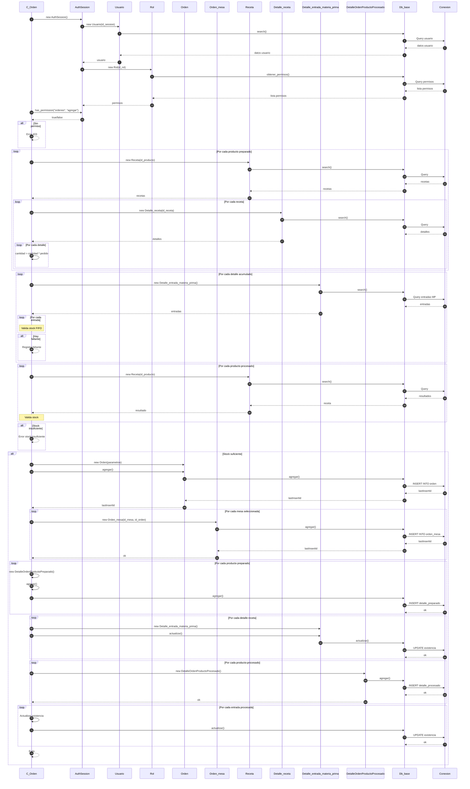
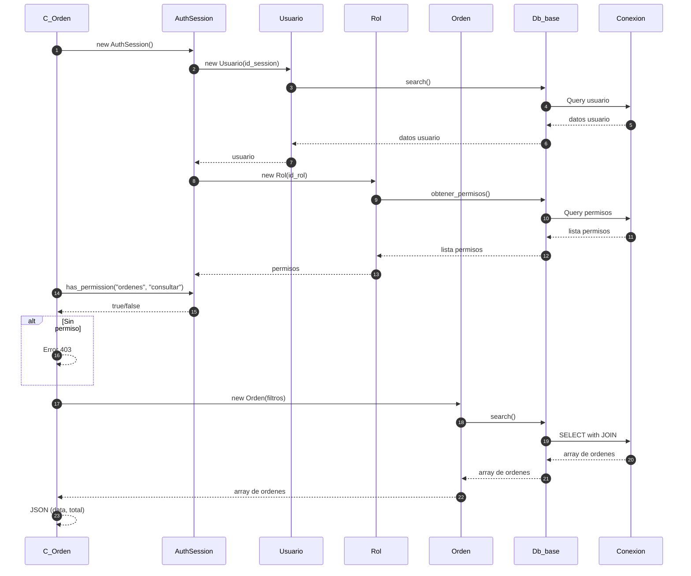
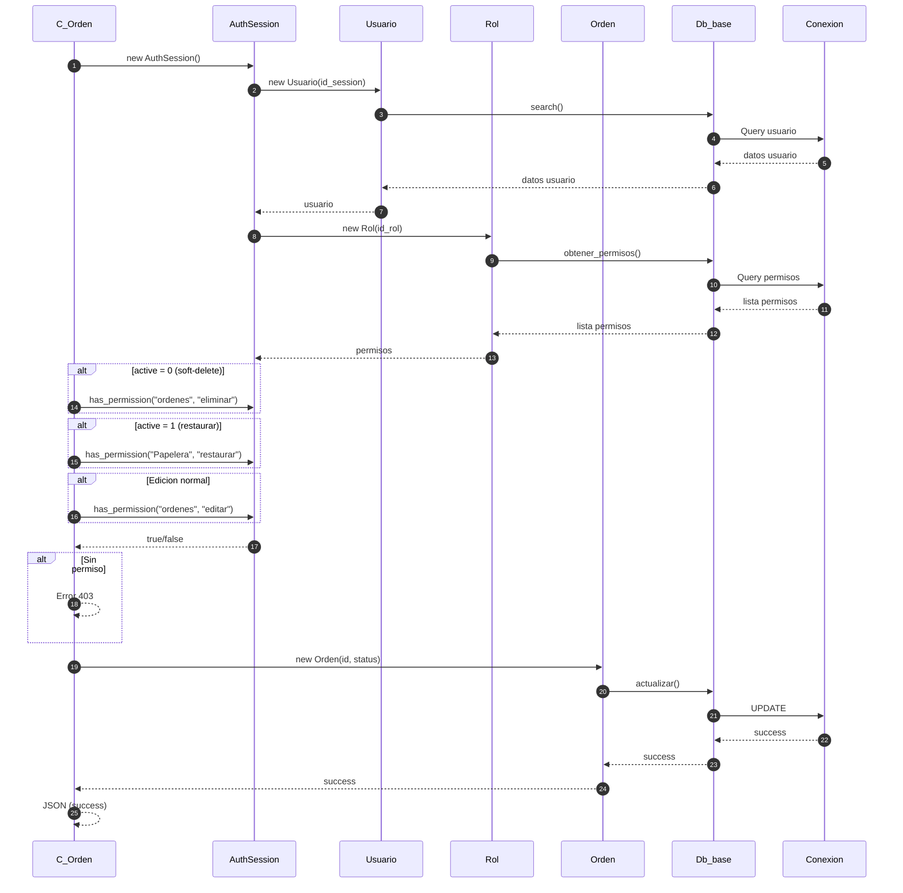
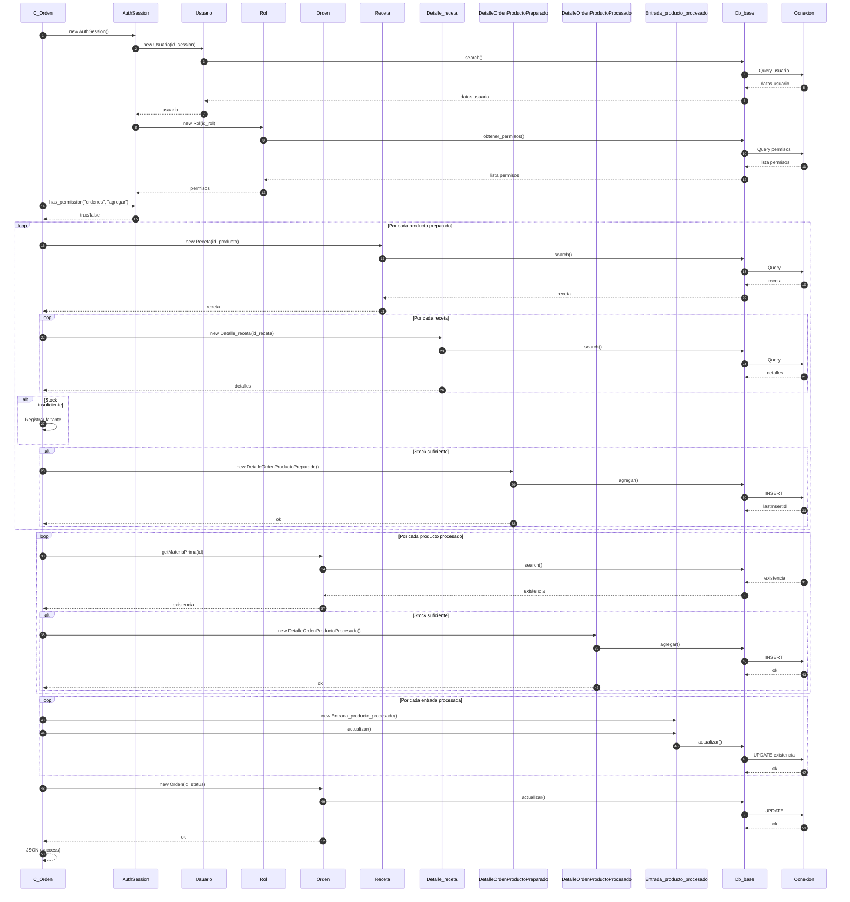

# Modulo Ordenes - Diagrama de Secuencia

## Agregar Orden Local

```mermaid
sequenceDiagram
    autonumber
    participant C_Orden as C_Orden
    participant AuthSession as AuthSession
    participant Usuario as Usuario
    participant Rol as Rol
    participant Orden as Orden
    participant Orden_mesa as Orden_mesa
    participant Receta as Receta
    participant Detalle_receta as Detalle_receta
    participant Detalle_entrada_mp as Detalle_entrada_materia_prima
    participant DetalleProc as DetalleOrdenProductoProcesado
    participant Db_base as Db_base
    participant Conexion as Conexion
    
    C_Orden->>AuthSession: new AuthSession()
    AuthSession->>Usuario: new Usuario(id_session)
    Usuario->>Db_base: search()
    Db_base->>Conexion: Query usuario
    Conexion-->>Db_base: datos usuario
    Db_base-->>Usuario: datos usuario
    Usuario-->>AuthSession: usuario
    
    AuthSession->>Rol: new Rol(id_rol)
    Rol->>Db_base: obtener_permisos()
    Db_base->>Conexion: Query permisos
    Conexion-->>Db_base: lista permisos
    Db_base-->>Rol: lista permisos
    Rol-->>AuthSession: permisos
    
    C_Orden->>AuthSession: has_permission("ordenes", "agregar")
    AuthSession-->>C_Orden: true/false
    
    alt Sin permiso
        C_Orden-->>C_Orden: Error 403
    end
    
    loop Por cada producto preparado
        C_Orden->>Receta: new Receta(id_producto)
        Receta->>Db_base: search()
        Db_base->>Conexion: Query
        Conexion-->>Db_base: recetas
        Db_base-->>Receta: recetas
        Receta-->>C_Orden: recetas
        
        loop Por cada receta
            C_Orden->>Detalle_receta: new Detalle_receta(id_receta)
            Detalle_receta->>Db_base: search()
            Db_base->>Conexion: Query
            Conexion-->>Db_base: detalles
            Detalle_receta-->>C_Orden: detalles
            
            loop Por cada detalle
                C_Orden->>C_Orden: cantidad = cantidad * pedido
            end
        end
    end
    
    loop Por cada detalle acumulado
        C_Orden->>Detalle_entrada_mp: new Detalle_entrada_materia_prima()
        Detalle_entrada_mp->>Db_base: search()
        Db_base->>Conexion: Query entradas MP
        Conexion-->>Db_base: entradas
        Detalle_entrada_mp-->>C_Orden: entradas
        
        loop Por cada entrada
            Note over C_Orden: Valida stock FIFO
        end
        
        alt Hay faltante
            C_Orden-->>C_Orden: Registra faltante
        end
    end
    
    loop Por cada producto procesado
        C_Orden->>Receta: new Receta(id_producto)
        Receta->>Db_base: search()
        Db_base->>Conexion: Query
        Conexion-->>Db_base: resultados
        Db_base-->>Receta: receta
        Receta-->>C_Orden: resultado
        
        Note over C_Orden: Valida stock
    end
    
    alt Stock insuficiente
        C_Orden-->>C_Orden: Error stock insuficiente
    end
    
    alt Stock suficiente
        C_Orden->>Orden: new Orden(parametros)
        C_Orden->>Orden: agregar()
        Orden->>Db_base: agregar()
        Db_base->>Conexion: INSERT INTO orden
        Conexion-->>Db_base: lastInsertId
        Db_base-->>Orden: lastInsertId
        Orden-->>C_Orden: lastInsertId
        
        loop Por cada mesa seleccionada
            C_Orden->>Orden_mesa: new Orden_mesa(id_mesa, id_orden)
            Orden_mesa->>Db_base: agregar()
            Db_base->>Conexion: INSERT INTO orden_mesa
            Conexion-->>Db_base: lastInsertId
            Db_base-->>Orden_mesa: lastInsertId
            Orden_mesa-->>C_Orden: ok
        end
        
        loop Por cada producto preparado
            C_Orden->>C_Orden: new DetalleOrdenProductoPreparado()
            C_Orden->>C_Orden: agregar()
            C_Orden->>Db_base: agregar()
            Db_base->>Conexion: INSERT detalle_preparado
            Conexion-->>Db_base: ok
        end
        
        loop Por cada detalle receta
            C_Orden->>Detalle_entrada_mp: new Detalle_entrada_materia_prima()
            C_Orden->>Detalle_entrada_mp: actualizar()
            Detalle_entrada_mp->>Db_base: actualizar()
            Db_base->>Conexion: UPDATE existencia
            Conexion-->>Db_base: ok
        end
        
        loop Por cada producto procesado
            C_Orden->>DetalleProc: new DetalleOrdenProductoProcesado()
            DetalleProc->>Db_base: agregar()
            Db_base->>Conexion: INSERT detalle_procesado
            Conexion-->>Db_base: ok
            DetalleProc-->>C_Orden: ok
        end
        
        loop Por cada entrada procesada
            C_Orden->>C_Orden: Actualizar existencia
            C_Orden->>Db_base: actualizar()
            Db_base->>Conexion: UPDATE existencia
            Conexion-->>Db_base: ok
        end
        
        C_Orden-->>C_Orden: Exito
    end
```

## Consultar Ordenes

```mermaid
sequenceDiagram
    autonumber
    participant C_Orden as C_Orden
    participant AuthSession as AuthSession
    participant Usuario as Usuario
    participant Rol as Rol
    participant Orden as Orden
    participant Db_base as Db_base
    participant Conexion as Conexion
    
    C_Orden->>AuthSession: new AuthSession()
    AuthSession->>Usuario: new Usuario(id_session)
    Usuario->>Db_base: search()
    Db_base->>Conexion: Query usuario
    Conexion-->>Db_base: datos usuario
    Db_base-->>Usuario: datos usuario
    Usuario-->>AuthSession: usuario
    
    AuthSession->>Rol: new Rol(id_rol)
    Rol->>Db_base: obtener_permisos()
    Db_base->>Conexion: Query permisos
    Conexion-->>Db_base: lista permisos
    Db_base-->>Rol: lista permisos
    Rol-->>AuthSession: permisos
    
    C_Orden->>AuthSession: has_permission("ordenes", "consultar")
    AuthSession-->>C_Orden: true/false
    
    alt Sin permiso
        C_Orden-->>C_Orden: Error 403
    end
    
    C_Orden->>Orden: new Orden(filtros)
    Orden->>Db_base: search()
    Db_base->>Conexion: SELECT with JOIN
    Conexion-->>Db_base: array de ordenes
    Db_base-->>Orden: array de ordenes
    Orden-->>C_Orden: array de ordenes
    
    C_Orden-->>C_Orden: JSON (data, total)
```

## Actualizar Estado de Orden

```mermaid
sequenceDiagram
    autonumber
    participant C_Orden as C_Orden
    participant AuthSession as AuthSession
    participant Usuario as Usuario
    participant Rol as Rol
    participant Orden as Orden
    participant Db_base as Db_base
    participant Conexion as Conexion
    
    C_Orden->>AuthSession: new AuthSession()
    AuthSession->>Usuario: new Usuario(id_session)
    Usuario->>Db_base: search()
    Db_base->>Conexion: Query usuario
    Conexion-->>Db_base: datos usuario
    Db_base-->>Usuario: datos usuario
    Usuario-->>AuthSession: usuario
    
    AuthSession->>Rol: new Rol(id_rol)
    Rol->>Db_base: obtener_permisos()
    Db_base->>Conexion: Query permisos
    Conexion-->>Db_base: lista permisos
    Db_base-->>Rol: lista permisos
    Rol-->>AuthSession: permisos
    
    alt active = 0 (soft-delete)
        C_Orden->>AuthSession: has_permission("ordenes", "eliminar")
    end
    
    alt active = 1 (restaurar)
        C_Orden->>AuthSession: has_permission("Papelera", "restaurar")
    end
    
    alt Edicion normal
        C_Orden->>AuthSession: has_permission("ordenes", "editar")
    end
    
    AuthSession-->>C_Orden: true/false
    
    alt Sin permiso
        C_Orden-->>C_Orden: Error 403
    end
    
    C_Orden->>Orden: new Orden(id, status)
    Orden->>Db_base: actualizar()
    Db_base->>Conexion: UPDATE
    Conexion-->>Db_base: success
    Db_base-->>Orden: success
    Orden-->>C_Orden: success
    
    C_Orden-->>C_Orden: JSON (success)
```

## Agregar Productos a Orden Existente

```mermaid
sequenceDiagram
    autonumber
    participant C_Orden as C_Orden
    participant AuthSession as AuthSession
    participant Usuario as Usuario
    participant Rol as Rol
    participant Orden as Orden
    participant Receta as Receta
    participant Detalle_receta as Detalle_receta
    participant DetallePrep as DetalleOrdenProductoPreparado
    participant DetalleProc as DetalleOrdenProductoProcesado
    participant Entrada_proc as Entrada_producto_procesado
    participant Db_base as Db_base
    participant Conexion as Conexion
    
    C_Orden->>AuthSession: new AuthSession()
    AuthSession->>Usuario: new Usuario(id_session)
    Usuario->>Db_base: search()
    Db_base->>Conexion: Query usuario
    Conexion-->>Db_base: datos usuario
    Db_base-->>Usuario: datos usuario
    Usuario-->>AuthSession: usuario
    
    AuthSession->>Rol: new Rol(id_rol)
    Rol->>Db_base: obtener_permisos()
    Db_base->>Conexion: Query permisos
    Conexion-->>Db_base: lista permisos
    Db_base-->>Rol: lista permisos
    Rol-->>AuthSession: permisos
    
    C_Orden->>AuthSession: has_permission("ordenes", "agregar")
    AuthSession-->>C_Orden: true/false
    
    loop Por cada producto preparado
        C_Orden->>Receta: new Receta(id_producto)
        Receta->>Db_base: search()
        Db_base->>Conexion: Query
        Conexion-->>Db_base: receta
        Db_base-->>Receta: receta
        Receta-->>C_Orden: receta
        
        loop Por cada receta
            C_Orden->>Detalle_receta: new Detalle_receta(id_receta)
            Detalle_receta->>Db_base: search()
            Db_base->>Conexion: Query
            Conexion-->>Db_base: detalles
            Detalle_receta-->>C_Orden: detalles
        end
        
        alt Stock insuficiente
            C_Orden->>C_Orden: Registrar faltante
        end
        
        alt Stock suficiente
            C_Orden->>DetallePrep: new DetalleOrdenProductoPreparado()
            DetallePrep->>Db_base: agregar()
            Db_base->>Conexion: INSERT
            Conexion-->>Db_base: lastInsertId
            DetallePrep-->>C_Orden: ok
        end
    end
    
    loop Por cada producto procesado
        C_Orden->>Orden: getMateriaPrima(id)
        Orden->>Db_base: search()
        Conexion-->>Db_base: existencia
        Db_base-->>Orden: existencia
        Orden-->>C_Orden: existencia
        
        alt Stock suficiente
            C_Orden->>DetalleProc: new DetalleOrdenProductoProcesado()
            DetalleProc->>Db_base: agregar()
            Db_base->>Conexion: INSERT
            Conexion-->>Db_base: ok
            DetalleProc-->>C_Orden: ok
        end
    end
    
    loop Por cada entrada procesada
        C_Orden->>Entrada_proc: new Entrada_producto_procesado()
        C_Orden->>Entrada_proc: actualizar()
        Entrada_proc->>Db_base: actualizar()
        Db_base->>Conexion: UPDATE existencia
        Conexion-->>Db_base: ok
    end
    
    C_Orden->>Orden: new Orden(id, status)
    Orden->>Db_base: actualizar()
    Db_base->>Conexion: UPDATE
    Conexion-->>Db_base: ok
    Orden-->>C_Orden: ok
    
    C_Orden-->>C_Orden: JSON (success)
```
