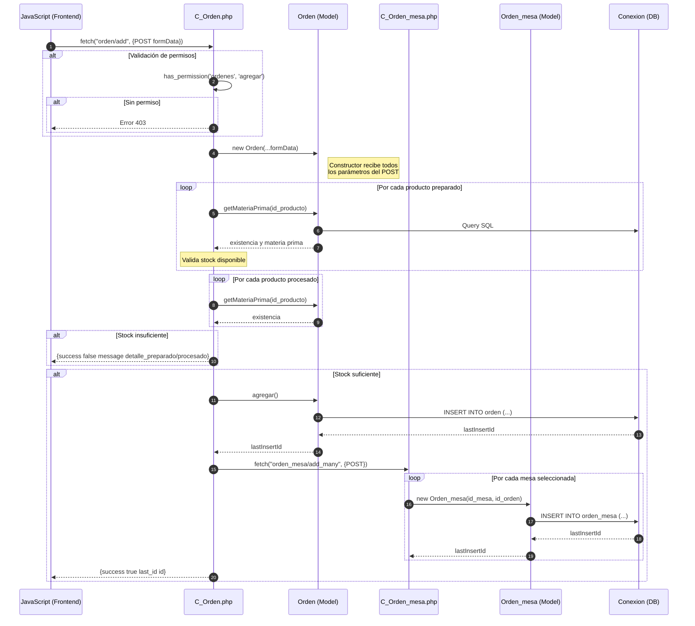
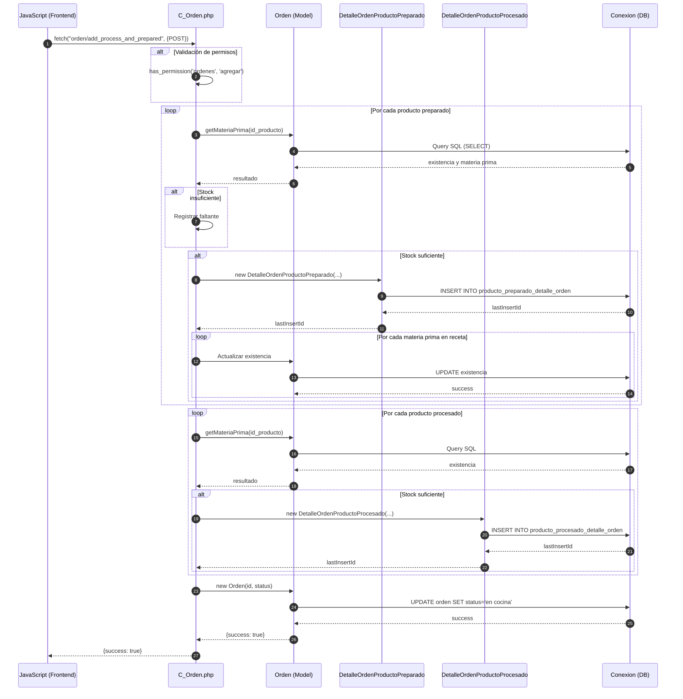
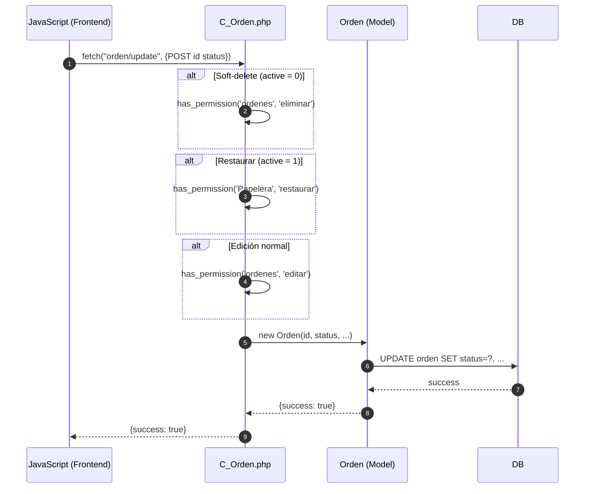
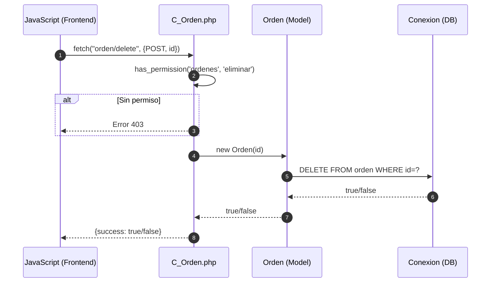
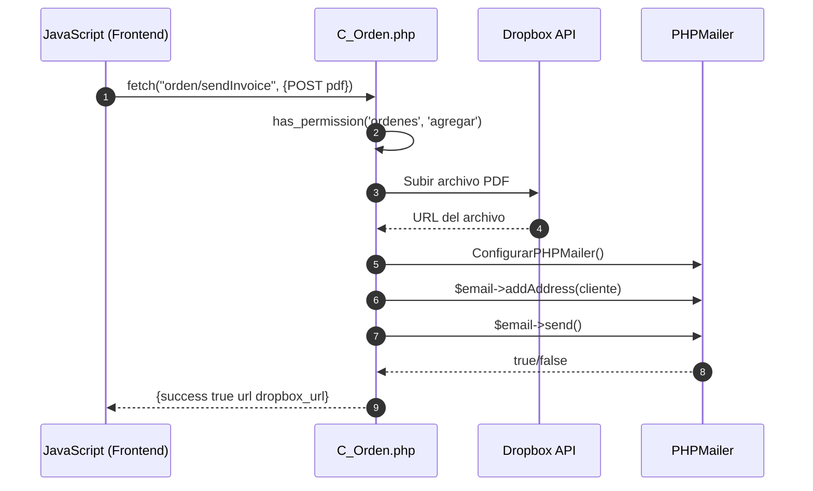

# Módulo Órdenes - Diagrama de Secuencia

## Agregar Orden Local

## Agregar Productos a Orden Existente

## Consultar Órdenes

```mermaid
sequenceDiagram
    autonumber
    participant JS as JavaScript (Frontend)
    participant C_Orden as C_Orden.php
    participant Orden as Orden (Model)
    participant DB as Conexion (DB)
    
    JS->>C_Orden: fetch("orden/get_all", {POST page limit order})
    
    alt Validación de permisos
        C_Orden->>C_Orden: has_permission('ordenes', 'consultar')
        alt Sin permiso
            C_Orden-->>JS: Error 403
        end
    end
    
    C_Orden->>Orden: new Orden(filtros del POST)
    Orden->>DB: SELECT ... LEFT JOIN clientes LEFT JOIN ventas
    DB-->>Orden: Array de órdenes
    Orden-->>C_Orden: Array de órdenes
    
    C_Orden-->>JS: {data [...] total n}
```

## Actualizar Estado de Orden

## Eliminar Orden

## Enviar Factura por Email

