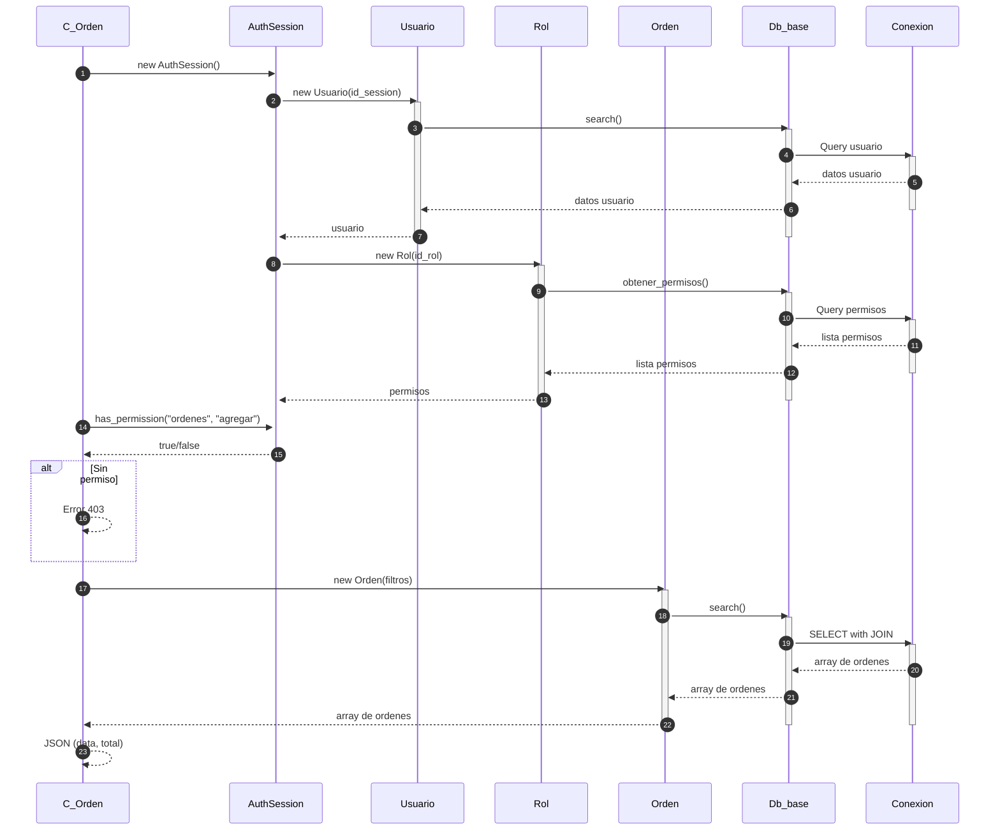
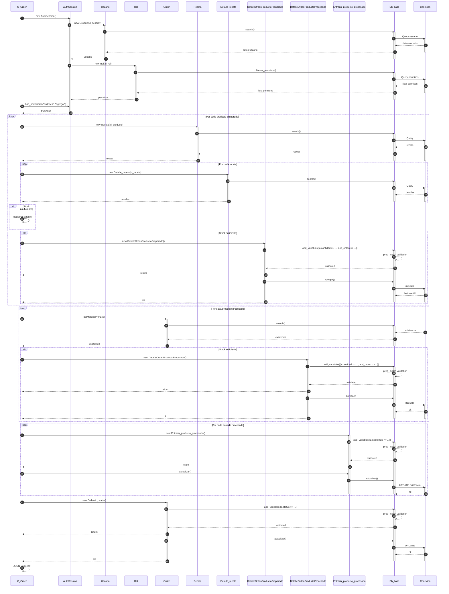

# Modulo Ordenes - Diagrama de Secuencia

## Agregar Orden Local

```mermaid
sequenceDiagram
    autonumber
    participant C_Orden as C_Orden
    participant AuthSession as AuthSession
    participant Usuario as Usuario
    participant Rol as Rol
    participant Orden as Orden
    participant Orden_mesa as Orden_mesa
    participant Receta as Receta
    participant Detalle_receta as Detalle_receta
    participant Detalle_entrada_mp as Detalle_entrada_materia_prima
    participant DetalleProc as DetalleOrdenProductoProcesado
    participant Db_base as Db_base
    participant Conexion as Conexion
    
    C_Orden->>AuthSession: new AuthSession()
    activate AuthSession
    AuthSession->>Usuario: new Usuario(id_session)
    activate Usuario
    Usuario->>Db_base: search()
    activate Db_base
    Db_base->>Conexion: Query usuario
    activate Conexion
    Conexion-->>Db_base: datos usuario
    Db_base-->>Usuario: datos usuario
    deactivate Conexion
    Usuario-->>AuthSession: usuario
    deactivate Usuario
    deactivate Db_base
    
    AuthSession->>Rol: new Rol(id_rol)
    activate Rol
    Rol->>Db_base: obtener_permisos()
    activate Db_base
    Db_base->>Conexion: Query permisos
    activate Conexion
    Conexion-->>Db_base: lista permisos
    Db_base-->>Rol: lista permisos
    deactivate Conexion
    Rol-->>AuthSession: permisos
    deactivate Rol
    deactivate Db_base
    
    alt active = 0 (soft-delete)
        C_Orden->>AuthSession: has_permission("ordenes", "eliminar")
    end
    
    loop Por cada producto preparado
        C_Orden->>Receta: new Receta(id_producto)
        activate Receta
        Receta->>Db_base: search()
        activate Db_base
        Db_base->>Conexion: Query
        activate Conexion
        Conexion-->>Db_base: recetas
        Db_base-->>Receta: recetas
        Receta-->>C_Orden: recetas
        deactivate Receta
        deactivate Conexion
        deactivate Db_base
        
        loop Por cada receta
            C_Orden->>Detalle_receta: new Detalle_receta(id_receta)
            activate Detalle_receta
            Detalle_receta->>Db_base: search()
            activate Db_base
            Db_base->>Conexion: Query
            activate Conexion
            Conexion-->>Db_base: detalles
            Detalle_receta-->>C_Orden: detalles
            deactivate Detalle_receta
            deactivate Conexion
            deactivate Db_base
            
            loop Por cada detalle
                C_Orden->>C_Orden: cantidad = cantidad * pedido
            end
        end
    end
    
    loop Por cada detalle acumulado
        C_Orden->>Detalle_entrada_mp: new Detalle_entrada_materia_prima()
        activate Detalle_entrada_mp
        Detalle_entrada_mp->>Db_base: search()
        activate Db_base
        Db_base->>Conexion: Query entradas MP
        activate Conexion
        Conexion-->>Db_base: entradas
        Detalle_entrada_mp-->>C_Orden: entradas
        deactivate Detalle_entrada_mp
        deactivate Conexion
        deactivate Db_base
        
        loop Por cada entrada
            Note over C_Orden: Valida stock FIFO
        end
        
        alt Hay faltante
            C_Orden-->>C_Orden: Registra faltante
        end
    end
    
    loop Por cada producto procesado
        C_Orden->>Receta: new Receta(id_producto)
        activate Receta
        Receta->>Db_base: search()
        activate Db_base
        Db_base->>Conexion: Query
        activate Conexion
        Conexion-->>Db_base: resultados
        Db_base-->>Receta: receta
        Receta-->>C_Orden: resultado
        deactivate Receta
        deactivate Conexion
        deactivate Db_base
        
        Note over C_Orden: Valida stock
    end
    
    alt Stock insuficiente
        C_Orden-->>C_Orden: Error stock insuficiente
    end
    
    alt Stock suficiente
        C_Orden->>Orden: new Orden(parametros)
        activate Orden
        Orden->>Db_base: add_variables([a.id_cliente => ..., a.total => ...])
        activate Db_base
        Db_base-->>Db_base: preg_match validation
        Db_base-->>Orden: validated
        Orden-->>C_Orden: return
        C_Orden->>Orden: agregar()
        Orden->>Db_base: agregar()
        Db_base->>Conexion: INSERT INTO orden
        activate Conexion
        Conexion-->>Db_base: lastInsertId
        Db_base-->>Orden: lastInsertId
        Orden-->>C_Orden: lastInsertId
        
        loop Por cada mesa seleccionada
            C_Orden->>Orden_mesa: new Orden_mesa(id_mesa, id_orden)
            activate Orden_mesa
            Orden_mesa->>Db_base: add_variables([a.id_mesa => ..., a.id_orden => ...])
            activate Db_base
            Db_base-->>Db_base: preg_match validation
            Db_base-->>Orden_mesa: validated
            Orden_mesa-->>C_Orden: return
            Orden_mesa->>Db_base: agregar()
            Db_base->>Conexion: INSERT INTO orden_mesa
            Conexion-->>Db_base: lastInsertId
            Db_base-->>Orden_mesa: lastInsertId
            Orden_mesa-->>C_Orden: ok
            deactivate Orden_mesa
            deactivate Conexion
            deactivate Db_base
        end
        
        loop Por cada producto preparado
            C_Orden->>C_Orden: new DetalleOrdenProductoPreparado()
            C_Orden->>C_Orden: agregar()
            C_Orden->>Db_base: agregar()
            activate Db_base
            Db_base->>Conexion: INSERT detalle_preparado
            activate Conexion
            Conexion-->>Db_base: ok
            deactivate Conexion
            deactivate Db_base
        end
        
        loop Por cada detalle receta
            C_Orden->>Detalle_entrada_mp: new Detalle_entrada_materia_prima()
            activate Detalle_entrada_mp
            Detalle_entrada_mp->>Db_base: add_variables([a.existencia => ...])
            activate Db_base
            Db_base-->>Db_base: preg_match validation
            Db_base-->>Detalle_entrada_mp: validated
            Detalle_entrada_mp-->>C_Orden: return
            C_Orden->>Detalle_entrada_mp: actualizar()
            Detalle_entrada_mp->>Db_base: actualizar()
            Db_base->>Conexion: UPDATE existencia
            activate Conexion
            Conexion-->>Db_base: ok
            deactivate Detalle_entrada_mp
            deactivate Conexion
            deactivate Db_base
        end
        
        loop Por cada producto procesado
            C_Orden->>DetalleProc: new DetalleOrdenProductoProcesado()
            activate DetalleProc
            DetalleProc->>Db_base: add_variables([a.cantidad => ..., a.id_orden => ...])
            activate Db_base
            Db_base-->>Db_base: preg_match validation
            Db_base-->>DetalleProc: validated
            DetalleProc-->>C_Orden: return
            DetalleProc->>Db_base: agregar()
            Db_base->>Conexion: INSERT detalle_procesado
            activate Conexion
            Conexion-->>Db_base: ok
            DetalleProc-->>C_Orden: ok
            deactivate DetalleProc
            deactivate Conexion
            deactivate Db_base
        end
        
        loop Por cada entrada procesada
            C_Orden->>C_Orden: Actualizar existencia
            C_Orden->>Db_base: actualizar()
            activate Db_base
            Db_base->>Conexion: UPDATE existencia
            activate Conexion
            Conexion-->>Db_base: ok
            deactivate Conexion
            deactivate Db_base
        end
        
        C_Orden-->>C_Orden: Exito
        deactivate Orden
        deactivate Db_base
        deactivate Conexion
    end
```

## Consultar Ordenes



## Actualizar Estado de Orden


## Agregar Productos a Orden Existente


