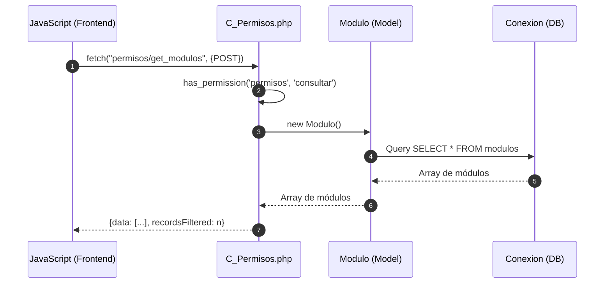
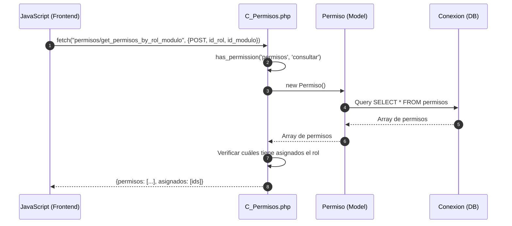
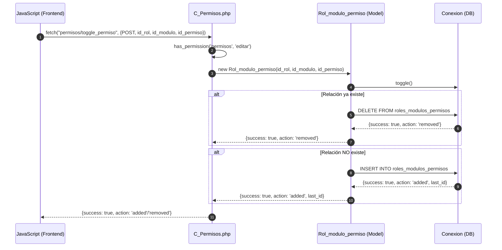
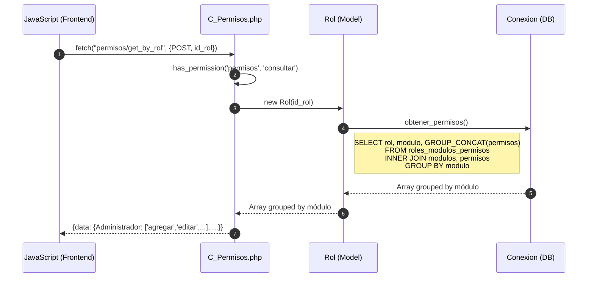

# Módulo Permisos - Diagrama de Secuencia

## Consultar Módulos

```mermaid
sequenceDiagram
    autonumber
    participant JS as JavaScript (Frontend)
    participant C_Permisos as C_Permisos.php
    participant Modulo as Modulo (Model)
    participant DB as Conexion (DB)
    
    JS->>C_Permisos: fetch("permisos/get_modulos", {POST})
    
    C_Permisos->>C_Permisos: has_permission('permisos', 'consultar')
    
    C_Permisos->>Modulo: new Modulo()
    Modulo->>DB: Query SELECT * FROM modulos
    DB-->>Modulo: Array de módulos
    Modulo-->>C_Permisos: Array de módulos
    
    C_Permisos-->>JS: {data: [...], recordsFiltered: n}
```

## Consultar Permisos Disponibles

```mermaid
sequenceDiagram
    autonumber
    participant JS as JavaScript (Frontend)
    participant C_Permisos as C_Permisos.php
    participant Permiso as Permiso (Model)
    participant DB as Conexion (DB)
    
    JS->>C_Permisos: fetch("permisos/get_permisos_by_rol_modulo", {POST, id_rol, id_modulo})
    
    C_Permisos->>C_Permisos: has_permission('permisos', 'consultar')
    
    C_Permisos->>Permiso: new Permiso()
    Permiso->>DB: Query SELECT * FROM permisos
    DB-->>Permiso: Array de permisos
    Permiso-->>C_Permisos: Array de permisos
    
    C_Permisos->>C_Permisos: Verificar cuáles tiene asignados el rol
    C_Permisos-->>JS: {permisos: [...], asignados: [ids]}
```

## Toggle Permiso (Asignar/Quitar)

```mermaid
sequenceDiagram
    autonumber
    participant JS as JavaScript (Frontend)
    participant C_Permisos as C_Permisos.php
    participant Rol_modulo_permiso as Rol_modulo_permiso (Model)
    participant DB as Conexion (DB)
    
    JS->>C_Permisos: fetch("permisos/toggle_permiso", {POST, id_rol, id_modulo, id_permiso})
    
    C_Permisos->>C_Permisos: has_permission('permisos', 'editar')
    
    C_Permisos->>Rol_modulo_permiso: new Rol_modulo_permiso(id_rol, id_modulo, id_permiso)
    Rol_modulo_permiso->>DB: toggle()
    
    alt Relación ya existe
        Rol_modulo_permiso->>DB: DELETE FROM roles_modulos_permisos
        DB-->>Rol_modulo_permiso: {success: true, action: 'removed'}
        Rol_modulo_permiso-->>C_Permisos: {success: true, action: 'removed'}
    end
    
    alt Relación NO existe
        Rol_modulo_permiso->>DB: INSERT INTO roles_modulos_permisos
        DB-->>Rol_modulo_permiso: {success: true, action: 'added', last_id}
        Rol_modulo_permiso-->>C_Permisos: {success: true, action: 'added', last_id}
    end
    
    C_Permisos-->>JS: {success: true, action: 'added'/'removed'}
```

## Obtener Permisos de un Rol

```mermaid
sequenceDiagram
    autonumber
    participant JS as JavaScript (Frontend)
    participant C_Permisos as C_Permisos.php
    participant Rol as Rol (Model)
    participant DB as Conexion (DB)
    
    JS->>C_Permisos: fetch("permisos/get_by_rol", {POST, id_rol})
    
    C_Permisos->>C_Permisos: has_permission('permisos', 'consultar')
    
    C_Permisos->>Rol: new Rol(id_rol)
    Rol->>DB: obtener_permisos()
    
    Note right of Rol: SELECT rol, modulo, GROUP_CONCAT(permisos)<br/>FROM roles_modulos_permisos<br/>INNER JOIN modulos, permisos<br/>GROUP BY modulo
    
    DB-->>Rol: Array grouped by módulo
    Rol-->>C_Permisos: Array grouped by módulo
    
    C_Permisos-->>JS: {data: {Administrador: ['agregar','editar',...], ...}}
```
