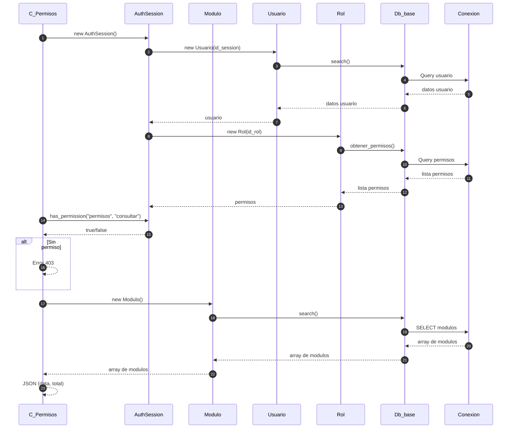
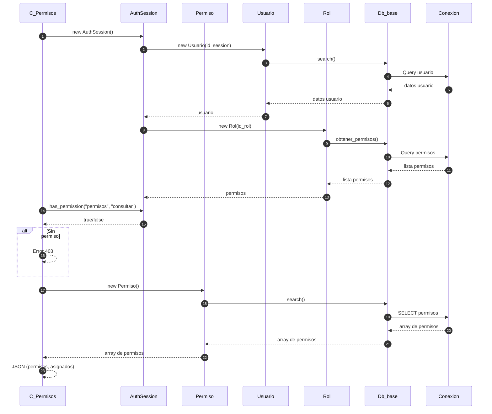
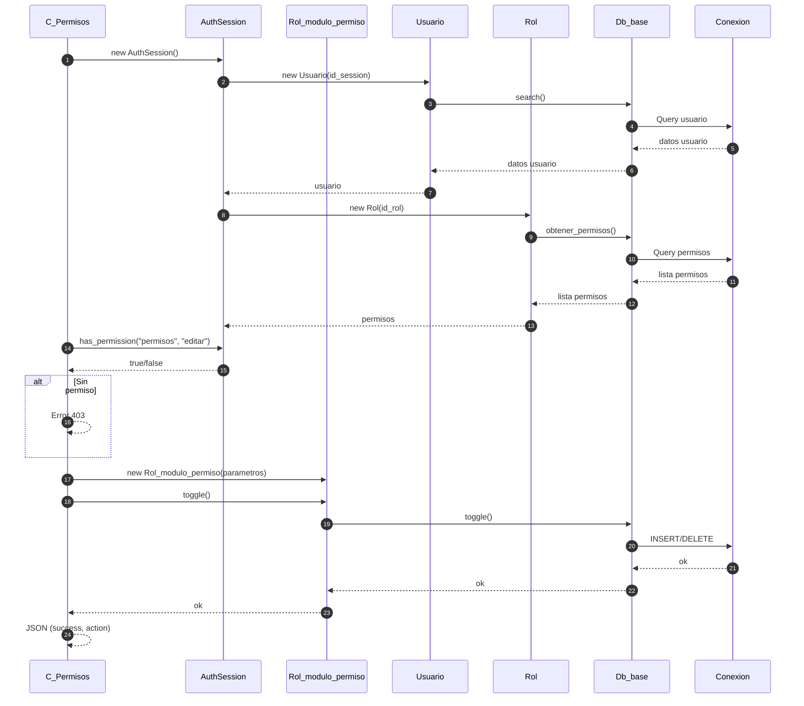
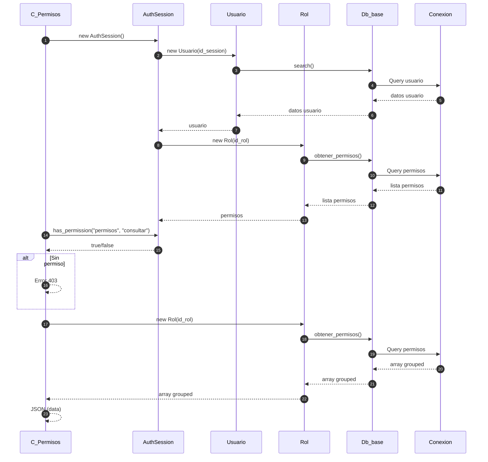

# Modulo Permisos - Diagrama de Secuencia

## Consultar Modulos

```mermaid
sequenceDiagram
    autonumber
    participant C_Permisos as C_Permisos
    participant AuthSession as AuthSession
    participant Modulo as Modulo
    participant Usuario as Usuario
    participant Rol as Rol
    participant Db_base as Db_base
    participant Conexion as Conexion
    
    C_Permisos->>AuthSession: new AuthSession()
    AuthSession->>Usuario: new Usuario(id_session)
    Usuario->>Db_base: search()
    Db_base->>Conexion: Query usuario
    Conexion-->>Db_base: datos usuario
    Db_base-->>Usuario: datos usuario
    Usuario-->>AuthSession: usuario
    
    AuthSession->>Rol: new Rol(id_rol)
    Rol->>Db_base: obtener_permisos()
    Db_base->>Conexion: Query permisos
    Conexion-->>Db_base: lista permisos
    Db_base-->>Rol: lista permisos
    Rol-->>AuthSession: permisos
    
    C_Permisos->>AuthSession: has_permission("permisos", "consultar")
    AuthSession-->>C_Permisos: true/false
    
    alt Sin permiso
        C_Permisos-->>C_Permisos: Error 403
    end
    
    C_Permisos->>Modulo: new Modulo()
    Modulo->>Db_base: search()
    Db_base->>Conexion: SELECT modulos
    Conexion-->>Db_base: array de modulos
    Db_base-->>Modulo: array de modulos
    Modulo-->>C_Permisos: array de modulos
    
    C_Permisos-->>C_Permisos: JSON (data, total)
```

## Consultar Permisos Disponibles

```mermaid
sequenceDiagram
    autonumber
    participant C_Permisos as C_Permisos
    participant AuthSession as AuthSession
    participant Permiso as Permiso
    participant Usuario as Usuario
    participant Rol as Rol
    participant Db_base as Db_base
    participant Conexion as Conexion
    
    C_Permisos->>AuthSession: new AuthSession()
    AuthSession->>Usuario: new Usuario(id_session)
    Usuario->>Db_base: search()
    Db_base->>Conexion: Query usuario
    Conexion-->>Db_base: datos usuario
    Db_base-->>Usuario: datos usuario
    Usuario-->>AuthSession: usuario
    
    AuthSession->>Rol: new Rol(id_rol)
    Rol->>Db_base: obtener_permisos()
    Db_base->>Conexion: Query permisos
    Conexion-->>Db_base: lista permisos
    Db_base-->>Rol: lista permisos
    Rol-->>AuthSession: permisos
    
    C_Permisos->>AuthSession: has_permission("permisos", "consultar")
    AuthSession-->>C_Permisos: true/false
    
    alt Sin permiso
        C_Permisos-->>C_Permisos: Error 403
    end
    
    C_Permisos->>Permiso: new Permiso()
    Permiso->>Db_base: search()
    Db_base->>Conexion: SELECT permisos
    Conexion-->>Db_base: array de permisos
    Db_base-->>Permiso: array de permisos
    Permiso-->>C_Permisos: array de permisos
    
    C_Permisos-->>C_Permisos: JSON (permisos, asignados)
```

## Toggle Permiso

```mermaid
sequenceDiagram
    autonumber
    participant C_Permisos as C_Permisos
    participant AuthSession as AuthSession
    participant Rol_modulo_permiso as Rol_modulo_permiso
    participant Usuario as Usuario
    participant Rol as Rol
    participant Db_base as Db_base
    participant Conexion as Conexion
    
    C_Permisos->>AuthSession: new AuthSession()
    AuthSession->>Usuario: new Usuario(id_session)
    Usuario->>Db_base: search()
    Db_base->>Conexion: Query usuario
    Conexion-->>Db_base: datos usuario
    Db_base-->>Usuario: datos usuario
    Usuario-->>AuthSession: usuario
    
    AuthSession->>Rol: new Rol(id_rol)
    Rol->>Db_base: obtener_permisos()
    Db_base->>Conexion: Query permisos
    Conexion-->>Db_base: lista permisos
    Db_base-->>Rol: lista permisos
    Rol-->>AuthSession: permisos
    
    C_Permisos->>AuthSession: has_permission("permisos", "editar")
    AuthSession-->>C_Permisos: true/false
    
    alt Sin permiso
        C_Permisos-->>C_Permisos: Error 403
    end
    
    C_Permisos->>Rol_modulo_permiso: new Rol_modulo_permiso(parametros)
    C_Permisos->>Rol_modulo_permiso: toggle()
    Rol_modulo_permiso->>Db_base: toggle()
    Db_base->>Conexion: INSERT/DELETE
    Conexion-->>Db_base: ok
    Db_base-->>Rol_modulo_permiso: ok
    Rol_modulo_permiso-->>C_Permisos: ok
    
    C_Permisos-->>C_Permisos: JSON (success, action)
```

## Obtener Permisos de un Rol

```mermaid
sequenceDiagram
    autonumber
    participant C_Permisos as C_Permisos
    participant AuthSession as AuthSession
    participant Usuario as Usuario
    participant Rol as Rol
    participant Db_base as Db_base
    participant Conexion as Conexion
    
    C_Permisos->>AuthSession: new AuthSession()
    AuthSession->>Usuario: new Usuario(id_session)
    Usuario->>Db_base: search()
    Db_base->>Conexion: Query usuario
    Conexion-->>Db_base: datos usuario
    Db_base-->>Usuario: datos usuario
    Usuario-->>AuthSession: usuario
    
    AuthSession->>Rol: new Rol(id_rol)
    Rol->>Db_base: obtener_permisos()
    Db_base->>Conexion: Query permisos
    Conexion-->>Db_base: lista permisos
    Db_base-->>Rol: lista permisos
    Rol-->>AuthSession: permisos
    
    C_Permisos->>AuthSession: has_permission("permisos", "consultar")
    AuthSession-->>C_Permisos: true/false
    
    alt Sin permiso
        C_Permisos-->>C_Permisos: Error 403
    end
    
    C_Permisos->>Rol: new Rol(id_rol)
    Rol->>Db_base: obtener_permisos()
    Db_base->>Conexion: Query permisos
    Conexion-->>Db_base: array grouped
    Db_base-->>Rol: array grouped
    Rol-->>C_Permisos: array grouped
    
    C_Permisos-->>C_Permisos: JSON (data)
```
