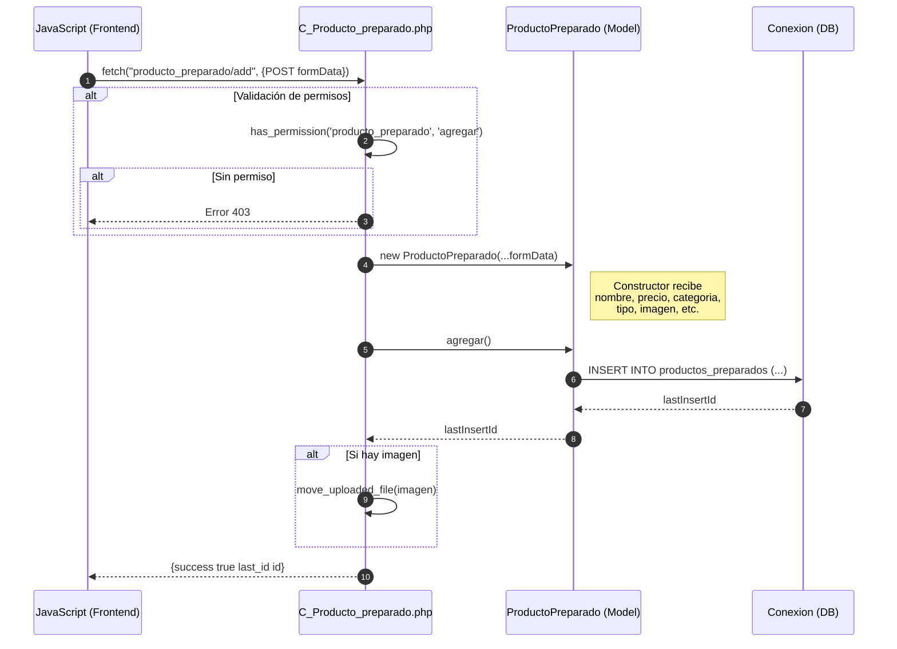
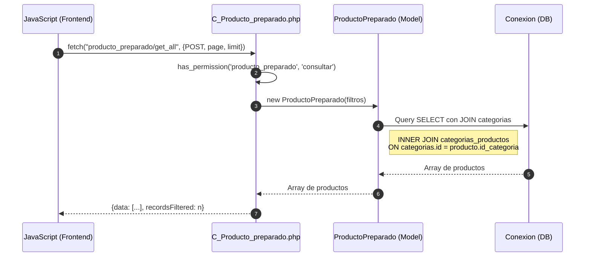
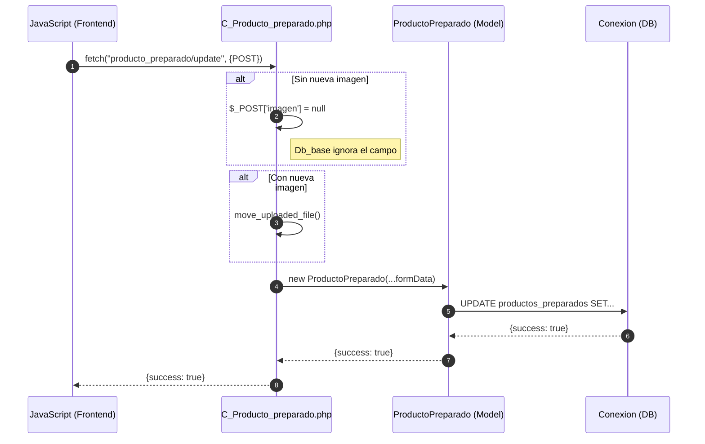
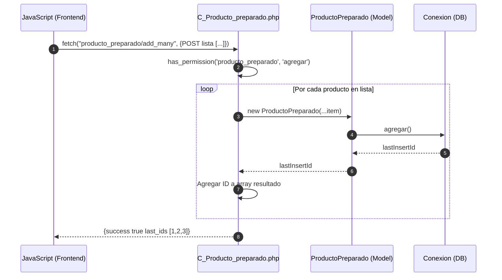

# Módulo Productos Preparados - Diagrama de Secuencia

## Agregar Producto Preparado

## Consultar Productos Preparados

## Actualizar Producto Preparado

## Agregar Varios Productos (add_many)

