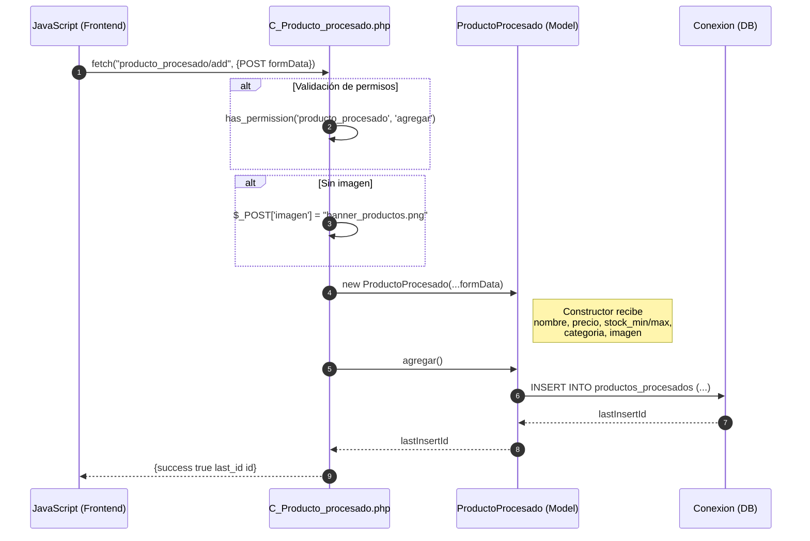
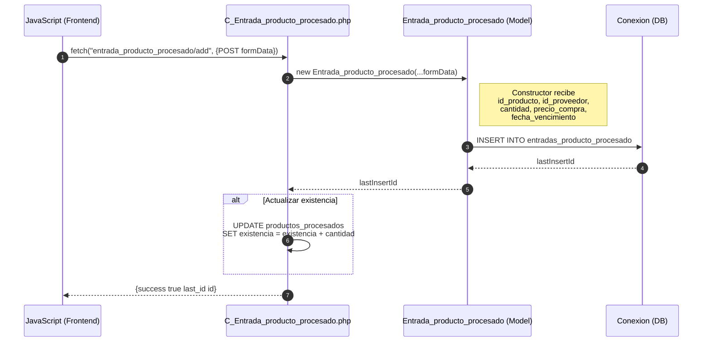
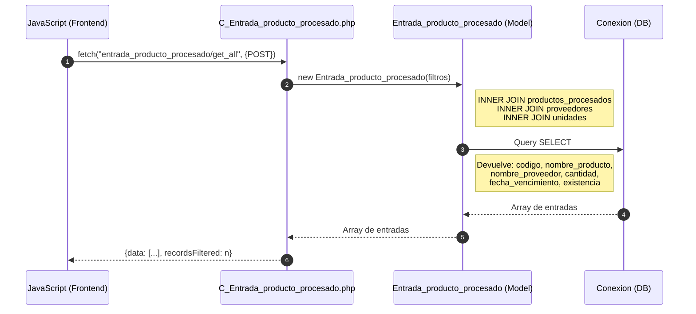
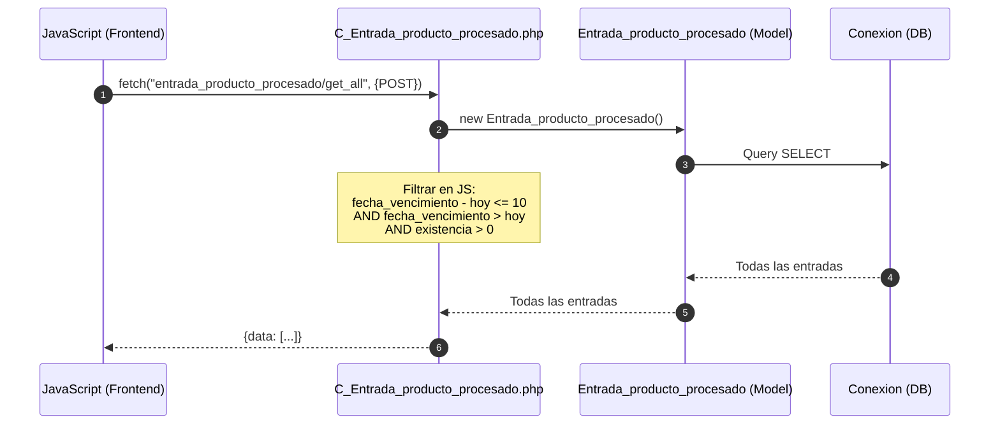
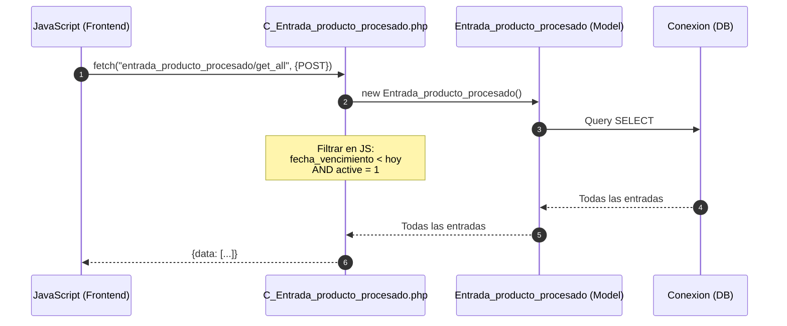
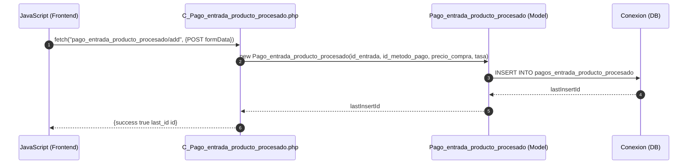

# Módulo Productos Procesados - Diagrama de Secuencia

## Agregar Producto Procesado

## Registrar Entrada de Producto Procesado

## Consultar Entradas de Productos Procesados

## Entradas Por Vencer (10 días)

## Entradas Vencidas

## Agregar Pago de Entrada Producto Procesado

