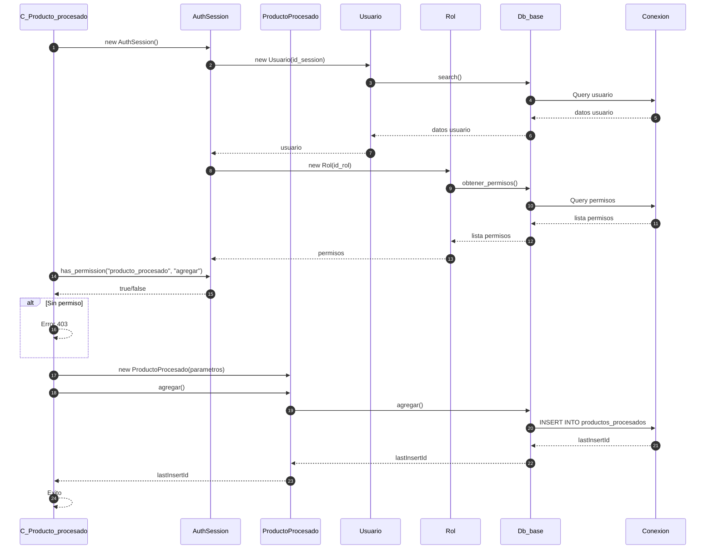
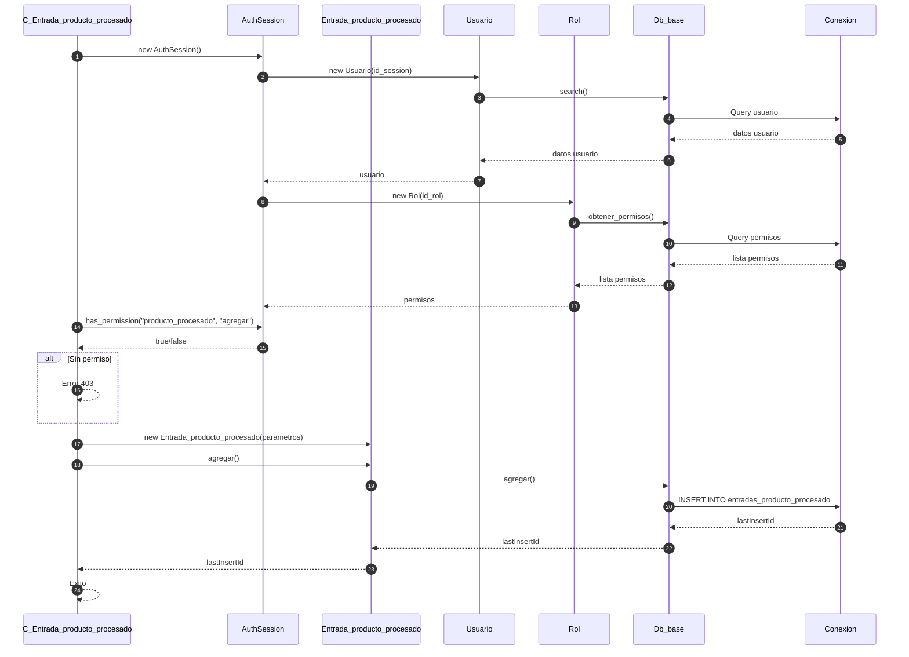
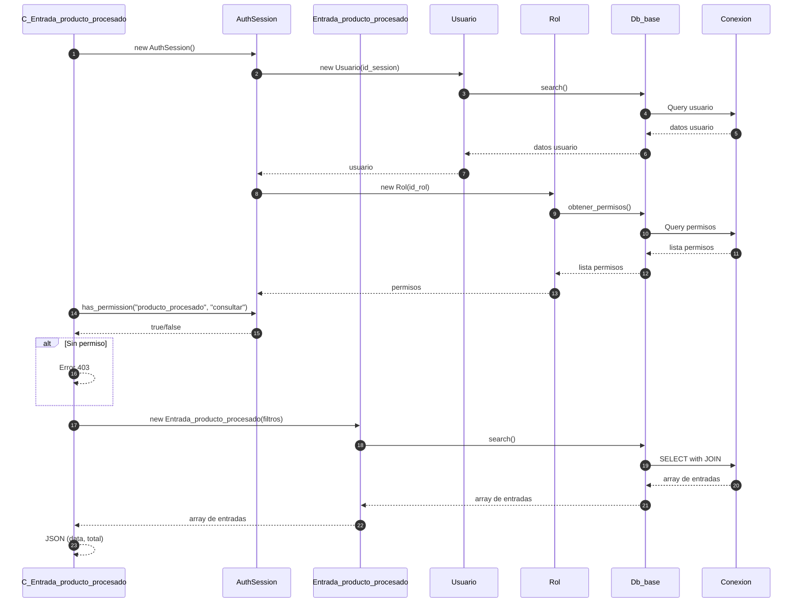
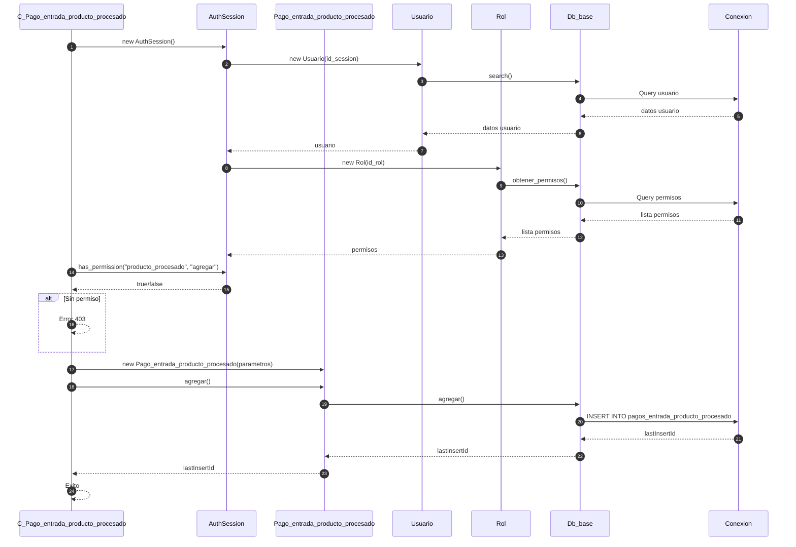

# Modulo Productos Procesados - Diagrama de Secuencia

## Agregar Producto Procesado

```mermaid
sequenceDiagram
    autonumber
    participant C_PP as C_Producto_procesado
    participant AuthSession as AuthSession
    participant ProductoProcesado as ProductoProcesado
    participant Usuario as Usuario
    participant Rol as Rol
    participant Db_base as Db_base
    participant Conexion as Conexion
    
    C_PP->>AuthSession: new AuthSession()
    AuthSession->>Usuario: new Usuario(id_session)
    Usuario->>Db_base: search()
    Db_base->>Conexion: Query usuario
    Conexion-->>Db_base: datos usuario
    Db_base-->>Usuario: datos usuario
    Usuario-->>AuthSession: usuario
    
    AuthSession->>Rol: new Rol(id_rol)
    Rol->>Db_base: obtener_permisos()
    Db_base->>Conexion: Query permisos
    Conexion-->>Db_base: lista permisos
    Db_base-->>Rol: lista permisos
    Rol-->>AuthSession: permisos
    
    C_PP->>AuthSession: has_permission("producto_procesado", "agregar")
    AuthSession-->>C_PP: true/false
    
    alt Sin permiso
        C_PP-->>C_PP: Error 403
    end
    
    C_PP->>ProductoProcesado: new ProductoProcesado(parametros)
    C_PP->>ProductoProcesado: agregar()
    ProductoProcesado->>Db_base: agregar()
    Db_base->>Conexion: INSERT INTO productos_procesados
    Conexion-->>Db_base: lastInsertId
    Db_base-->>ProductoProcesado: lastInsertId
    ProductoProcesado-->>C_PP: lastInsertId
    
    C_PP-->>C_PP: Exito
```

## Registrar Entrada de Producto Procesado

```mermaid
sequenceDiagram
    autonumber
    participant C_Entrada_PP as C_Entrada_producto_procesado
    participant AuthSession as AuthSession
    participant Entrada_PP as Entrada_producto_procesado
    participant Usuario as Usuario
    participant Rol as Rol
    participant Db_base as Db_base
    participant Conexion as Conexion
    
    C_Entrada_PP->>AuthSession: new AuthSession()
    AuthSession->>Usuario: new Usuario(id_session)
    Usuario->>Db_base: search()
    Db_base->>Conexion: Query usuario
    Conexion-->>Db_base: datos usuario
    Db_base-->>Usuario: datos usuario
    Usuario-->>AuthSession: usuario
    
    AuthSession->>Rol: new Rol(id_rol)
    Rol->>Db_base: obtener_permisos()
    Db_base->>Conexion: Query permisos
    Conexion-->>Db_base: lista permisos
    Db_base-->>Rol: lista permisos
    Rol-->>AuthSession: permisos
    
    C_Entrada_PP->>AuthSession: has_permission("producto_procesado", "agregar")
    AuthSession-->>C_Entrada_PP: true/false
    
    alt Sin permiso
        C_Entrada_PP-->>C_Entrada_PP: Error 403
    end
    
    C_Entrada_PP->>Entrada_PP: new Entrada_producto_procesado(parametros)
    C_Entrada_PP->>Entrada_PP: agregar()
    Entrada_PP->>Db_base: agregar()
    Db_base->>Conexion: INSERT INTO entradas_producto_procesado
    Conexion-->>Db_base: lastInsertId
    Db_base-->>Entrada_PP: lastInsertId
    Entrada_PP-->>C_Entrada_PP: lastInsertId
    
    C_Entrada_PP-->>C_Entrada_PP: Exito
```

## Consultar Entradas de Productos

```mermaid
sequenceDiagram
    autonumber
    participant C_Entrada_PP as C_Entrada_producto_procesado
    participant AuthSession as AuthSession
    participant Entrada_PP as Entrada_producto_procesado
    participant Usuario as Usuario
    participant Rol as Rol
    participant Db_base as Db_base
    participant Conexion as Conexion
    
    C_Entrada_PP->>AuthSession: new AuthSession()
    AuthSession->>Usuario: new Usuario(id_session)
    Usuario->>Db_base: search()
    Db_base->>Conexion: Query usuario
    Conexion-->>Db_base: datos usuario
    Db_base-->>Usuario: datos usuario
    Usuario-->>AuthSession: usuario
    
    AuthSession->>Rol: new Rol(id_rol)
    Rol->>Db_base: obtener_permisos()
    Db_base->>Conexion: Query permisos
    Conexion-->>Db_base: lista permisos
    Db_base-->>Rol: lista permisos
    Rol-->>AuthSession: permisos
    
    C_Entrada_PP->>AuthSession: has_permission("producto_procesado", "consultar")
    AuthSession-->>C_Entrada_PP: true/false
    
    alt Sin permiso
        C_Entrada_PP-->>C_Entrada_PP: Error 403
    end
    
    C_Entrada_PP->>Entrada_PP: new Entrada_producto_procesado(filtros)
    Entrada_PP->>Db_base: search()
    Db_base->>Conexion: SELECT with JOIN
    Conexion-->>Db_base: array de entradas
    Db_base-->>Entrada_PP: array de entradas
    Entrada_PP-->>C_Entrada_PP: array de entradas
    
    C_Entrada_PP-->>C_Entrada_PP: JSON (data, total)
```

## Agregar Pago de Entrada

```mermaid
sequenceDiagram
    autonumber
    participant C_Pago_PP as C_Pago_entrada_producto_procesado
    participant AuthSession as AuthSession
    participant Pago_PP as Pago_entrada_producto_procesado
    participant Usuario as Usuario
    participant Rol as Rol
    participant Db_base as Db_base
    participant Conexion as Conexion
    
    C_Pago_PP->>AuthSession: new AuthSession()
    AuthSession->>Usuario: new Usuario(id_session)
    Usuario->>Db_base: search()
    Db_base->>Conexion: Query usuario
    Conexion-->>Db_base: datos usuario
    Db_base-->>Usuario: datos usuario
    Usuario-->>AuthSession: usuario
    
    AuthSession->>Rol: new Rol(id_rol)
    Rol->>Db_base: obtener_permisos()
    Db_base->>Conexion: Query permisos
    Conexion-->>Db_base: lista permisos
    Db_base-->>Rol: lista permisos
    Rol-->>AuthSession: permisos
    
    C_Pago_PP->>AuthSession: has_permission("producto_procesado", "agregar")
    AuthSession-->>C_Pago_PP: true/false
    
    alt Sin permiso
        C_Pago_PP-->>C_Pago_PP: Error 403
    end
    
    C_Pago_PP->>Pago_PP: new Pago_entrada_producto_procesado(parametros)
    C_Pago_PP->>Pago_PP: agregar()
    Pago_PP->>Db_base: agregar()
    Db_base->>Conexion: INSERT INTO pagos_entrada_producto_procesado
    Conexion-->>Db_base: lastInsertId
    Db_base-->>Pago_PP: lastInsertId
    Pago_PP-->>C_Pago_PP: lastInsertId
    
    C_Pago_PP-->>C_Pago_PP: Exito
```
