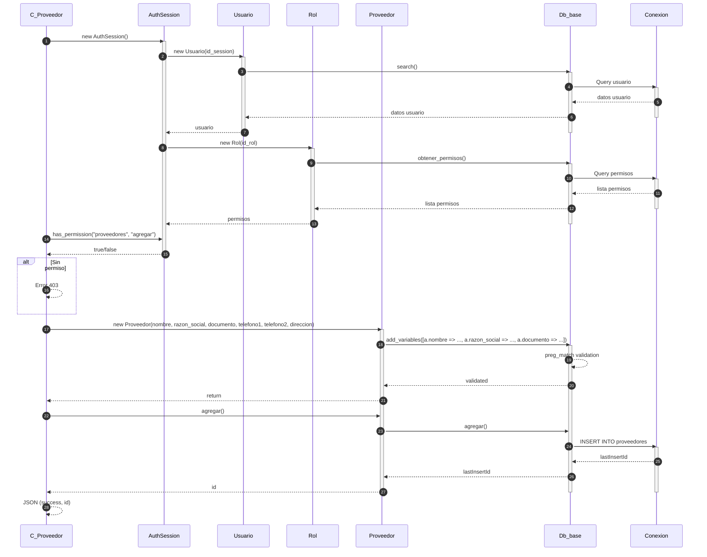
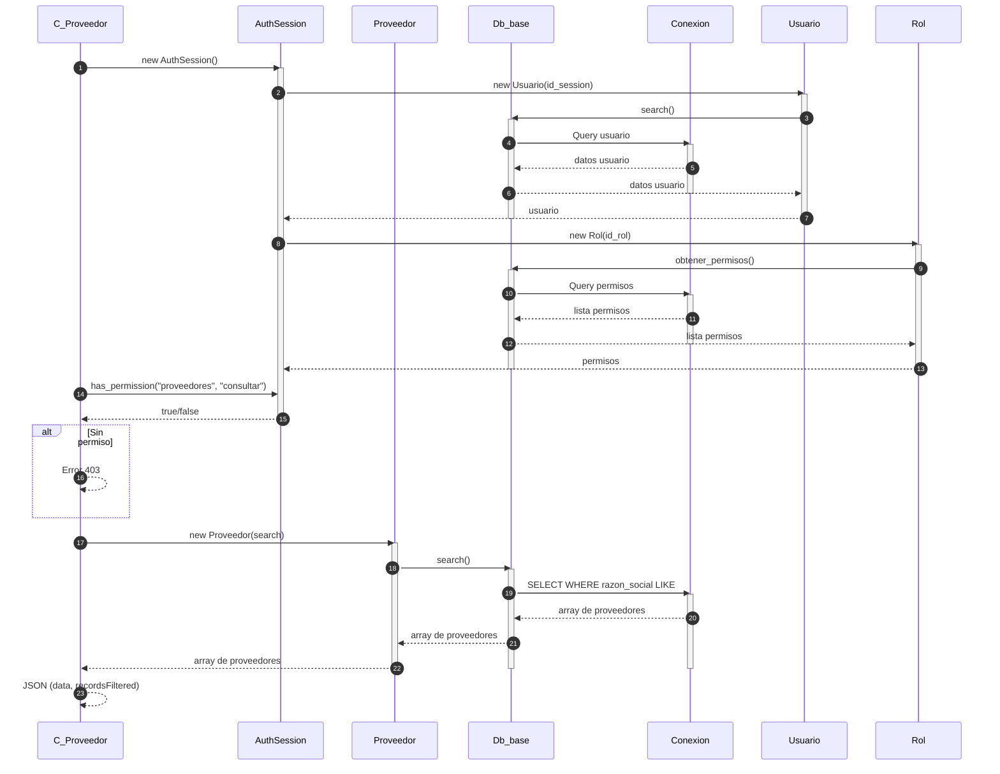
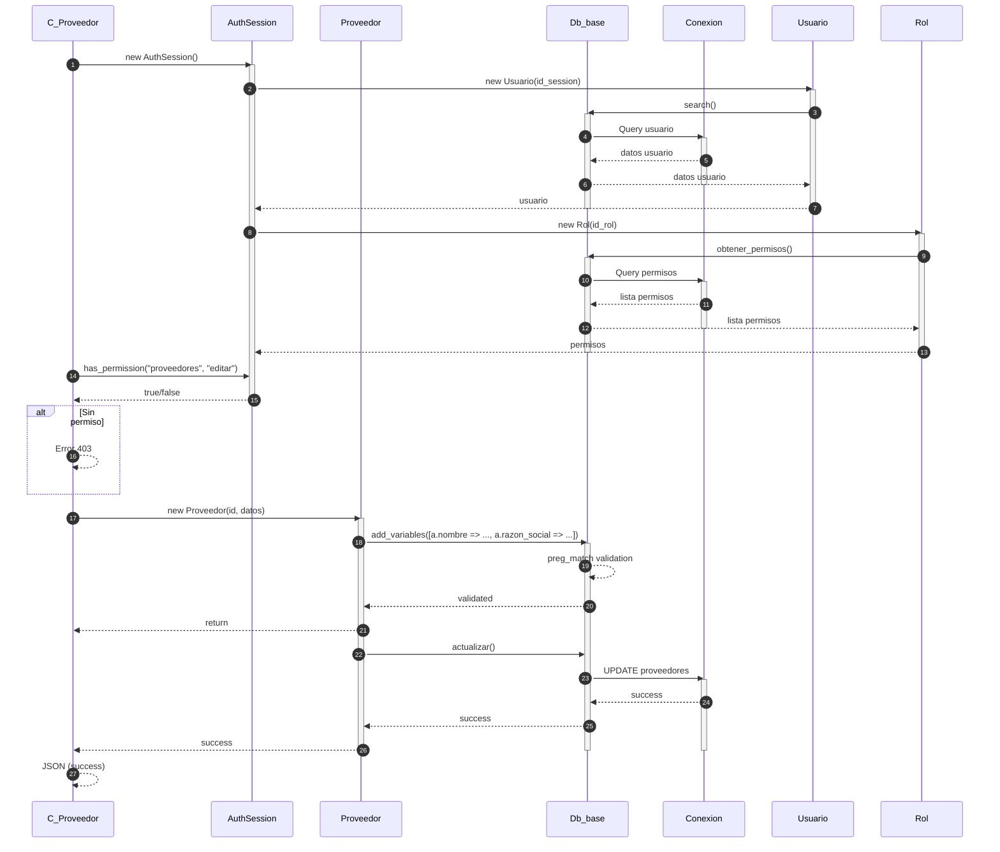
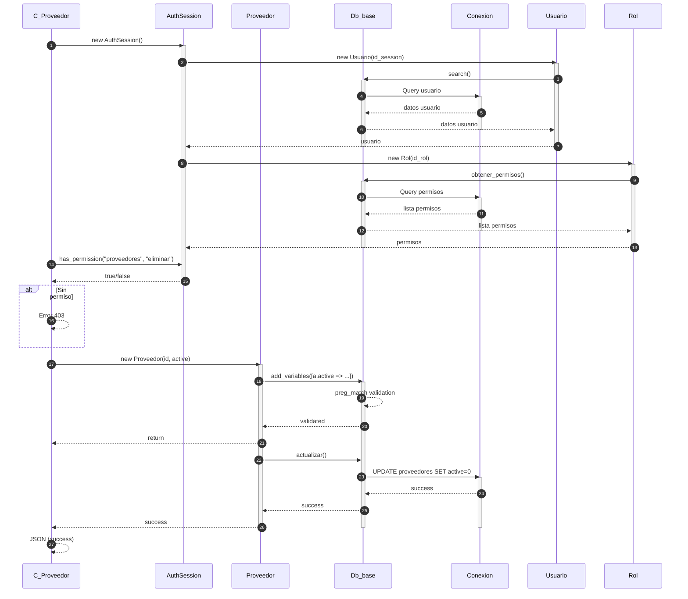

# Módulo Proveedores - Diagrama de Secuencia

## Agregar Proveedor

```mermaid
sequenceDiagram
    autonumber
    participant C_Proveedor as C_Proveedor
    participant AuthSession as AuthSession
    participant Usuario as Usuario
    participant Rol as Rol
    participant Proveedor as Proveedor
    participant Db_base as Db_base
    participant Conexion as Conexion
    
    C_Proveedor->>AuthSession: new AuthSession()
    activate AuthSession
    AuthSession->>Usuario: new Usuario(id_session)
    activate Usuario
    Usuario->>Db_base: search()
    activate Db_base
    Db_base->>Conexion: Query usuario
    activate Conexion
    Conexion-->>Db_base: datos usuario
    Db_base-->>Usuario: datos usuario
    deactivate Conexion
    Usuario-->>AuthSession: usuario
    deactivate Usuario
    deactivate Db_base
    
    AuthSession->>Rol: new Rol(id_rol)
    activate Rol
    Rol->>Db_base: obtener_permisos()
    activate Db_base
    Db_base->>Conexion: Query permisos
    activate Conexion
    Conexion-->>Db_base: lista permisos
    Db_base-->>Rol: lista permisos
    deactivate Conexion
    Rol-->>AuthSession: permisos
    deactivate Rol
    deactivate Db_base
    
    C_Proveedor->>AuthSession: has_permission("proveedores", "agregar")
    AuthSession-->>C_Proveedor: true/false
    deactivate AuthSession
    
    alt Sin permiso
        C_Proveedor-->>C_Proveedor: Error 403
    end
    
    C_Proveedor->>Proveedor: new Proveedor(nombre, razon_social, documento, telefono1, telefono2, direccion)
    activate Proveedor
    Proveedor->>Db_base: add_variables([a.nombre => ..., a.razon_social => ..., a.documento => ...])
    activate Db_base
    Db_base-->>Db_base: preg_match validation
    Db_base-->>Proveedor: validated
    Proveedor-->>C_Proveedor: return
    C_Proveedor->>Proveedor: agregar()
    Proveedor->>Db_base: agregar()
    Db_base->>Conexion: INSERT INTO proveedores
    activate Conexion
    Conexion-->>Db_base: lastInsertId
    Db_base-->>Proveedor: lastInsertId
    Proveedor-->>C_Proveedor: id
    deactivate Proveedor
    deactivate Conexion
    deactivate Db_base
    
    C_Proveedor-->>C_Proveedor: JSON (success, id)
```

## Consultar Proveedores

```mermaid
sequenceDiagram
    autonumber
    participant C_Proveedor as C_Proveedor
    participant AuthSession as AuthSession
    participant Proveedor as Proveedor
    participant Db_base as Db_base
    participant Conexion as Conexion
    
    C_Proveedor->>AuthSession: new AuthSession()
    activate AuthSession
    AuthSession->>Usuario: new Usuario(id_session)
    activate Usuario
    Usuario->>Db_base: search()
    activate Db_base
    Db_base->>Conexion: Query usuario
    activate Conexion
    Conexion-->>Db_base: datos usuario
    Db_base-->>Usuario: datos usuario
    deactivate Conexion
    Usuario-->>AuthSession: usuario
    deactivate Usuario
    deactivate Db_base
    
    AuthSession->>Rol: new Rol(id_rol)
    activate Rol
    Rol->>Db_base: obtener_permisos()
    activate Db_base
    Db_base->>Conexion: Query permisos
    activate Conexion
    Conexion-->>Db_base: lista permisos
    Db_base-->>Rol: lista permisos
    deactivate Conexion
    Rol-->>AuthSession: permisos
    deactivate Rol
    deactivate Db_base
    
    C_Proveedor->>AuthSession: has_permission("proveedores", "consultar")
    AuthSession-->>C_Proveedor: true/false
    deactivate AuthSession
    
    alt Sin permiso
        C_Proveedor-->>C_Proveedor: Error 403
    end
    
    C_Proveedor->>Proveedor: new Proveedor(search)
    activate Proveedor
    Proveedor->>Db_base: search()
    activate Db_base
    Db_base->>Conexion: SELECT WHERE razon_social LIKE
    activate Conexion
    Conexion-->>Db_base: array de proveedores
    Db_base-->>Proveedor: array de proveedores
    Proveedor-->>C_Proveedor: array de proveedores
    deactivate Proveedor
    deactivate Conexion
    deactivate Db_base
    
    C_Proveedor-->>C_Proveedor: JSON (data, recordsFiltered)
```

## Actualizar Proveedor

```mermaid
sequenceDiagram
    autonumber
    participant C_Proveedor as C_Proveedor
    participant AuthSession as AuthSession
    participant Proveedor as Proveedor
    participant Db_base as Db_base
    participant Conexion as Conexion
    
    C_Proveedor->>AuthSession: new AuthSession()
    activate AuthSession
    AuthSession->>Usuario: new Usuario(id_session)
    activate Usuario
    Usuario->>Db_base: search()
    activate Db_base
    Db_base->>Conexion: Query usuario
    activate Conexion
    Conexion-->>Db_base: datos usuario
    Db_base-->>Usuario: datos usuario
    deactivate Conexion
    Usuario-->>AuthSession: usuario
    deactivate Usuario
    deactivate Db_base
    
    AuthSession->>Rol: new Rol(id_rol)
    activate Rol
    Rol->>Db_base: obtener_permisos()
    activate Db_base
    Db_base->>Conexion: Query permisos
    activate Conexion
    Conexion-->>Db_base: lista permisos
    Db_base-->>Rol: lista permisos
    deactivate Conexion
    Rol-->>AuthSession: permisos
    deactivate Rol
    deactivate Db_base
    
    C_Proveedor->>AuthSession: has_permission("proveedores", "editar")
    AuthSession-->>C_Proveedor: true/false
    deactivate AuthSession
    
    alt Sin permiso
        C_Proveedor-->>C_Proveedor: Error 403
    end
    
    C_Proveedor->>Proveedor: new Proveedor(id, datos)
    activate Proveedor
    Proveedor->>Db_base: add_variables([a.nombre => ..., a.razon_social => ...])
    activate Db_base
    Db_base-->>Db_base: preg_match validation
    Db_base-->>Proveedor: validated
    Proveedor-->>C_Proveedor: return
    Proveedor->>Db_base: actualizar()
    Db_base->>Conexion: UPDATE proveedores
    activate Conexion
    Conexion-->>Db_base: success
    Db_base-->>Proveedor: success
    Proveedor-->>C_Proveedor: success
    deactivate Proveedor
    deactivate Conexion
    deactivate Db_base
    
    C_Proveedor-->>C_Proveedor: JSON (success)
```

## Eliminar Proveedor (Soft-delete)

```mermaid
sequenceDiagram
    autonumber
    participant C_Proveedor as C_Proveedor
    participant AuthSession as AuthSession
    participant Proveedor as Proveedor
    participant Db_base as Db_base
    participant Conexion as Conexion
    
    C_Proveedor->>AuthSession: new AuthSession()
    activate AuthSession
    AuthSession->>Usuario: new Usuario(id_session)
    activate Usuario
    Usuario->>Db_base: search()
    activate Db_base
    Db_base->>Conexion: Query usuario
    activate Conexion
    Conexion-->>Db_base: datos usuario
    Db_base-->>Usuario: datos usuario
    deactivate Conexion
    Usuario-->>AuthSession: usuario
    deactivate Usuario
    deactivate Db_base
    
    AuthSession->>Rol: new Rol(id_rol)
    activate Rol
    Rol->>Db_base: obtener_permisos()
    activate Db_base
    Db_base->>Conexion: Query permisos
    activate Conexion
    Conexion-->>Db_base: lista permisos
    Db_base-->>Rol: lista permisos
    deactivate Conexion
    Rol-->>AuthSession: permisos
    deactivate Rol
    deactivate Db_base
    
    C_Proveedor->>AuthSession: has_permission("proveedores", "eliminar")
    AuthSession-->>C_Proveedor: true/false
    deactivate AuthSession
    
    alt Sin permiso
        C_Proveedor-->>C_Proveedor: Error 403
    end
    
    C_Proveedor->>Proveedor: new Proveedor(id, active)
    activate Proveedor
    Proveedor->>Db_base: add_variables([a.active => ...])
    activate Db_base
    Db_base-->>Db_base: preg_match validation
    Db_base-->>Proveedor: validated
    Proveedor-->>C_Proveedor: return
    Proveedor->>Db_base: actualizar()
    Db_base->>Conexion: UPDATE proveedores SET active=0
    activate Conexion
    Conexion-->>Db_base: success
    Db_base-->>Proveedor: success
    Proveedor-->>C_Proveedor: success
    deactivate Proveedor
    deactivate Conexion
    deactivate Db_base
    
    C_Proveedor-->>C_Proveedor: JSON (success)
```
