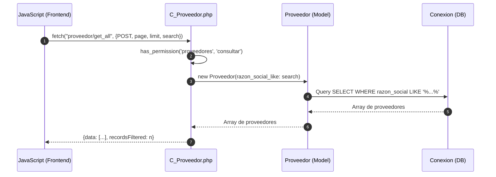
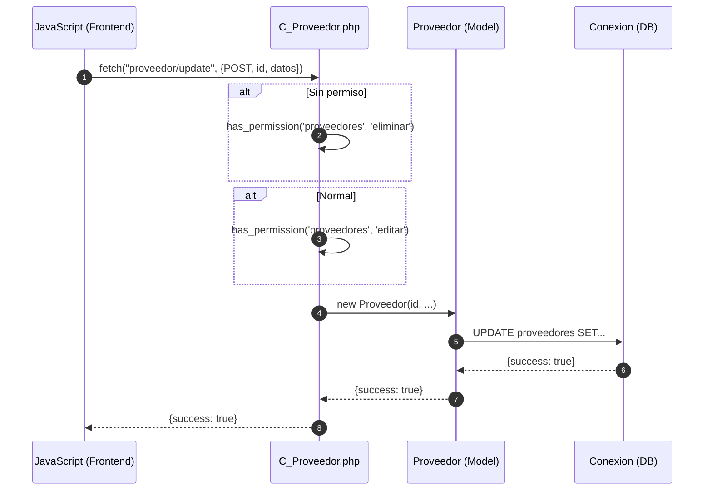
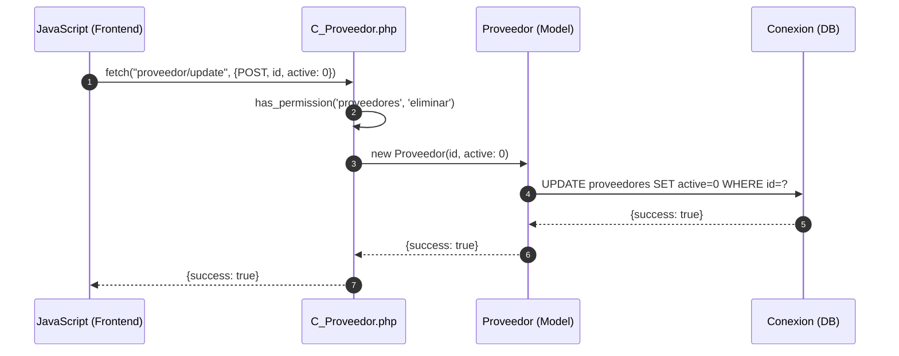

# Módulo Proveedores - Diagrama de Secuencia

## Agregar Proveedor

```mermaid
sequenceDiagram
    autonumber
    participant JS as JavaScript (Frontend)
    participant C_Proveedor as C_Proveedor.php
    participant Proveedor as Proveedor (Model)
    participant DB as Conexion (DB)
    
    JS->>C_Proveedor: fetch("proveedor/add", {POST, formData})
    
    alt Validación de permisos
        C_Proveedor->>C_Proveedor: has_permission('proveedores', 'agregar')
    end
    
    C_Proveedor->>Proveedor: new Proveedor(
        nombre, 
        razon_social, 
        documento,
        n_telefono1,
        n_telefono2,
        direccion
    )
    
    C_Proveedor->>Proveedor: agregar()
    Proveedor->>DB: INSERT INTO proveedores (...)
    DB-->>Proveedor: lastInsertId
    Proveedor-->>C_Proveedor: lastInsertId
    
    C_Proveedor-->>JS: {success: true, last_id: id}
```

## Consultar Proveedores



## Actualizar Proveedor



## Eliminar Proveedor (Soft-delete)


