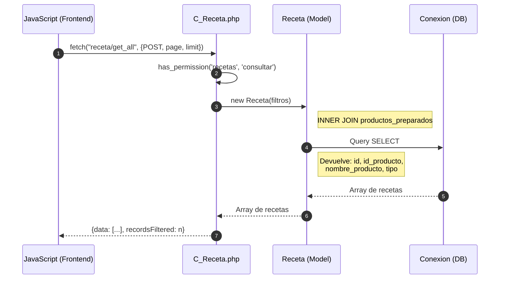
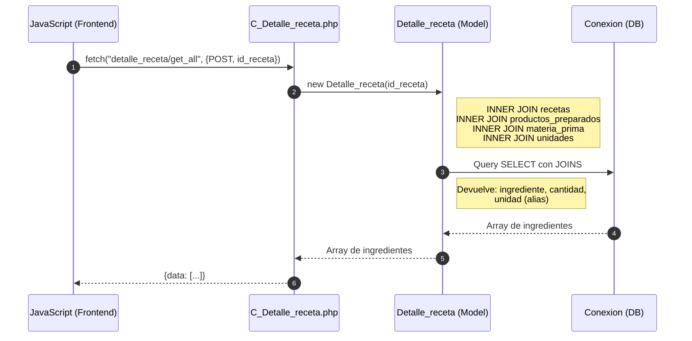
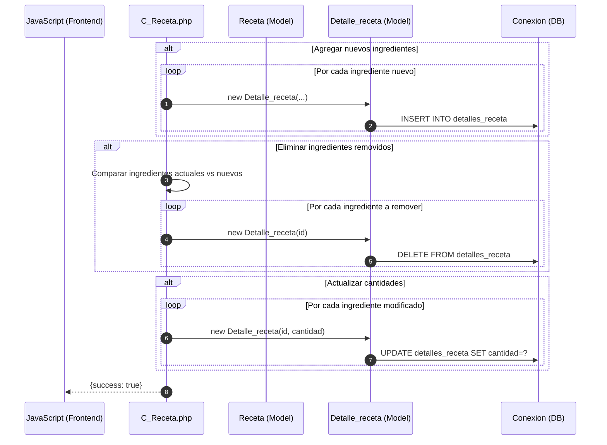
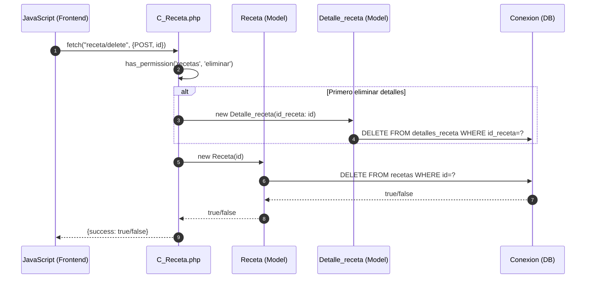

# Módulo Recetas - Diagrama de Secuencia

## Agregar Receta

```mermaid
sequenceDiagram
    autonumber
    participant JS as JavaScript (Frontend)
    participant C_Receta as C_Receta.php
    participant Receta as Receta (Model)
    participant Detalle_receta as Detalle_receta (Model)
    participant DB as Conexion (DB)
    
    JS->>C_Receta: fetch("receta/add", {POST, id_producto})
    
    alt Validación de permisos
        C_Receta->>C_Receta: has_permission('recetas', 'agregar')
    end
    
    C_Receta->>Receta: new Receta(id_producto)
    
    C_Receta->>Receta: agregar()
    Receta->>DB: INSERT INTO recetas (id_producto)
    DB-->>Receta: id_receta
    Receta-->>C_Receta: id_receta
    
    loop Por cada ingrediente (materia prima)
        C_Receta->>Detalle_receta: new Detalle_receta(
            id_receta, 
            id_materia_prima, 
            cantidad
        )
        Detalle_receta->>DB: INSERT INTO detalles_receta
        DB-->>Detalle_receta: lastInsertId
        Detalle_receta-->>C_Receta: lastInsertId
    end
    
    C_Receta-->>JS: {success: true, last_id: id_receta}
```

## Consultar Recetas



## Consultar Detalles de Receta (Ingredientes)



## Actualizar Receta



## Eliminar Receta


