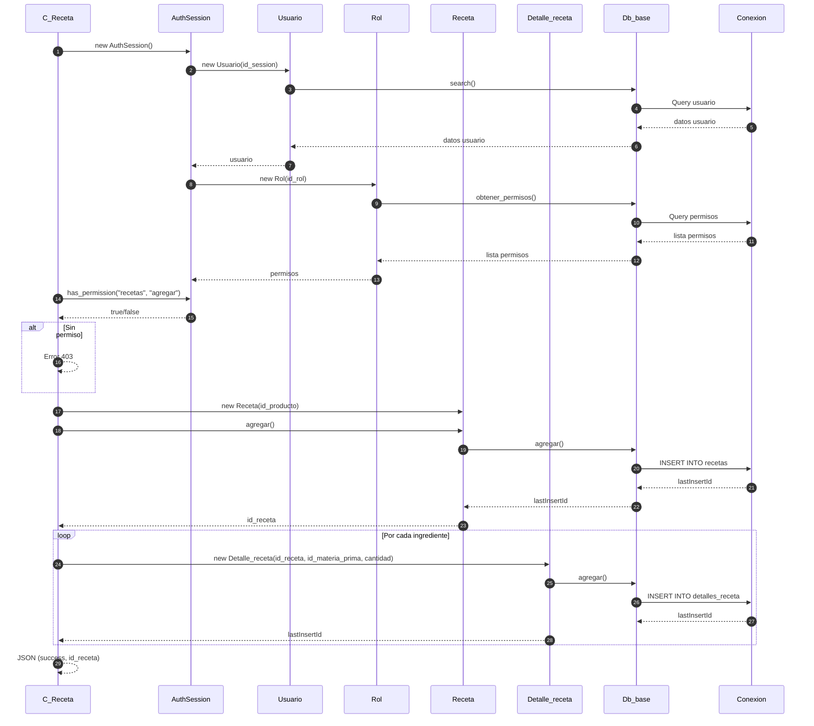
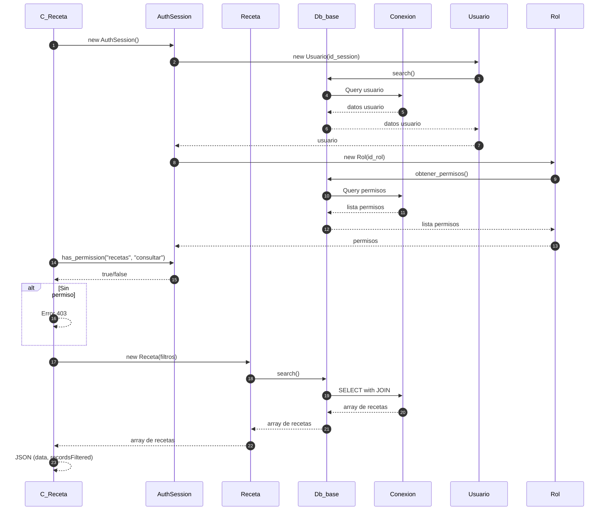
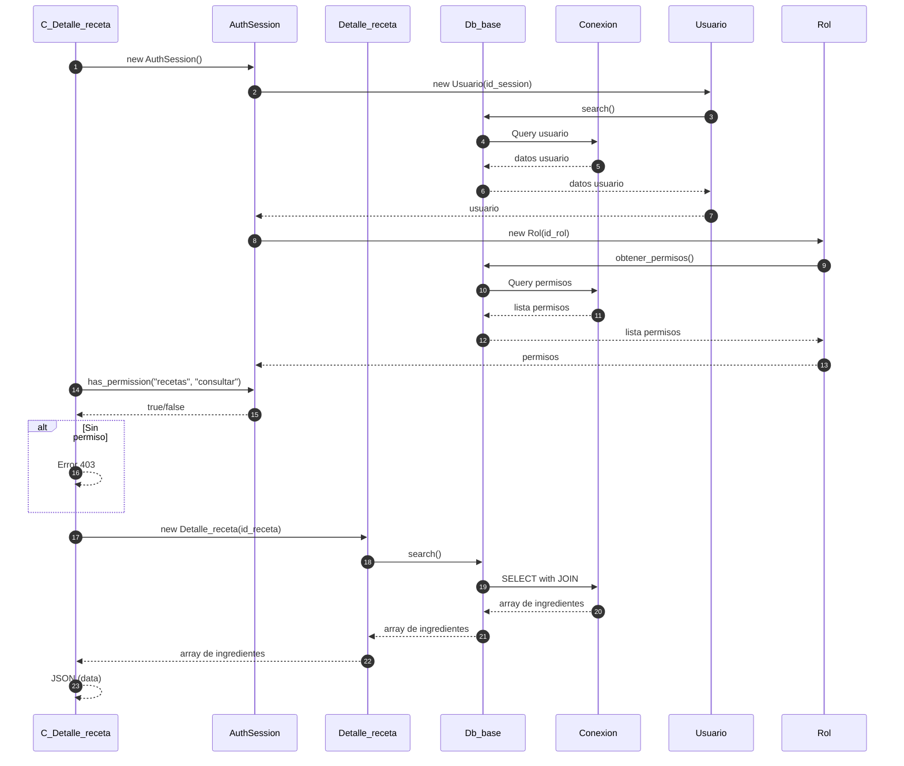
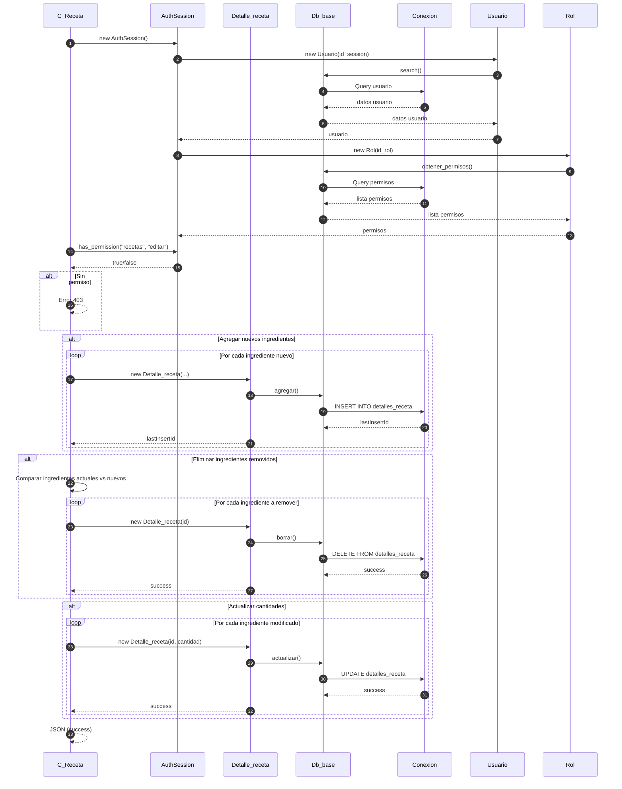
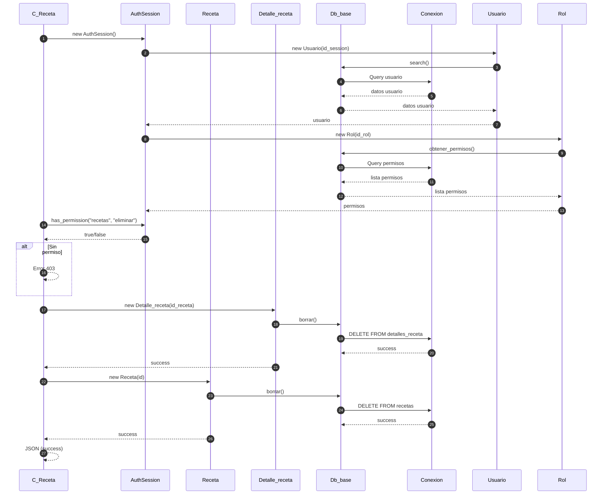

# Módulo Recetas - Diagrama de Secuencia

## Agregar Receta

```mermaid
sequenceDiagram
    autonumber
    participant C_Receta as C_Receta
    participant AuthSession as AuthSession
    participant Usuario as Usuario
    participant Rol as Rol
    participant Receta as Receta
    participant Detalle_receta as Detalle_receta
    participant Db_base as Db_base
    participant Conexion as Conexion
    
    C_Receta->>AuthSession: new AuthSession()
    AuthSession->>Usuario: new Usuario(id_session)
    Usuario->>Db_base: search()
    Db_base->>Conexion: Query usuario
    Conexion-->>Db_base: datos usuario
    Db_base-->>Usuario: datos usuario
    Usuario-->>AuthSession: usuario
    
    AuthSession->>Rol: new Rol(id_rol)
    Rol->>Db_base: obtener_permisos()
    Db_base->>Conexion: Query permisos
    Conexion-->>Db_base: lista permisos
    Db_base-->>Rol: lista permisos
    Rol-->>AuthSession: permisos
    
    C_Receta->>AuthSession: has_permission("recetas", "agregar")
    AuthSession-->>C_Receta: true/false
    
    alt Sin permiso
        C_Receta-->>C_Receta: Error 403
    end
    
    C_Receta->>Receta: new Receta(id_producto)
    C_Receta->>Receta: agregar()
    Receta->>Db_base: agregar()
    Db_base->>Conexion: INSERT INTO recetas
    Conexion-->>Db_base: lastInsertId
    Db_base-->>Receta: lastInsertId
    Receta-->>C_Receta: id_receta
    
    loop Por cada ingrediente
        C_Receta->>Detalle_receta: new Detalle_receta(id_receta, id_materia_prima, cantidad)
        Detalle_receta->>Db_base: agregar()
        Db_base->>Conexion: INSERT INTO detalles_receta
        Conexion-->>Db_base: lastInsertId
        Detalle_receta-->>C_Receta: lastInsertId
    end
    
    C_Receta-->>C_Receta: JSON (success, id_receta)
```

## Consultar Recetas

```mermaid
sequenceDiagram
    autonumber
    participant C_Receta as C_Receta
    participant AuthSession as AuthSession
    participant Receta as Receta
    participant Db_base as Db_base
    participant Conexion as Conexion
    
    C_Receta->>AuthSession: new AuthSession()
    AuthSession->>Usuario: new Usuario(id_session)
    Usuario->>Db_base: search()
    Db_base->>Conexion: Query usuario
    Conexion-->>Db_base: datos usuario
    Db_base-->>Usuario: datos usuario
    Usuario-->>AuthSession: usuario
    
    AuthSession->>Rol: new Rol(id_rol)
    Rol->>Db_base: obtener_permisos()
    Db_base->>Conexion: Query permisos
    Conexion-->>Db_base: lista permisos
    Db_base-->>Rol: lista permisos
    Rol-->>AuthSession: permisos
    
    C_Receta->>AuthSession: has_permission("recetas", "consultar")
    AuthSession-->>C_Receta: true/false
    
    alt Sin permiso
        C_Receta-->>C_Receta: Error 403
    end
    
    C_Receta->>Receta: new Receta(filtros)
    Receta->>Db_base: search()
    Db_base->>Conexion: SELECT with JOIN
    Conexion-->>Db_base: array de recetas
    Db_base-->>Receta: array de recetas
    Receta-->>C_Receta: array de recetas
    
    C_Receta-->>C_Receta: JSON (data, recordsFiltered)
```

## Consultar Detalles de Receta

```mermaid
sequenceDiagram
    autonumber
    participant C_Detalle_receta as C_Detalle_receta
    participant AuthSession as AuthSession
    participant Detalle_receta as Detalle_receta
    participant Db_base as Db_base
    participant Conexion as Conexion
    
    C_Detalle_receta->>AuthSession: new AuthSession()
    AuthSession->>Usuario: new Usuario(id_session)
    Usuario->>Db_base: search()
    Db_base->>Conexion: Query usuario
    Conexion-->>Db_base: datos usuario
    Db_base-->>Usuario: datos usuario
    Usuario-->>AuthSession: usuario
    
    AuthSession->>Rol: new Rol(id_rol)
    Rol->>Db_base: obtener_permisos()
    Db_base->>Conexion: Query permisos
    Conexion-->>Db_base: lista permisos
    Db_base-->>Rol: lista permisos
    Rol-->>AuthSession: permisos
    
    C_Detalle_receta->>AuthSession: has_permission("recetas", "consultar")
    AuthSession-->>C_Detalle_receta: true/false
    
    alt Sin permiso
        C_Detalle_receta-->>C_Detalle_receta: Error 403
    end
    
    C_Detalle_receta->>Detalle_receta: new Detalle_receta(id_receta)
    Detalle_receta->>Db_base: search()
    Db_base->>Conexion: SELECT with JOIN
    Conexion-->>Db_base: array de ingredientes
    Db_base-->>Detalle_receta: array de ingredientes
    Detalle_receta-->>C_Detalle_receta: array de ingredientes
    
    C_Detalle_receta-->>C_Detalle_receta: JSON (data)
```

## Actualizar Receta

```mermaid
sequenceDiagram
    autonumber
    participant C_Receta as C_Receta
    participant AuthSession as AuthSession
    participant Detalle_receta as Detalle_receta
    participant Db_base as Db_base
    participant Conexion as Conexion
    
    C_Receta->>AuthSession: new AuthSession()
    AuthSession->>Usuario: new Usuario(id_session)
    Usuario->>Db_base: search()
    Db_base->>Conexion: Query usuario
    Conexion-->>Db_base: datos usuario
    Db_base-->>Usuario: datos usuario
    Usuario-->>AuthSession: usuario
    
    AuthSession->>Rol: new Rol(id_rol)
    Rol->>Db_base: obtener_permisos()
    Db_base->>Conexion: Query permisos
    Conexion-->>Db_base: lista permisos
    Db_base-->>Rol: lista permisos
    Rol-->>AuthSession: permisos
    
    C_Receta->>AuthSession: has_permission("recetas", "editar")
    AuthSession-->>C_Receta: true/false
    
    alt Sin permiso
        C_Receta-->>C_Receta: Error 403
    end
    
    alt Agregar nuevos ingredientes
        loop Por cada ingrediente nuevo
            C_Receta->>Detalle_receta: new Detalle_receta(...)
            Detalle_receta->>Db_base: agregar()
            Db_base->>Conexion: INSERT INTO detalles_receta
            Conexion-->>Db_base: lastInsertId
            Detalle_receta-->>C_Receta: lastInsertId
        end
    end
    
    alt Eliminar ingredientes removidos
        C_Receta->>C_Receta: Comparar ingredientes actuales vs nuevos
        loop Por cada ingrediente a remover
            C_Receta->>Detalle_receta: new Detalle_receta(id)
            Detalle_receta->>Db_base: borrar()
            Db_base->>Conexion: DELETE FROM detalles_receta
            Conexion-->>Db_base: success
            Detalle_receta-->>C_Receta: success
        end
    end
    
    alt Actualizar cantidades
        loop Por cada ingrediente modificado
            C_Receta->>Detalle_receta: new Detalle_receta(id, cantidad)
            Detalle_receta->>Db_base: actualizar()
            Db_base->>Conexion: UPDATE detalles_receta
            Conexion-->>Db_base: success
            Detalle_receta-->>C_Receta: success
        end
    end
    
    C_Receta-->>C_Receta: JSON (success)
```

## Eliminar Receta

```mermaid
sequenceDiagram
    autonumber
    participant C_Receta as C_Receta
    participant AuthSession as AuthSession
    participant Receta as Receta
    participant Detalle_receta as Detalle_receta
    participant Db_base as Db_base
    participant Conexion as Conexion
    
    C_Receta->>AuthSession: new AuthSession()
    AuthSession->>Usuario: new Usuario(id_session)
    Usuario->>Db_base: search()
    Db_base->>Conexion: Query usuario
    Conexion-->>Db_base: datos usuario
    Db_base-->>Usuario: datos usuario
    Usuario-->>AuthSession: usuario
    
    AuthSession->>Rol: new Rol(id_rol)
    Rol->>Db_base: obtener_permisos()
    Db_base->>Conexion: Query permisos
    Conexion-->>Db_base: lista permisos
    Db_base-->>Rol: lista permisos
    Rol-->>AuthSession: permisos
    
    C_Receta->>AuthSession: has_permission("recetas", "eliminar")
    AuthSession-->>C_Receta: true/false
    
    alt Sin permiso
        C_Receta-->>C_Receta: Error 403
    end
    
    C_Receta->>Detalle_receta: new Detalle_receta(id_receta)
    Detalle_receta->>Db_base: borrar()
    Db_base->>Conexion: DELETE FROM detalles_receta
    Conexion-->>Db_base: success
    Detalle_receta-->>C_Receta: success
    
    C_Receta->>Receta: new Receta(id)
    Receta->>Db_base: borrar()
    Db_base->>Conexion: DELETE FROM recetas
    Conexion-->>Db_base: success
    Receta-->>C_Receta: success
    
    C_Receta-->>C_Receta: JSON (success)
```
