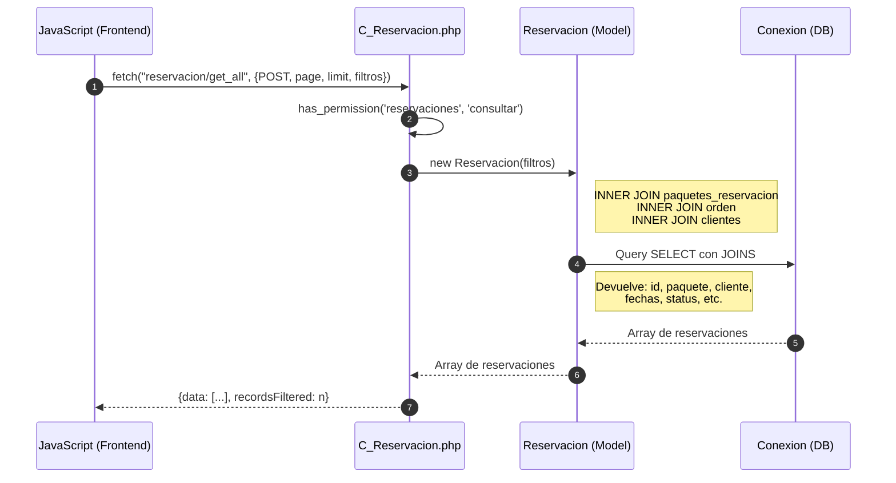
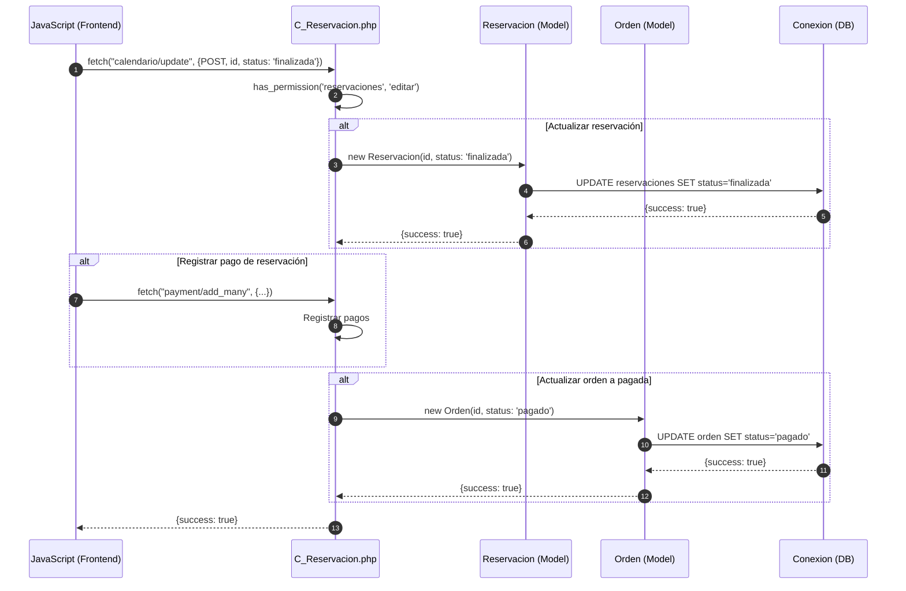

# Módulo Reservaciones - Diagrama de Secuencia

## Agregar Reservación

```mermaid
sequenceDiagram
    autonumber
    participant JS as JavaScript (Frontend)
    participant C_Reservacion as C_Reservacion.php
    participant Reservacion as Reservacion (Model)
    participant Paquetes_mesa as Paquetes_mesa (Model)
    participant DB as Conexion (DB)
    
    JS->>C_Reservacion: fetch("reservacion/add", {POST, formData})
    
    alt Validación de permisos
        C_Reservacion->>C_Reservacion: has_permission('reservaciones', 'agregar')
    end
    
    alt Crear Orden primero
        C_Reservacion->>C_Reservacion: fetch("orden/add", {...})
    end
    
    C_Reservacion->>Reservacion: new Reservacion(
        id_orden, 
        id_paquete, 
        fecha_inicio, 
        fecha_final,
        descripcion
    )
    
    Reservacion->>DB: INSERT INTO reservaciones (...)
    DB-->>Reservacion: lastInsertId
    Reservacion-->>C_Reservacion: lastInsertId
    
    loop Por cada mesa en paquete
        C_Reservacion->>Paquetes_mesa: new Paquetes_mesa(id_paquete, id_mesa)
        Paquetes_mesa->>DB: INSERT INTO paquetes_mesas
        DB-->>Paquetes_mesa: lastInsertId
        Paquetes_mesa-->>C_Reservacion: lastInsertId
    end
    
    C_Reservacion-->>JS: {success: true, last_id: id}
```

## Consultar Reservaciones



## Finalizar Reservación (al pagar)



## Bloquear Fechas (No disponible)

```mermaid
sequenceDiagram
    autonumber
    participant JS as JavaScript (Frontend)
    participant C_Reservacion as C_Reservacion.php
    participant Reservacion as Reservacion (Model)
    participant DB as Conexion (DB)
    
    JS->>C_Reservacion: fetch("reservacion/add", {POST, fecha_bloqueo, ...})
    
    C_Reservacion->>C_Reservacion: has_permission('reservaciones', 'agregar')
    
    C_Reservacion->>Reservacion: new Reservacion(
        fecha_bloqueo, 
        status: 'bloqueado'
    )
    
    Reservacion->>DB: INSERT INTO reservaciones (...)
    DB-->>Reservacion: lastInsertId
    Reservacion-->>C_Reservacion: lastInsertId
    
    C_Reservacion-->>JS: {success: true, last_id: id}
```
