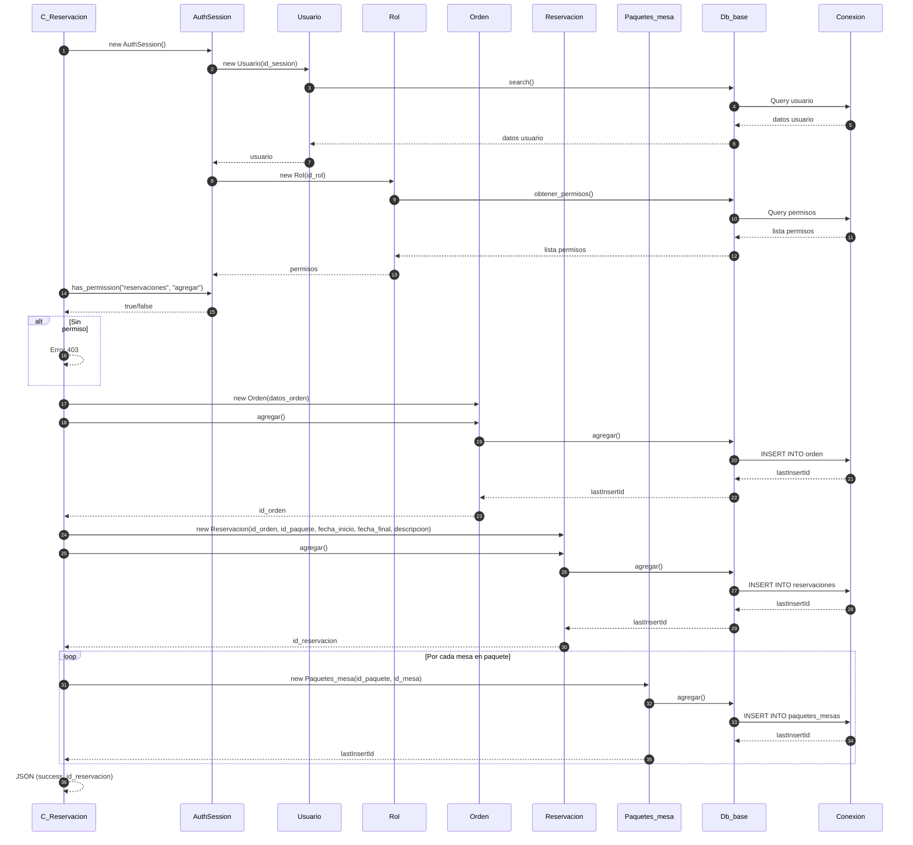
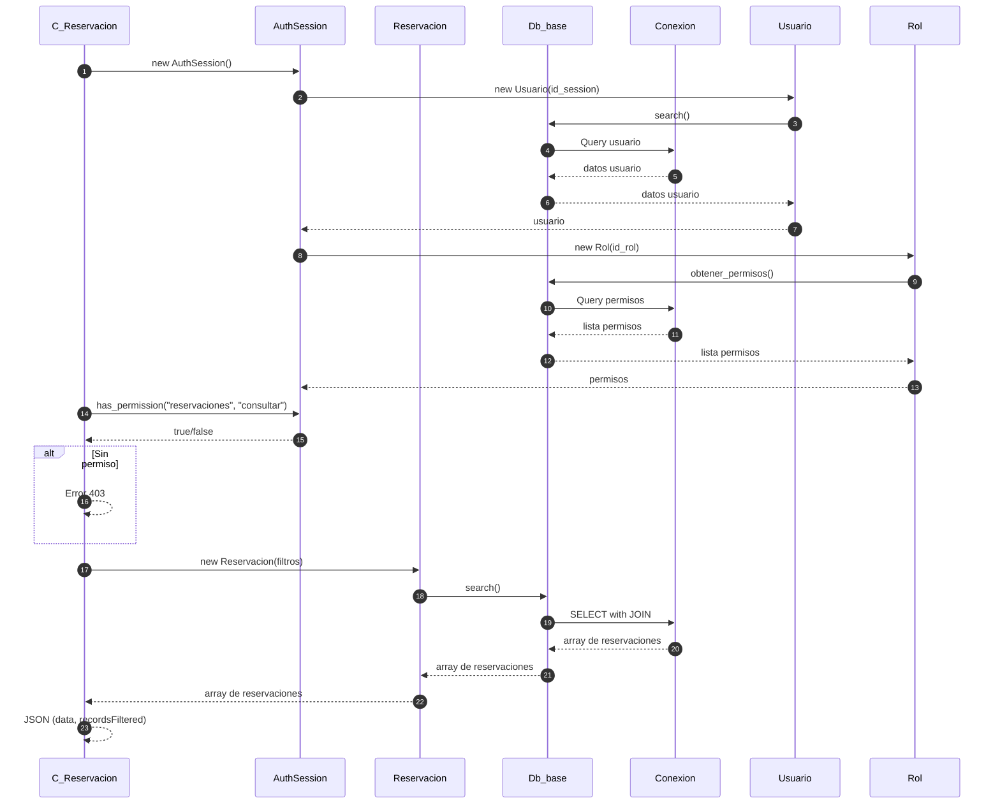
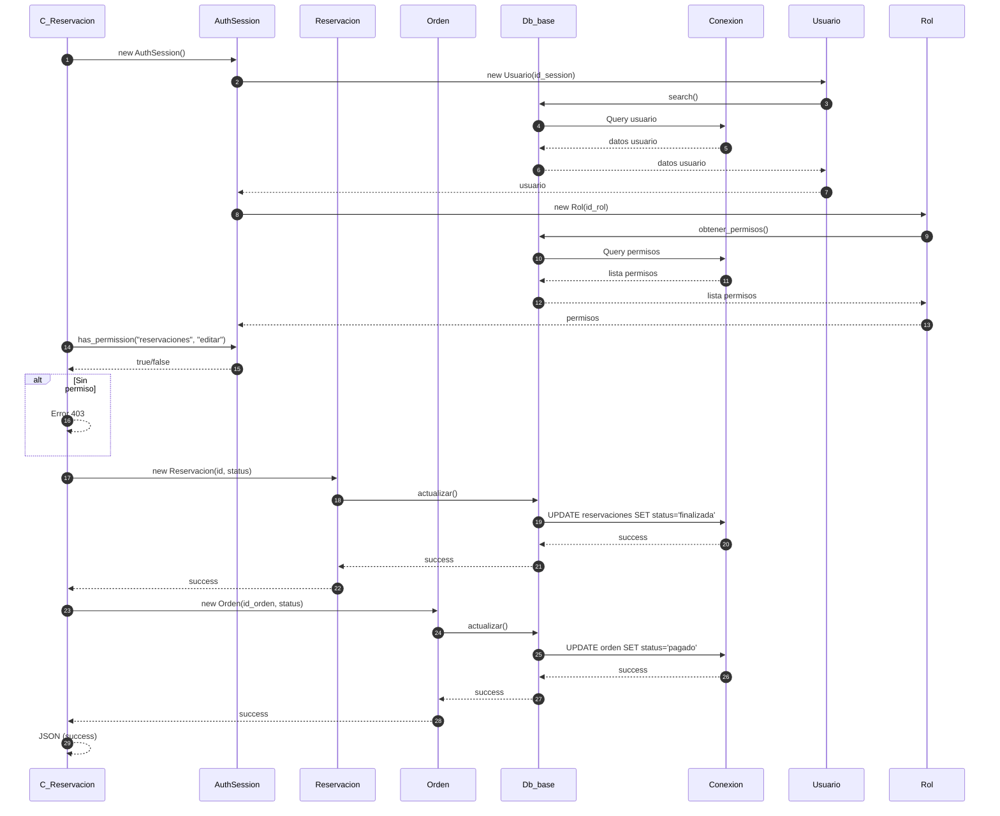
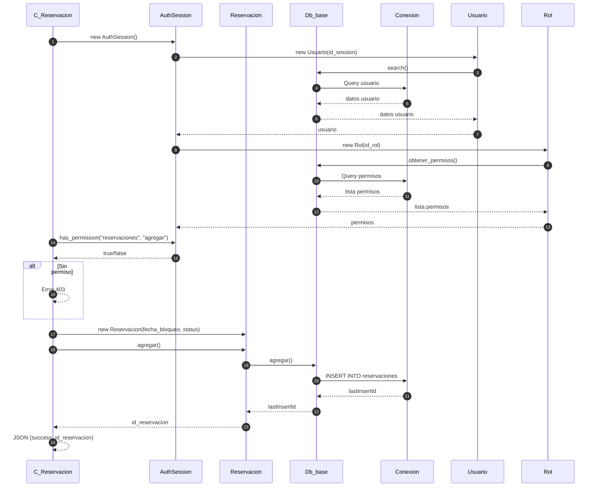

# Módulo Reservaciones - Diagrama de Secuencia

## Agregar Reservación

```mermaid
sequenceDiagram
    autonumber
    participant C_Reservacion as C_Reservacion
    participant AuthSession as AuthSession
    participant Usuario as Usuario
    participant Rol as Rol
    participant Orden as Orden
    participant Reservacion as Reservacion
    participant Paquetes_mesa as Paquetes_mesa
    participant Db_base as Db_base
    participant Conexion as Conexion
    
    C_Reservacion->>AuthSession: new AuthSession()
    AuthSession->>Usuario: new Usuario(id_session)
    Usuario->>Db_base: search()
    Db_base->>Conexion: Query usuario
    Conexion-->>Db_base: datos usuario
    Db_base-->>Usuario: datos usuario
    Usuario-->>AuthSession: usuario
    
    AuthSession->>Rol: new Rol(id_rol)
    Rol->>Db_base: obtener_permisos()
    Db_base->>Conexion: Query permisos
    Conexion-->>Db_base: lista permisos
    Db_base-->>Rol: lista permisos
    Rol-->>AuthSession: permisos
    
    C_Reservacion->>AuthSession: has_permission("reservaciones", "agregar")
    AuthSession-->>C_Reservacion: true/false
    
    alt Sin permiso
        C_Reservacion-->>C_Reservacion: Error 403
    end
    
    C_Reservacion->>Orden: new Orden(datos_orden)
    C_Reservacion->>Orden: agregar()
    Orden->>Db_base: agregar()
    Db_base->>Conexion: INSERT INTO orden
    Conexion-->>Db_base: lastInsertId
    Db_base-->>Orden: lastInsertId
    Orden-->>C_Reservacion: id_orden
    
    C_Reservacion->>Reservacion: new Reservacion(id_orden, id_paquete, fecha_inicio, fecha_final, descripcion)
    C_Reservacion->>Reservacion: agregar()
    Reservacion->>Db_base: agregar()
    Db_base->>Conexion: INSERT INTO reservaciones
    Conexion-->>Db_base: lastInsertId
    Db_base-->>Reservacion: lastInsertId
    Reservacion-->>C_Reservacion: id_reservacion
    
    loop Por cada mesa en paquete
        C_Reservacion->>Paquetes_mesa: new Paquetes_mesa(id_paquete, id_mesa)
        Paquetes_mesa->>Db_base: agregar()
        Db_base->>Conexion: INSERT INTO paquetes_mesas
        Conexion-->>Db_base: lastInsertId
        Paquetes_mesa-->>C_Reservacion: lastInsertId
    end
    
    C_Reservacion-->>C_Reservacion: JSON (success, id_reservacion)
```

## Consultar Reservaciones

```mermaid
sequenceDiagram
    autonumber
    participant C_Reservacion as C_Reservacion
    participant AuthSession as AuthSession
    participant Reservacion as Reservacion
    participant Db_base as Db_base
    participant Conexion as Conexion
    
    C_Reservacion->>AuthSession: new AuthSession()
    AuthSession->>Usuario: new Usuario(id_session)
    Usuario->>Db_base: search()
    Db_base->>Conexion: Query usuario
    Conexion-->>Db_base: datos usuario
    Db_base-->>Usuario: datos usuario
    Usuario-->>AuthSession: usuario
    
    AuthSession->>Rol: new Rol(id_rol)
    Rol->>Db_base: obtener_permisos()
    Db_base->>Conexion: Query permisos
    Conexion-->>Db_base: lista permisos
    Db_base-->>Rol: lista permisos
    Rol-->>AuthSession: permisos
    
    C_Reservacion->>AuthSession: has_permission("reservaciones", "consultar")
    AuthSession-->>C_Reservacion: true/false
    
    alt Sin permiso
        C_Reservacion-->>C_Reservacion: Error 403
    end
    
    C_Reservacion->>Reservacion: new Reservacion(filtros)
    Reservacion->>Db_base: search()
    Db_base->>Conexion: SELECT with JOIN
    Conexion-->>Db_base: array de reservaciones
    Db_base-->>Reservacion: array de reservaciones
    Reservacion-->>C_Reservacion: array de reservaciones
    
    C_Reservacion-->>C_Reservacion: JSON (data, recordsFiltered)
```

## Finalizar Reservación

```mermaid
sequenceDiagram
    autonumber
    participant C_Reservacion as C_Reservacion
    participant AuthSession as AuthSession
    participant Reservacion as Reservacion
    participant Orden as Orden
    participant Db_base as Db_base
    participant Conexion as Conexion
    
    C_Reservacion->>AuthSession: new AuthSession()
    AuthSession->>Usuario: new Usuario(id_session)
    Usuario->>Db_base: search()
    Db_base->>Conexion: Query usuario
    Conexion-->>Db_base: datos usuario
    Db_base-->>Usuario: datos usuario
    Usuario-->>AuthSession: usuario
    
    AuthSession->>Rol: new Rol(id_rol)
    Rol->>Db_base: obtener_permisos()
    Db_base->>Conexion: Query permisos
    Conexion-->>Db_base: lista permisos
    Db_base-->>Rol: lista permisos
    Rol-->>AuthSession: permisos
    
    C_Reservacion->>AuthSession: has_permission("reservaciones", "editar")
    AuthSession-->>C_Reservacion: true/false
    
    alt Sin permiso
        C_Reservacion-->>C_Reservacion: Error 403
    end
    
    C_Reservacion->>Reservacion: new Reservacion(id, status)
    Reservacion->>Db_base: actualizar()
    Db_base->>Conexion: UPDATE reservaciones SET status='finalizada'
    Conexion-->>Db_base: success
    Db_base-->>Reservacion: success
    Reservacion-->>C_Reservacion: success
    
    C_Reservacion->>Orden: new Orden(id_orden, status)
    Orden->>Db_base: actualizar()
    Db_base->>Conexion: UPDATE orden SET status='pagado'
    Conexion-->>Db_base: success
    Db_base-->>Orden: success
    Orden-->>C_Reservacion: success
    
    C_Reservacion-->>C_Reservacion: JSON (success)
```

## Bloquear Fechas

```mermaid
sequenceDiagram
    autonumber
    participant C_Reservacion as C_Reservacion
    participant AuthSession as AuthSession
    participant Reservacion as Reservacion
    participant Db_base as Db_base
    participant Conexion as Conexion
    
    C_Reservacion->>AuthSession: new AuthSession()
    AuthSession->>Usuario: new Usuario(id_session)
    Usuario->>Db_base: search()
    Db_base->>Conexion: Query usuario
    Conexion-->>Db_base: datos usuario
    Db_base-->>Usuario: datos usuario
    Usuario-->>AuthSession: usuario
    
    AuthSession->>Rol: new Rol(id_rol)
    Rol->>Db_base: obtener_permisos()
    Db_base->>Conexion: Query permisos
    Conexion-->>Db_base: lista permisos
    Db_base-->>Rol: lista permisos
    Rol-->>AuthSession: permisos
    
    C_Reservacion->>AuthSession: has_permission("reservaciones", "agregar")
    AuthSession-->>C_Reservacion: true/false
    
    alt Sin permiso
        C_Reservacion-->>C_Reservacion: Error 403
    end
    
    C_Reservacion->>Reservacion: new Reservacion(fecha_bloqueo, status)
    C_Reservacion->>Reservacion: agregar()
    Reservacion->>Db_base: agregar()
    Db_base->>Conexion: INSERT INTO reservaciones
    Conexion-->>Db_base: lastInsertId
    Db_base-->>Reservacion: lastInsertId
    Reservacion-->>C_Reservacion: id_reservacion
    
    C_Reservacion-->>C_Reservacion: JSON (success, id_reservacion)
```
