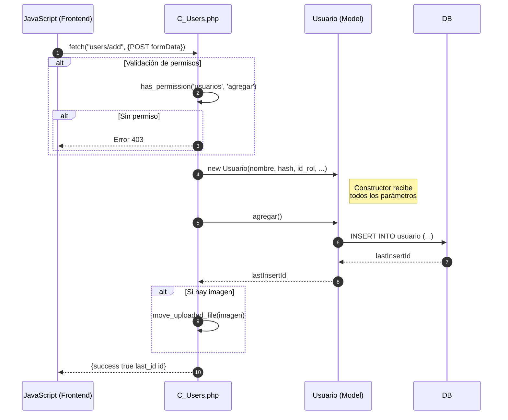
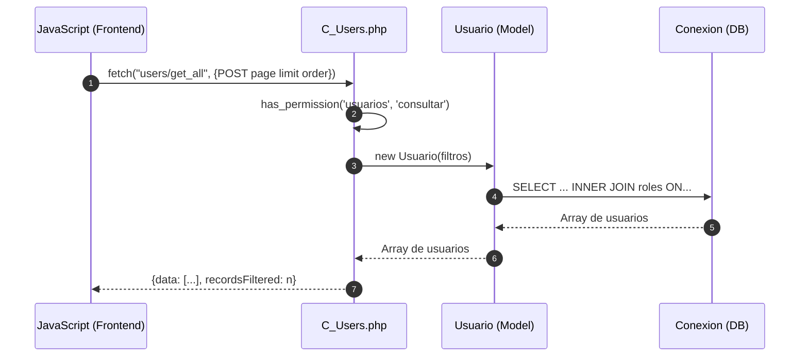
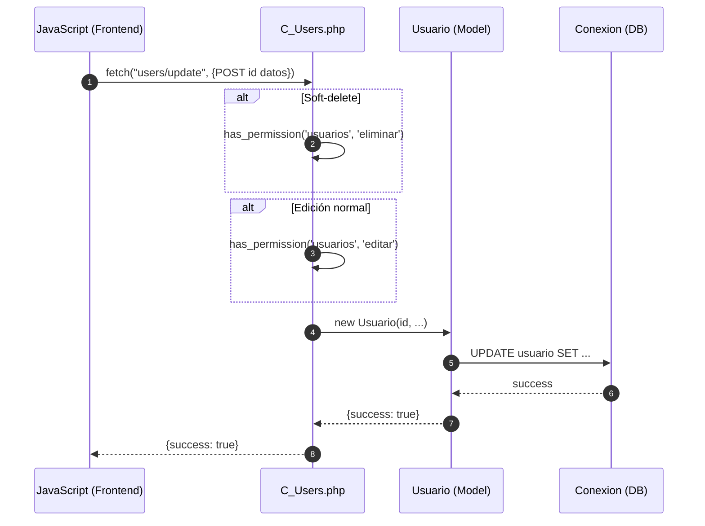
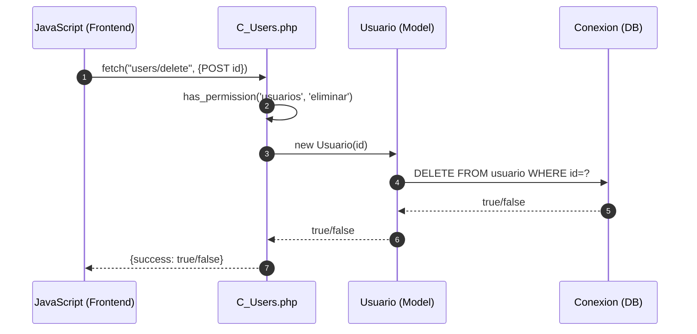
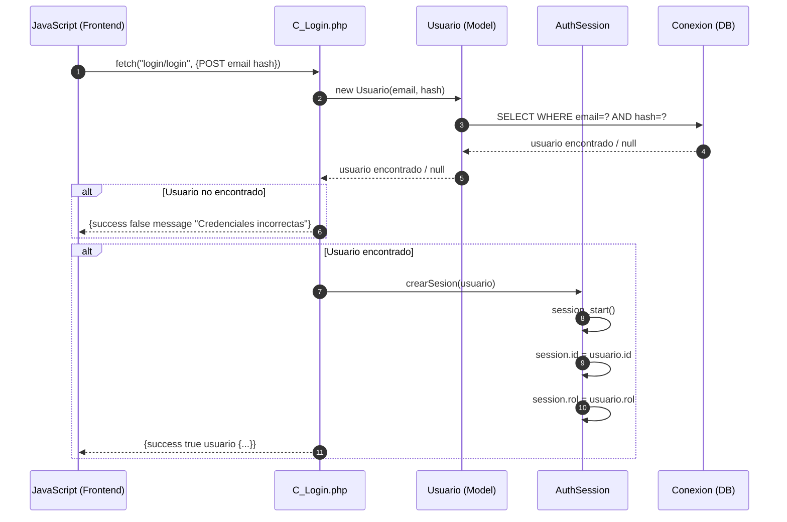
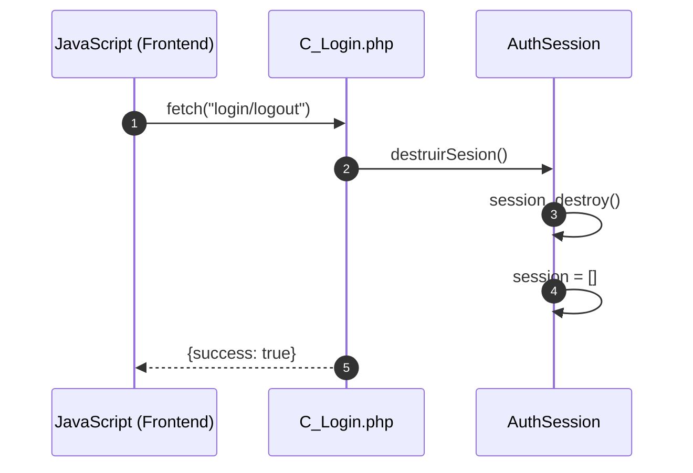

# Módulo Usuarios - Diagrama de Secuencia

## Agregar Usuario



## Consultar Usuarios



## Actualizar Usuario



## Eliminar Usuario



## Login



## Logout


    JS->>C_Login: fetch("login/logout")
    
    C_Login->>Auth: destruirSesion()
    Auth->>Auth: session_destroy()
    Auth->>Auth: session = []
    
    C_Login-->>JS: {success: true}
```
