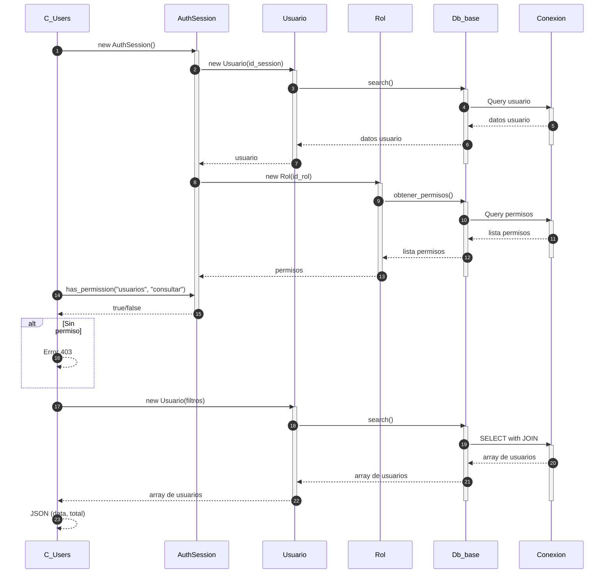
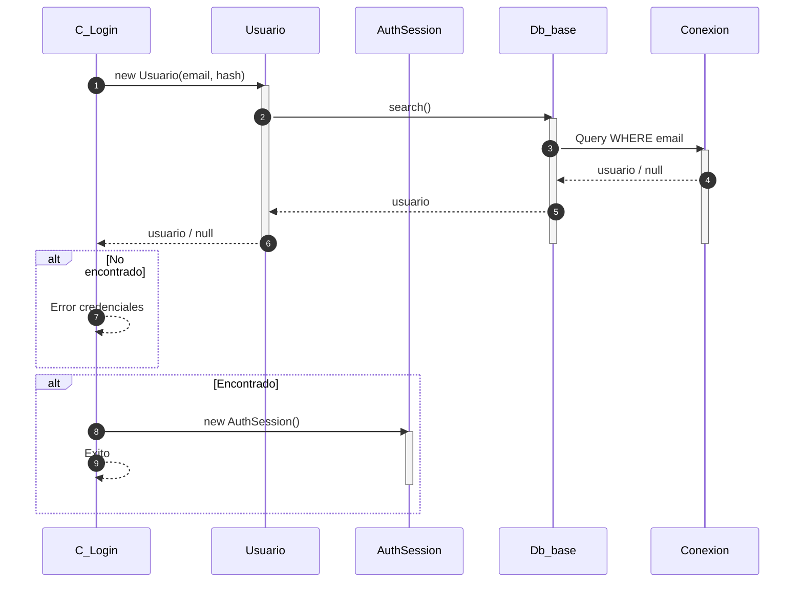
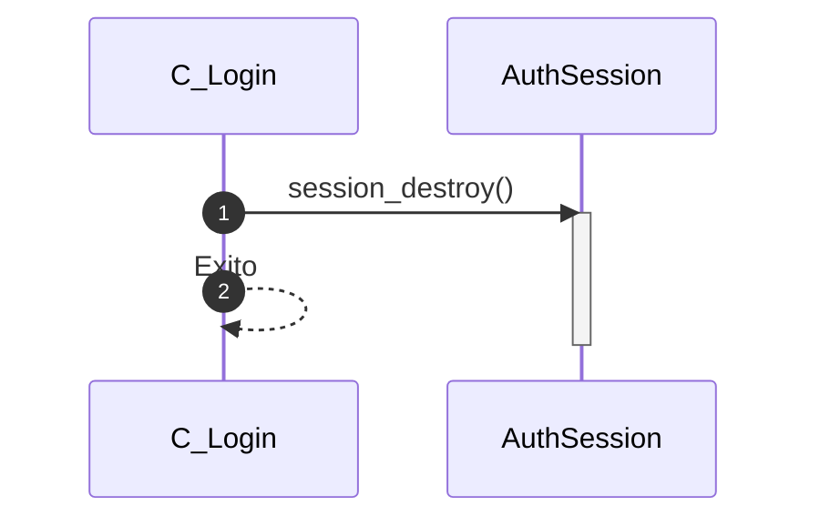

# Modulo Usuarios - Diagrama de Secuencia

## Agregar Usuario

```mermaid
sequenceDiagram
    autonumber
    participant C_Users as C_Users
    participant AuthSession as AuthSession
    participant Usuario as Usuario
    participant Rol as Rol
    participant Db_base as Db_base
    participant Conexion as Conexion
    
    C_Users->>AuthSession: new AuthSession()
    activate AuthSession
    AuthSession->>Usuario: new Usuario(id_session)
    activate Usuario
    Usuario->>Db_base: search()
    activate Db_base
    Db_base->>Conexion: Query usuario
    activate Conexion
    Conexion-->>Db_base: datos usuario
    Db_base-->>Usuario: datos usuario
    deactivate Conexion
    Usuario-->>AuthSession: usuario
    deactivate Usuario
    deactivate Db_base
    
    AuthSession->>Rol: new Rol(id_rol)
    activate Rol
    Rol->>Db_base: obtener_permisos()
    activate Db_base
    Db_base->>Conexion: Query permisos
    activate Conexion
    Conexion-->>Db_base: lista permisos
    Db_base-->>Rol: lista permisos
    deactivate Conexion
    Rol-->>AuthSession: permisos
    deactivate Rol
    deactivate Db_base
    
    C_Users->>AuthSession: has_permission("usuarios", "agregar")
    AuthSession-->>C_Users: true/false
    deactivate AuthSession
    
    alt Sin permiso
        C_Users-->>C_Users: Error 403
    end
    
    C_Users->>Usuario: new Usuario(parametros)
    activate Usuario
    Usuario->>Db_base: add_variables([a.nombre => ..., a.email => ..., a.password => ...])
    activate Db_base
    Db_base-->>Db_base: preg_match validation
    Db_base-->>Usuario: validated
    Usuario-->>C_Users: return
    C_Users->>Usuario: agregar()
    Usuario->>Db_base: agregar()
    Db_base->>Conexion: INSERT INTO usuario
    activate Conexion
    Conexion-->>Db_base: lastInsertId
    Db_base-->>Usuario: lastInsertId
    Usuario-->>C_Users: lastInsertId
    deactivate Usuario
    deactivate Conexion
    deactivate Db_base
    
    end
```

## Eliminar Usuario

```mermaid
sequenceDiagram
    autonumber
    participant C_Users as C_Users
    participant AuthSession as AuthSession
    participant Usuario as Usuario
    participant Rol as Rol
    participant Db_base as Db_base
    participant Conexion as Conexion
    
    C_Users->>AuthSession: new AuthSession()
    activate AuthSession
    AuthSession->>Usuario: new Usuario(id_session)
    activate Usuario
    Usuario->>Db_base: search()
    activate Db_base
    Db_base->>Conexion: Query usuario
    activate Conexion
    Conexion-->>Db_base: datos usuario
    Db_base-->>Usuario: datos usuario
    deactivate Conexion
    Usuario-->>AuthSession: usuario
    deactivate Usuario
    deactivate Db_base
    
    AuthSession->>Rol: new Rol(id_rol)
    activate Rol
    Rol->>Db_base: obtener_permisos()
    activate Db_base
    Db_base->>Conexion: Query permisos
    activate Conexion
    Conexion-->>Db_base: lista permisos
    Db_base-->>Rol: lista permisos
    deactivate Conexion
    Rol-->>AuthSession: permisos
    deactivate Rol
    deactivate Db_base
    
    C_Users->>AuthSession: has_permission("usuarios", "eliminar")
    AuthSession-->>C_Users: true/false
    deactivate AuthSession
    
    alt Sin permiso
        C_Users-->>C_Users: Error 403
    end
    
    C_Users->>Usuario: new Usuario(id)
    activate Usuario
    Usuario->>Db_base: borrar()
    activate Db_base
    Db_base->>Conexion: DELETE
    activate Conexion
    Conexion-->>Db_base: true/false
    Db_base-->>Usuario: true/false
    Usuario-->>C_Users: true/false
    deactivate Usuario
    deactivate Conexion
    deactivate Db_base
    
    end
```

## Consultar Usuarios



## Actualizar Usuario

```mermaid
sequenceDiagram
    autonumber
    participant C_Users as C_Users
    participant AuthSession as AuthSession
    participant Usuario as Usuario
    participant Rol as Rol
    participant Db_base as Db_base
    participant Conexion as Conexion
    
    C_Users->>AuthSession: new AuthSession()
    activate AuthSession
    AuthSession->>Usuario: new Usuario(id_session)
    activate Usuario
    Usuario->>Db_base: search()
    activate Db_base
    Db_base->>Conexion: Query usuario
    activate Conexion
    Conexion-->>Db_base: datos usuario
    Db_base-->>Usuario: datos usuario
    deactivate Conexion
    Usuario-->>AuthSession: usuario
    deactivate Usuario
    deactivate Db_base
    
    AuthSession->>Rol: new Rol(id_rol)
    activate Rol
    Rol->>Db_base: obtener_permisos()
    activate Db_base
    Db_base->>Conexion: Query permisos
    activate Conexion
    Conexion-->>Db_base: lista permisos
    Db_base-->>Rol: lista permisos
    deactivate Conexion
    Rol-->>AuthSession: permisos
    deactivate Rol
    deactivate Db_base
    
    alt active = 0 (soft-delete)
        C_Users->>AuthSession: has_permission("usuarios", "eliminar")
    end
    
    alt active = 1 (restaurar)
        C_Users->>AuthSession: has_permission("Papelera", "restaurar")
    end
    
    alt Edicion normal
        C_Users->>AuthSession: has_permission("usuarios", "editar")
    end
    
    AuthSession-->>C_Users: true/false
    deactivate AuthSession
    
    alt Sin permiso
        C_Users-->>C_Users: Error 403
    end
    
    C_Users->>Usuario: new Usuario(id, datos)
    activate Usuario
    Usuario->>Db_base: add_variables([a.nombre => ..., a.email => ...])
    activate Db_base
    Db_base-->>Db_base: preg_match validation
    Db_base-->>Usuario: validated
    Usuario->>Db_base: actualizar()
    activate Conexion
    Db_base->>Conexion: UPDATE
    Conexion-->>Db_base: success
    Db_base-->>Usuario: success
    Usuario-->>C_Users: success
    deactivate Usuario
    deactivate Conexion
    deactivate Db_base
    
    end
```

## Login



## Logout


