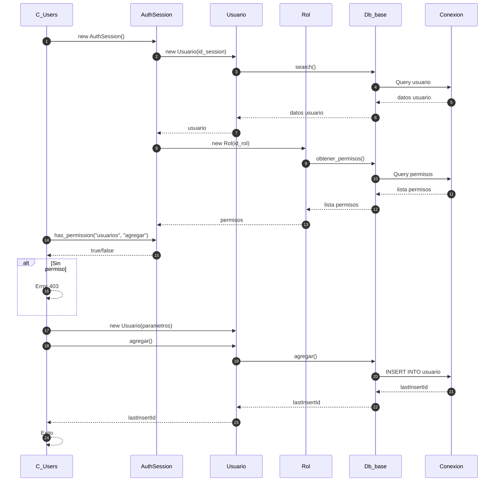
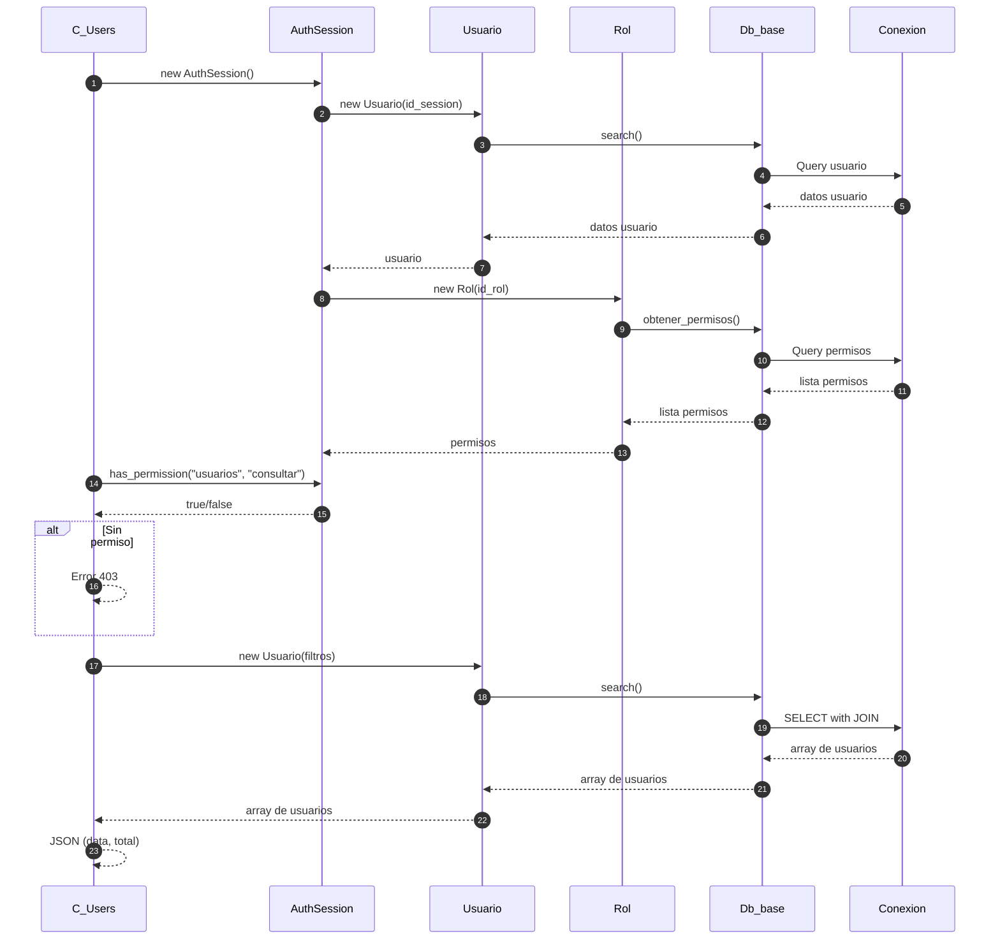
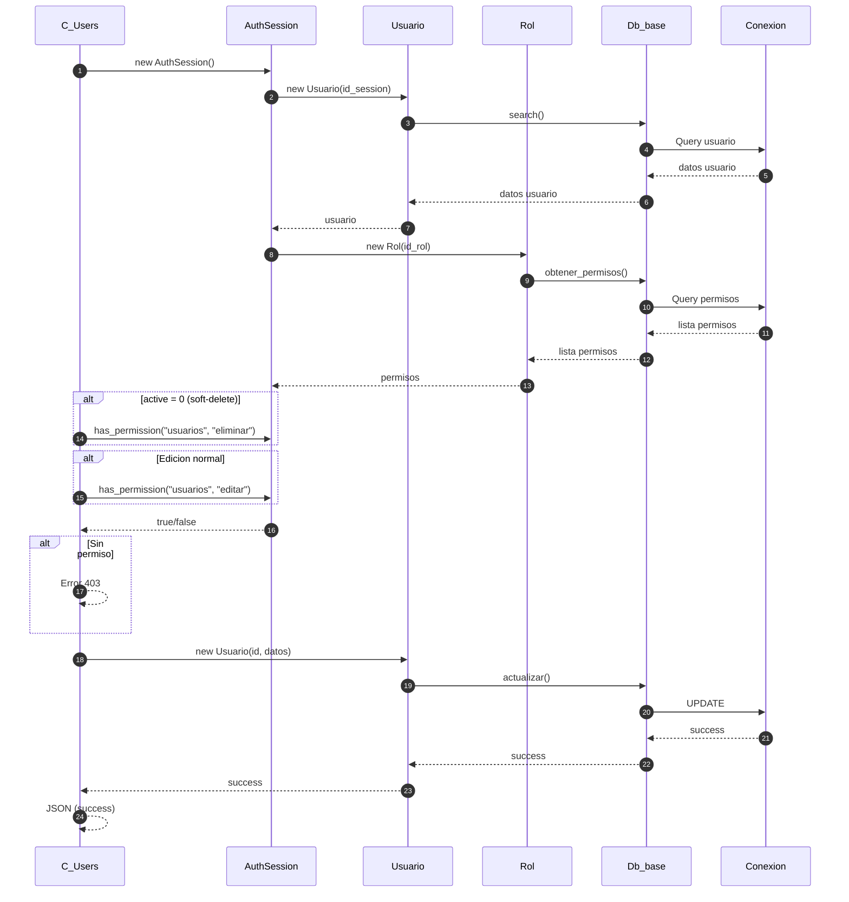
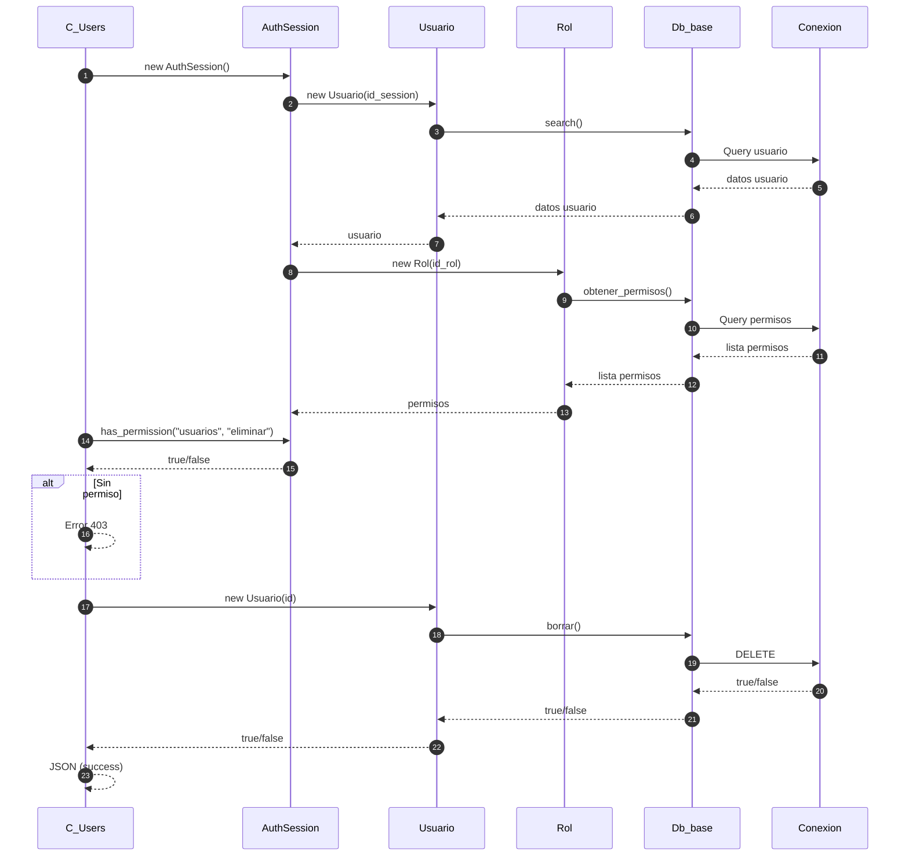
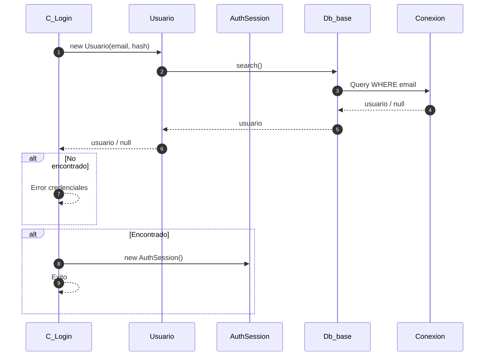
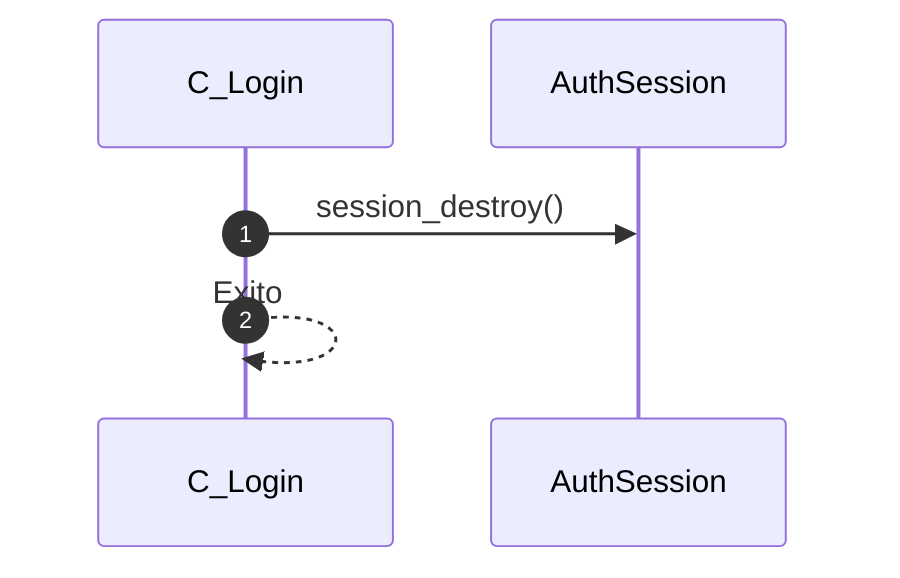

# Modulo Usuarios - Diagrama de Secuencia

## Agregar Usuario

```mermaid
sequenceDiagram
    autonumber
    participant C_Users as C_Users
    participant AuthSession as AuthSession
    participant Usuario as Usuario
    participant Rol as Rol
    participant Db_base as Db_base
    participant Conexion as Conexion
    
    C_Users->>AuthSession: new AuthSession()
    AuthSession->>Usuario: new Usuario(id_session)
    Usuario->>Db_base: search()
    Db_base->>Conexion: Query usuario
    Conexion-->>Db_base: datos usuario
    Db_base-->>Usuario: datos usuario
    Usuario-->>AuthSession: usuario
    
    AuthSession->>Rol: new Rol(id_rol)
    Rol->>Db_base: obtener_permisos()
    Db_base->>Conexion: Query permisos
    Conexion-->>Db_base: lista permisos
    Db_base-->>Rol: lista permisos
    Rol-->>AuthSession: permisos
    
    C_Users->>AuthSession: has_permission("usuarios", "agregar")
    AuthSession-->>C_Users: true/false
    
    alt Sin permiso
        C_Users-->>C_Users: Error 403
    end
    
    C_Users->>Usuario: new Usuario(parametros)
    C_Users->>Usuario: agregar()
    Usuario->>Db_base: agregar()
    Db_base->>Conexion: INSERT INTO usuario
    Conexion-->>Db_base: lastInsertId
    Db_base-->>Usuario: lastInsertId
    Usuario-->>C_Users: lastInsertId
    
    C_Users-->>C_Users: Exito
```

## Consultar Usuarios

```mermaid
sequenceDiagram
    autonumber
    participant C_Users as C_Users
    participant AuthSession as AuthSession
    participant Usuario as Usuario
    participant Rol as Rol
    participant Db_base as Db_base
    participant Conexion as Conexion
    
    C_Users->>AuthSession: new AuthSession()
    AuthSession->>Usuario: new Usuario(id_session)
    Usuario->>Db_base: search()
    Db_base->>Conexion: Query usuario
    Conexion-->>Db_base: datos usuario
    Db_base-->>Usuario: datos usuario
    Usuario-->>AuthSession: usuario
    
    AuthSession->>Rol: new Rol(id_rol)
    Rol->>Db_base: obtener_permisos()
    Db_base->>Conexion: Query permisos
    Conexion-->>Db_base: lista permisos
    Db_base-->>Rol: lista permisos
    Rol-->>AuthSession: permisos
    
    C_Users->>AuthSession: has_permission("usuarios", "consultar")
    AuthSession-->>C_Users: true/false
    
    alt Sin permiso
        C_Users-->>C_Users: Error 403
    end
    
    C_Users->>Usuario: new Usuario(filtros)
    Usuario->>Db_base: search()
    Db_base->>Conexion: SELECT with JOIN
    Conexion-->>Db_base: array de usuarios
    Db_base-->>Usuario: array de usuarios
    Usuario-->>C_Users: array de usuarios
    
    C_Users-->>C_Users: JSON (data, total)
```

## Actualizar Usuario

```mermaid
sequenceDiagram
    autonumber
    participant C_Users as C_Users
    participant AuthSession as AuthSession
    participant Usuario as Usuario
    participant Rol as Rol
    participant Db_base as Db_base
    participant Conexion as Conexion
    
    C_Users->>AuthSession: new AuthSession()
    AuthSession->>Usuario: new Usuario(id_session)
    Usuario->>Db_base: search()
    Db_base->>Conexion: Query usuario
    Conexion-->>Db_base: datos usuario
    Db_base-->>Usuario: datos usuario
    Usuario-->>AuthSession: usuario
    
    AuthSession->>Rol: new Rol(id_rol)
    Rol->>Db_base: obtener_permisos()
    Db_base->>Conexion: Query permisos
    Conexion-->>Db_base: lista permisos
    Db_base-->>Rol: lista permisos
    Rol-->>AuthSession: permisos
    
    alt active = 0 (soft-delete)
        C_Users->>AuthSession: has_permission("usuarios", "eliminar")
    end
    
    alt Edicion normal
        C_Users->>AuthSession: has_permission("usuarios", "editar")
    end
    
    AuthSession-->>C_Users: true/false
    
    alt Sin permiso
        C_Users-->>C_Users: Error 403
    end
    
    C_Users->>Usuario: new Usuario(id, datos)
    Usuario->>Db_base: actualizar()
    Db_base->>Conexion: UPDATE
    Conexion-->>Db_base: success
    Db_base-->>Usuario: success
    Usuario-->>C_Users: success
    
    C_Users-->>C_Users: JSON (success)
```

## Eliminar Usuario

```mermaid
sequenceDiagram
    autonumber
    participant C_Users as C_Users
    participant AuthSession as AuthSession
    participant Usuario as Usuario
    participant Rol as Rol
    participant Db_base as Db_base
    participant Conexion as Conexion
    
    C_Users->>AuthSession: new AuthSession()
    AuthSession->>Usuario: new Usuario(id_session)
    Usuario->>Db_base: search()
    Db_base->>Conexion: Query usuario
    Conexion-->>Db_base: datos usuario
    Db_base-->>Usuario: datos usuario
    Usuario-->>AuthSession: usuario
    
    AuthSession->>Rol: new Rol(id_rol)
    Rol->>Db_base: obtener_permisos()
    Db_base->>Conexion: Query permisos
    Conexion-->>Db_base: lista permisos
    Db_base-->>Rol: lista permisos
    Rol-->>AuthSession: permisos
    
    C_Users->>AuthSession: has_permission("usuarios", "eliminar")
    AuthSession-->>C_Users: true/false
    
    alt Sin permiso
        C_Users-->>C_Users: Error 403
    end
    
    C_Users->>Usuario: new Usuario(id)
    Usuario->>Db_base: borrar()
    Db_base->>Conexion: DELETE
    Conexion-->>Db_base: true/false
    Db_base-->>Usuario: true/false
    Usuario-->>C_Users: true/false
    
    C_Users-->>C_Users: JSON (success)
```

## Login

```mermaid
sequenceDiagram
    autonumber
    participant C_Login as C_Login
    participant Usuario as Usuario
    participant AuthSession as AuthSession
    participant Db_base as Db_base
    participant Conexion as Conexion
    
    C_Login->>Usuario: new Usuario(email, hash)
    Usuario->>Db_base: search()
    Db_base->>Conexion: Query WHERE email
    Conexion-->>Db_base: usuario / null
    Db_base-->>Usuario: usuario
    Usuario-->>C_Login: usuario / null
    
    alt No encontrado
        C_Login-->>C_Login: Error credenciales
    end
    
    alt Encontrado
        C_Login->>AuthSession: new AuthSession()
        C_Login-->>C_Login: Exito
    end
```

## Logout

```mermaid
sequenceDiagram
    autonumber
    participant C_Login as C_Login
    participant AuthSession as AuthSession
    
    C_Login->>AuthSession: session_destroy()
    
    C_Login-->>C_Login: Exito
```
